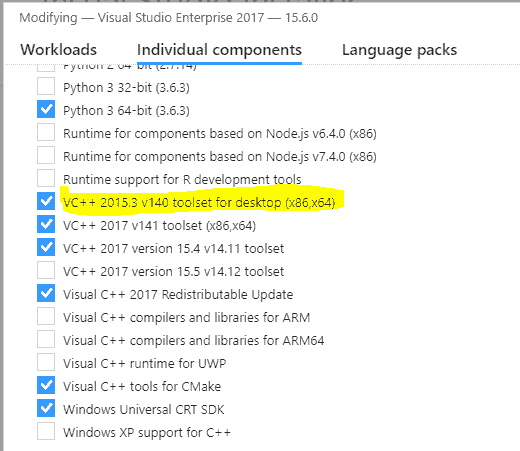
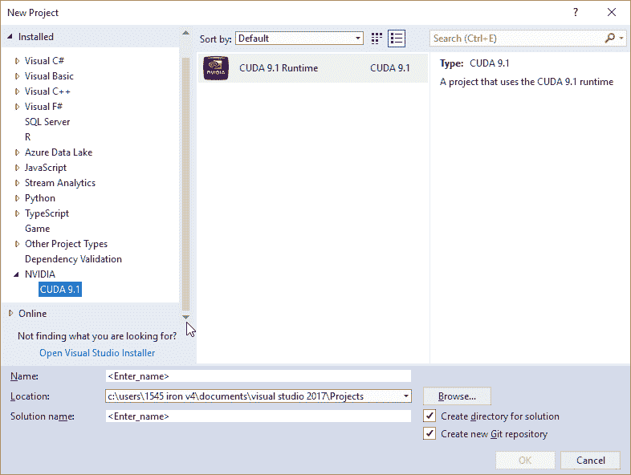
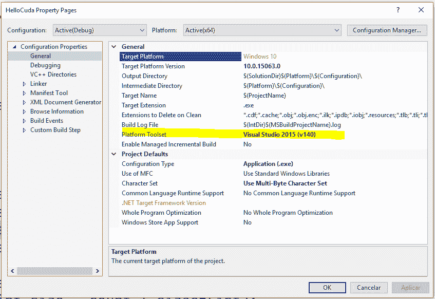

# CUDA 入门(使用 VS2017)

> 原文：<https://dev.to/elemarjr/getting-started-with-cuda-using-vs2017-56ba>

如果你对性能感兴趣，你需要了解更多关于 CUDA 的知识。

来自[官网](https://developer.nvidia.com/cuda-zone):

> CUDA 是 NVIDIA 开发的并行计算平台和编程模型，用于图形处理单元(GPU)上的一般计算。有了 CUDA，开发人员就可以利用 GPU 的强大功能，大幅提高计算应用的速度。
> 
> 在 GPU 加速的应用中，工作负载的顺序部分在 CPU 上运行，针对单线程性能进行了优化，而应用的计算密集型部分在数千个 GPU 内核上并行运行。当使用 CUDA 时，开发人员使用 C、C++、Fortran、Python 和 MATLAB 等流行语言编程，并通过几个基本关键字形式的扩展来表达并行性。

在这篇文章中，我将指导你使用 CUDA 的第一步。此外，我将向您展示如何将一些基本处理从 CPU 转移到 GPU。

让我们开始获取一些字节。

## 环境设置

我用的是 Visual Studio 2017(版本 15.6.0)。要使用 CUDA 编码，您需要下载并安装 [CUDA 工具包。](https://developer.nvidia.com/cuda-toolkit)该工具包包括 Visual Studio 项目模板和 NSight IDE(可以在 Visual Studio 中使用)。

另外，你还需要安装 VC++ 2017 工具集(CUDA 仍然与最新版本的 Visual Studio 不兼容)。

[T2】](https://res.cloudinary.com/practicaldev/image/fetch/s--MSZK-NJa--/c_limit%2Cf_auto%2Cfl_progressive%2Cq_auto%2Cw_880/http://www.elemarjr.com/wp-content/uploads/2018/03/cuda_setup_1.png)

## 使用 CUDA 启动新项目

启动使用 CUDA 的项目最简单的方法是利用 CUDA 模板。

[T2】](https://res.cloudinary.com/practicaldev/image/fetch/s--qzWC5uk8--/c_limit%2Cf_auto%2Cfl_progressive%2Cq_auto%2Cw_880/http://www.elemarjr.com/wp-content/uploads/2018/03/CUDA-New-Project.png)

为了能够编译它，您需要更改项目属性以使用 Visual Studio 2015 工具集。

[T2】](https://res.cloudinary.com/practicaldev/image/fetch/s--F_ZULIyU--/c_limit%2Cf_auto%2Cfl_progressive%2Cq_auto%2Cw_880/http://www.elemarjr.com/wp-content/uploads/2018/03/platform_toolset.png)

我建议您清理模板的样板文件，将文件 *kernel.cu* 的内容改为这个 _:_

```
#include "cuda_runtime.h" 
#include "device_launch_parameters.h" 
```

Enter fullscreen mode Exit fullscreen mode

## 基本 CPU 处理

让我们添加两个数组( *a* 和 *b* )并将结果放入第三个数组( *c* )。

```
#include "cuda_runtime.h" 
#include "device_launch_parameters.h" 
#include <stdio.h> 
void add_arrays_cpu(int* a, int* b, int* c, const int count)
{
    for (auto i = 0; i < count; i++)
    {
        c[i] = a[i] + b[i];
    }
} 

int main()
{
    const auto count = 5; 
    int a[] = { 1, 2, 3, 4, 5 }; 
    int b[] = { 10, 20, 30, 40, 60 }; int c[count]; 
    add_arrays_cpu(a, b, c, count); 
    for (auto i = 0; i < count; i ++)
    {
        printf("%d ", c[i]);
    } 
    getchar(); 
    return 0;
} 
```

Enter fullscreen mode Exit fullscreen mode

这段代码非常简单。但是很难并行化。

每当我们想要使用并行时，我们需要创建可以独立执行的函数。函数 *add_arrays_cpu* 有一个 *for 循环*，它以顺序方式运行 *add 进程*。但是，没有理由以这种方式工作。来改一下:

```
#include "cuda_runtime.h"
#include "device_launch_parameters.h" 
#include <stdio.h>; 
void add_array_element_cpu(int* a, int * b, int* c, const int index)
{
    c[index] = a[index] + b[index];
}

int main()
{
    const auto count = 5;
    int a[] = { 1, 2, 3, 4, 5 };
    int b[] = { 10, 20, 30, 40, 60 };
    int c[count];

    add_arrays_cpu(a, b, c, count);

    for (auto i = 0; i < count; i++)
    {
        add_array_element_cpu(a, b, c, i);
    }

    for (auto i = 0; i < count; i ++)
    {
        printf("%d ", c[i]);
    }

    getchar();

    return 0;
} 
```

Enter fullscreen mode Exit fullscreen mode

函数 *add_array_element_cpu* 可以独立执行，那就太棒了。我们可以为数组的每个位置启动一个线程，这样就很好了(我并不是说这对于 CPU 来说是正确的事情，只是作为一个例子)。

## 将 CUDA 带入游戏

下一个合乎逻辑的步骤是开始使用 GPU 运行我们的代码。我们不会将所有的功能都转移到 GPU，而是只转移我们认为可以并行化的功能。

```
#include "cuda_runtime.h"
#include "device_launch_parameters.h" 
#include <stdio.h>; 
__global__ void add_arrays_gpu(int* a, int *b, int* c)
{
    c[threadIdx.x] = a[threadIdx.x] + b[threadIdx.x];
}

int main()
{
    const auto count = 5;
    int host_a[] = { 1, 2, 3, 4, 5 };
    int host_b[] = { 10, 20, 30, 40, 60 };
    int host_c[count];

    int *device_a, *device_b, *device_c;
    const int size = count * sizeof(int);
    cudaMalloc(&amp;device_a, size);
    cudaMalloc(&amp;device_b, size);
    cudaMalloc(&amp;device_c, size);

    cudaMemcpy(
        device_a, host_a,
        size,
        cudaMemcpyHostToDevice
    );

    cudaMemcpy(
        device_b, host_b,
        size,
        cudaMemcpyHostToDevice
    );

    add_arrays_gpu <<< 1, count >>> (device_a, device_b, device_c);

    cudaMemcpy(
        host_c, device_c,
        size,
        cudaMemcpyDeviceToHost
    );

    for (auto i = 0; i < count; i ++)
    {
        printf("%d ", host_c[i]);
    }

    getchar();

    return 0;
} 
```

Enter fullscreen mode Exit fullscreen mode

我们将 *add_arrays_gpu* 函数标记为 ***全局*** 。使用 CUDA 术语，这个函数是一个*内核，*，它将从 GPU 上执行。它运行在 GPU 上，从 CPU 调用(还有一个限定符 location 限定符， ***device*** 要和运行在 GPU 上的函数一起使用，从 GPU 调用)。

使用特殊的< < < … > > >语法调用 ***全局*** 函数。我们使用的参数表明我们正在运行 *1 块 count (5)线程*中的内核函数。我们将在以后更多地讨论它。

注意，我们不再需要通知一个*索引*了——我们从 *threadIdx* 中检索索引位置。x. *threadIdx* 是一个特殊的变量，由 CUDA runtime 提供，它通知当前线程在线程块中的位置(我们使用五个线程，一个线程块运行我们的代码。因此，我们能够将该信息用作数组中的索引)。

我想对一个你在做 CUDA 编程时会经常看到的重要模式做一个特殊的考虑。要运行，GPU 代码不允许访问 CPU 内存(反之亦然)。因此，我们需要:

1.  将我们需要处理的数据从 CPU 复制到 GPU 内存中
2.  进行加工
3.  将结果从 GPU 复制到 CPU 内存。

## 最后的话

我知道，我知道！将两个只有五个元素的数组相加并不是一个令人兴奋的例子。但是，在这篇文章中，我们设置了在我们的机器上使用 CUDA。然后，我帮你把你的 can 从 CPU 上的顺序运行转移到 GPU 上的并行运行。以后还是回归 it，拿点实实在在的好处吧。

【CUDA 入门(使用 VS2017) 的帖子最早出现在 [Elemar JR](http://www.elemarjr.com/en) 上。