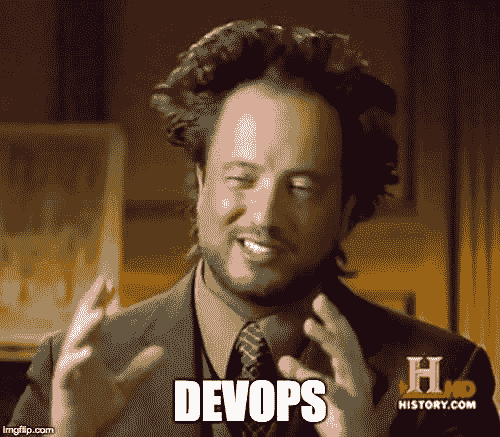
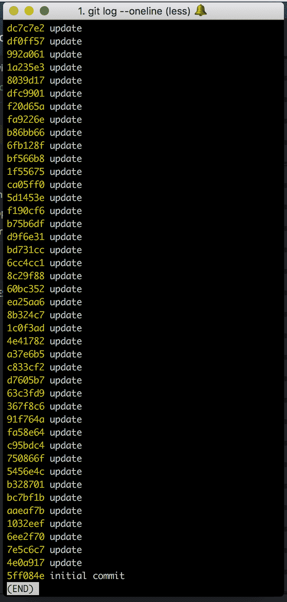
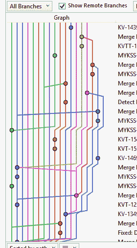

# DevOps 入门

> 原文：<https://dev.to/sublimegeek/getting-started-with-devops-3e31>

### devo PS 入门，第 1 部分

<figure>[](https://res.cloudinary.com/practicaldev/image/fetch/s--SYzE61gl--/c_limit%2Cf_auto%2Cfl_progressive%2Cq_auto%2Cw_880/https://cdn-images-1.medium.com/max/500/1%2AcRJvB1XvvexVNPmIwAFh8g.jpeg) 

<figcaption>我不是说是 devo PS……但是，是 DevOps</figcaption>

</figure>

DevOps 作为一个流行词，这些年来越来越受欢迎。当一个人或另一个人告诉你，你需要“做”DevOps，这意味着什么？

液体错误:内部

我将尝试从整体上审视 DevOps 的过程，并整理出一些基本定义，这些定义至少会让你开始 DevOps 之旅。

DevOps 是一段旅程，不是目的地。你不会奇迹般地到达某个时间点，然后突然到达 DevOps 涅槃。这是一个不断改进、快速失败的循环，当您意识到您正在尽可能快地部署和集成时，标准就提高了。您的客户已经领先您两步，昨天就需要您的更改。

### 它以代码开头

认为 DevOps *不是从代码开始的想法是愚蠢的。我们都以某种方式编写和部署代码。所以*我们如何*编写代码和*如何*部署代码一样重要。*

我关注了乔科·威林克 **的**播客，他的核心理念之一是**纪律等于自由**。对于软件工程来说，这是千真万确的。你在编写和管理代码时越自律，你就有更多的自由来编写新的特性，获得宁静的睡眠，等等。

多年来， [Git](http://git-scm.com) 一直是源代码管理的领头羊。虽然有其他工具可以做到这一点，但本文将重点讨论 Git。你可以编写完美的代码，但是如果你的团队在*管理*这些变化时没有纪律，你就是在要求自由的反面。

请记住，DevOps 是一个旅程，所以如果你至少从某个地方开始，你可以逐渐到达你想去的地方，并随着时间的推移不断调整。

关于用 Git 管理源代码，我有 5 个简单的原则(这适用于大多数其他配置管理工具)。

> 尽早并经常承诺。
> 
> 使每个提交消息有意义。
> 
> 使您的提交更改较小且具有事务性。
> 
> 不要做一个囤积犯。将您的代码推到远程(即使您是唯一的开发人员)
> 
> 永远不要重写共享历史。就是不要。想都别想。

让我解释一下。

如果你已经连续工作了几个小时，突然到了下午 6 点，你累了，想回家，但是你还没有做任何事情。那又怎样？你是做什么的？

你懒洋洋地把所有的修改都加入到一次提交中，给它一个蹩脚的消息，因为现在是下午 6 点，你已经没有创意了。因此，您最终会得到以下结果:

> 试图找出这个侧边栏的问题

…其中包含对 53 个文件的更改，增加了 3，564 项内容，删除了 4，352 项内容。匆忙中，你合上笔记本电脑，塞进包里，拼命想赶上高峰时间。当你到家时，你疯狂地寻找你的笔记本电脑，却发现你把它忘在了你的车顶上，现在它已经散落在州际公路上。

没关系，他们会借给你另一台笔记本电脑…除了你没有将你的更改推送到远程回购(在这种情况下，GitHub)。现在，在花了半天时间恢复开发环境之后，您整个下午都被束缚在办公桌前，试图弄清楚前一天所做的一切。

<figure>[](https://res.cloudinary.com/practicaldev/image/fetch/s--TAqBDm9N--/c_limit%2Cf_auto%2Cfl_progressive%2Cq_auto%2Cw_880/https://cdn-images-1.medium.com/max/750/1%2AXFNqxg6UFdqNs52QqblAnA.png) 

<figcaption>Git 提交的消息几乎比里面的内容更重要。在你有 Githubs 和 Bitbuckets 之前，这是你的全部。让它有价值！</figcaption>

</figure>

用**有意义的**消息提交你的代码，并推送它们。你未来的自己(以及所有在你之后的人)会感谢你的。或者他们不会…但是，至少你可以说你做了你的一部分。

[https://medium . com/media/41ef 432 FAA 52 DAC 22 c 718 aa 9 da 209d 12/href](https://medium.com/media/41ef432faa52dac22c718aa9da209d12/href)

### Git 意大利面

<figure>[](https://res.cloudinary.com/practicaldev/image/fetch/s--zxHXOLs---/c_limit%2Cf_auto%2Cfl_progressive%2Cq_auto%2Cw_880/https://cdn-images-1.medium.com/max/280/0%2AM0EfHaTOhLxkKllm.) 

<figcaption>尽量避免这种情况。(来源:Reddit)</figcaption>

</figure>

Git 非常灵活，您可以创建无限数量的分支、标记、提交，并使用任意数量的远程 repos。因此，有一个好的策略和与你的团队的工作协议对于避免类似上面的混乱是很重要的。

要记住的事情:

*   主人应该保持干净
*   分支应该是短命的，并且有一个有意义的名字
*   分支机构名称应该标准化(但不要过度设计)

有几个现成的工作流程可用。对于新的和不太自律的团队，你可以从一个[集中的工作流](https://www.atlassian.com/git/tutorials/comparing-workflows#centralized-workflow)开始；然而，因为没有人喜欢合并冲突，所以最好保持代码隔离，并以更度量的方法集成它。**我喜欢** [**基于特性的工作流**](https://www.atlassian.com/git/tutorials/comparing-workflows/feature-branch-workflow) **，因为它与** [**基于主干的开发**](https://trunkbaseddevelopment.com/) **。**主要是因为我喜欢在每个人自己的回购协议中保持代码新鲜，同时保持功能足够独立，这样你就有一个稳定的平台可以操作。

FBW & TBD 的酷之处在于，如果你有漂亮的部署管道和持续集成工具，比如 Jenkins 或 Travis CI，那么这个工作流程非常适合这些工具。

正如我之前提到的，还有更复杂的工作流，如 [Git Flow](https://www.atlassian.com/git/tutorials/comparing-workflows/gitflow-workflow) 和 [Forking](https://www.atlassian.com/git/tutorials/comparing-workflows/forking-workflow) ，但你的里程可能会有所不同。

### 什么是拉取请求，它们应该是什么

<figure>[](https://res.cloudinary.com/practicaldev/image/fetch/s--dDbWKuhf--/c_limit%2Cf_auto%2Cfl_progressive%2Cq_auto%2Cw_880/https://cdn-images-1.medium.com/max/610/0%2AcUxf4n46m633zTFH.png) 

<figcaption>每时每刻都在发生。</figcaption>

</figure>

我们来谈谈拉取请求。首先，当 Git 诞生的时候，还没有 GitHub。Linus Torvalds 会[收到电子邮件(是的，电子邮件)](https://git-scm.com/docs/git-request-pull)将其他贡献者的代码拉入主 Linux 内核的存储库中。现在，我们都已经习惯了拉请求(被宠坏了！)，但结果是，如果管理不善，PRs 可能会像未经测试的合并一样危险。

拉式请求已经成为一种美化的橡皮图章。

<figure>[](https://res.cloudinary.com/practicaldev/image/fetch/s--1LIxcSta--/c_limit%2Cf_auto%2Cfl_progressive%2Cq_auto%2Cw_880/https://cdn-images-1.medium.com/max/960/0%2AH6MIejUOwx6N_yH4.png)

<figcaption>PRs 都变成什么了。</figcaption>

</figure>

对我来说，Git 是让我成为更好的软件工程师的一个有价值的工具。Git 让你能够一砖一瓦地建造一堵墙，如果这堵墙倒了，你可以把它竖起来，就像它从来没有倒过一样。因此，如果 Git 可以帮助开发人员在可行的基础上进行构建，并使用一次性实验来变得更好，我们为什么不能使用拉请求来变得更好呢？

> **一次性实验**。创建一个分支进行实验，意识到它不会工作，然后删除它——放弃工作——没有其他人会看到它(即使你在此期间推动了其他分支)。来源: [Git About](https://git-scm.com/about)

<figure>[](https://res.cloudinary.com/practicaldev/image/fetch/s--6_RvJb1x--/c_limit%2Cf_auto%2Cfl_progressive%2Cq_auto%2Cw_880/https://cdn-images-1.medium.com/max/1024/1%2ANaUmBti42n0FMMffyjTtBg.jpeg) 

<figcaption>应该是什么拉动要求。照片由 [Marvin Meyer](https://unsplash.com/photos/SYTO3xs06fU?utm_source=unsplash&utm_medium=referral&utm_content=creditCopyText) 在 [Unsplash](https://unsplash.com/search/photos/meeting?utm_source=unsplash&utm_medium=referral&utm_content=creditCopyText)</figcaption>

</figure>

上拍摄

拉式请求应该是一种讨论。它应该是一个团队中的开发人员聚在一起，敲打代码，直到被**团队**接受，而不仅仅是那些审查 PR 的人。

我是不是说每个 PR 都必须是这个冗长的代码审查过程？号码

一次公关审查需要几分钟，不会超过一只手的手指。如果你发现 PR review 花费了更多的时间来评审，并且把你和你的团队从编写代码中抽离出来，你需要更小的 Pull 请求。

PR 应该是团队审查代码的机会，并通过建议更好的方法、询问关于功能的问题以及确保质量来检查其他开发人员。

他们是剧中的两个演员。拉动请求**提交者**和**团队。**

#### 提交者

提交者的责任是确保特性(假设他们正在提交一个特性分支以拉入主特性)是**完整的**。对于“完成”，我们的意思是这个特性满足团队的**定义的标准。**

大多数 PRs (Github 和 Bitbucket)包含一个主题和一个描述字段。主题应该是用一句话概括的变更，描述应该描述提交的变更。

我喜欢更进一步，对拉请求使用 [GitHub 模板](https://blog.github.com/2016-02-17-issue-and-pull-request-templates/)，对每个 PR 使用预定义的模板。它把“我应该在这个巨大的领域写什么”的想法带走了。

以下是我想问 PR 提交者的一些问题:

*   关于变化的简短介绍
*   截图显示代码正在工作/已经过测试
*   为什么需要/必须进行这种改变？
*   相关 GitHub 或 JIRA 问题的链接

在模板的底部，我想知道 PR 是一个新特性、bug 修复还是其他(描述)。

在此之下，我喜欢包括复选框提交者可以检查，以确保他们已经做了尽职调查，以确保完成。

这一变更是否需要变更文件？文档是否已更新或添加了新文档？

是否已经为该变更编写了测试？所有新的和现有的测试都通过了吗？

除此之外，如果您的更改需要模拟、包更新等，您可以添加这些复选框。

**重点是……**作为提交者，你有责任向团队传达你的变更，并且你已经证明变更已经准备好合并到主代码中。

#### 评审者又名大家

理想情况下，您有不止一双眼睛盯着代码(不包括提交者)。是的，就是提交者和 2 个或更多的审核者。为了不过度设计，如果公关还没准备好，你应该有有限的几个人来决定是否进行。反馈是有用的。反馈太多，你开始得到递减的回报。

对公关来说，最强有力的行动就是完全拒绝它。记住这一点。

如果你有良好的公关纪律，恭喜你！你的工作应该很容易。如果提交者已经完成了他们的尽职调查，并且正确地测试了变更，并且您没有合并冲突，那么您剩下的职责就是挑剔代码格式和变量名。

> 说到代码格式化，你应该让每个人都使用相同的林挺，并使用类似于[pre-commit formatting rules 的工具。](http://prettier.io)

任何可以将 PR 评审的想法去掉，并使提交者和评审者更容易集成代码的东西都是快乐的代码。

### 代码覆盖率相当于代码可信度

<figure>[](https://res.cloudinary.com/practicaldev/image/fetch/s--LpchFsnT--/c_limit%2Cf_auto%2Cfl_progressive%2Cq_auto%2Cw_880/https://cdn-images-1.medium.com/max/1024/1%2AWJ5qEwqaY-hutlp3yCqiag.jpeg) 

<figcaption>当你所有的考验都通过时的那种感觉。照片由 [Dino Reichmuth](https://unsplash.com/photos/1tFd-Bb1pxk?utm_source=unsplash&utm_medium=referral&utm_content=creditCopyText) 在 [Unsplash](https://unsplash.com/search/photos/freedom?utm_source=unsplash&utm_medium=referral&utm_content=creditCopyText)</figcaption>

</figure>

上拍摄

如果你知道如何欺骗系统，100%的代码覆盖率是很容易的。编写覆盖所有代码的测试很容易，但是编写覆盖所有场景的测试用例却更具挑战性。在这种情况下，我想起了 [Testivus](https://www.scribd.com/document/69769/TheWayOfTestivus) 。

多少代码覆盖率是足够的？百分之八十，不能少！😉

当你的测试覆盖了你的场景，这将有机地增加你的代码覆盖率，反过来，增加你的**代码信心。**

如果你有 60%的代码覆盖率和 100%的场景覆盖率，你肯定是在正确的道路上。继续努力吧，可能还有更多你没想到的情况。

从基础开始。“这个方法/函数/页面存在吗？”那是个测试！在此基础上加入“这个按钮应该是蓝色的”，一直到使用[小黄瓜语言](http://docs.behat.org/en/v2.5/guides/1.gherkin.html)。

```
**Feature:** Some terse yet descriptive text of what is desired
  In order to realize a named business value
  As an explicit system actor
  I want to gain some beneficial outcome which furthers the goal

**Scenario:** Some determinable business situation
    **Given** some precondition
**And** some other precondition
**When** some action by the actor
**And** some other action
**And** yet another action
**Then** some testable outcome is achieved
**And** something else we can check happens too 
```

Enter fullscreen mode Exit fullscreen mode

> **假设**我在这个页面上
> 
> **当**我点击结账按钮
> 
> **然后**我应该被带到订单汇总屏幕。

关于小黄瓜的巧妙之处在于，你可以用同一种语言编写用户故事，并使用类似于[cumber](https://cucumber.io/)的测试工具来测试代码单元之外的验收标准。

### 谢谢

接下来，我将谈论编写测试如何帮助自动化和应用程序生命周期。查看第 2 部分。

* * *