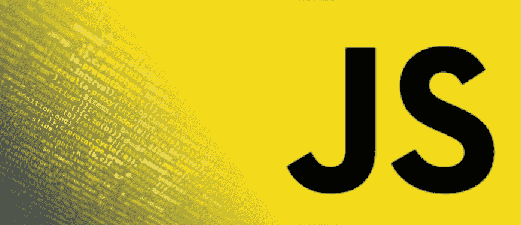
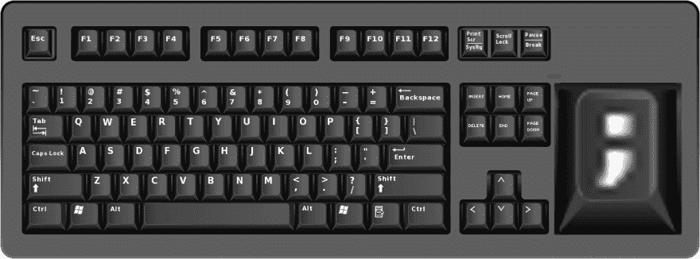
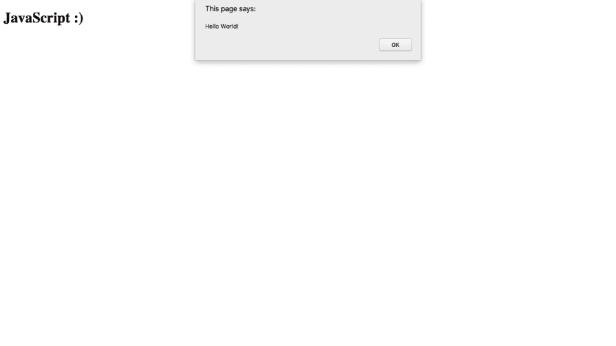

# JavaScript 入门！

> 原文：<https://dev.to/codetheweb/getting-started-with-javascript-4oaj>

[T2】](https://res.cloudinary.com/practicaldev/image/fetch/s--vRT0NsO1--/c_limit%2Cf_auto%2Cfl_progressive%2Cq_auto%2Cw_880/https://codetheweb.blog/assets/img/posts/hello-javascript/cover.png)

JavaScript 是一种让网站做事情的编程语言。它可以存储变量，根据逻辑执行某些操作等等。您甚至可以使用 JavaScript 更改页面的 HTML 并添加 CSS！这是每个 web 开发人员都必须在某个时候学习的语言，因为它非常*有用*。

许多编程语言需要你下载编译器来在你的计算机上运行代码，但是 JavaScript 不需要！JavaScript 的一个主要优势是它可以在任何电脑的任何浏览器上运行。这使得它非常容易上手——到本文结束时，您已经运行了第一行 JavaScript。

继续说服你学习 JavaScript 没有多大意义，因为如果你不想学，你就不会出现在这个页面上！😜

## 如何运行 JavaScript

因为 JavaScript 作为网站的一部分运行，所以我们通过在 HTML 中包含它来执行它——有两种方法可以做到这一点。

第一种方法是将 JavaScript 放在 Script 标签中。这里有一个例子:

```
<script>
    // Your JavaScript code here!
</script> 
```

Enter fullscreen mode Exit fullscreen mode

你可能对第二行感到疑惑:

```
// Your JavaScript code here! 
```

Enter fullscreen mode Exit fullscreen mode

文本前面的`//`使整行(在`//`之后)成为*注释*。这意味着它不会作为 JavaScript 运行，而只是一条供我们人类(或者半人类)编码员阅读的消息。

到现在为止，您可能已经迫不及待地想写一些代码了，我不怪您！首先在电脑上新建一个文件夹，里面有一个`index.html`文件。接下来，让我们添加一些样板 HTML 代码:

```
<!DOCTYPE html>
<html>
    <head>
        Hello world in JavaScript!
    </head>
    <body>
        <h1>JavaScript :)</h1>
    </body>
</html> 
```

Enter fullscreen mode Exit fullscreen mode

是时候添加我们的`<script>`标签了！它可以放在`<head>`或`<body>`标签中。注意，它在 HTML 中的位置执行*。这意味着如果我们正在修改一个`<h1>`，但是`<h1>`在`<script>`标签之后，那么它还没有被加载，代码也不会工作。因此，`<script>`标签通常放在结尾`</body>`标签的前面，所以所有的东西都是先加载的。*

我们把它加进去吧！

```
<!DOCTYPE html>
<html>
    <head>
        Hello world in JavaScript!
    </head>
    <body>
        <h1>JavaScript :)</h1>
        <script>
            // Your JavaScript code here!
        </script>
    </body>
</html> 
```

Enter fullscreen mode Exit fullscreen mode

如果您保存并重新加载页面，什么都不会改变——这是因为我们的脚本还没有做任何事情！

## 写点 JavaScript！

准备好吧——你正准备写你的第一行 JavaScript 代码(当然不包括注释😜)

我们将创建一个弹出窗口，上面写着“Hello World！”-这是程序员第一次尝试使用新技术或语言时经常使用的经典信息。

下面是代码:

```
alert('Hello World!'); 
```

Enter fullscreen mode Exit fullscreen mode

**等等！**暂时不要将代码复制到您的编辑器中！在我们尝试这段代码之前，我们需要先了解这里发生了什么。我是否看到你的鼠标慢慢移向你的代码编辑器？就在这里陪我一会儿。

这一行由一个单词、一些括号、一些包含文本的引号和一个分号组成。`alert(...)`位被称为*功能*。功能基本上是你告诉计算机去做的一个特定的动作。一个函数可以有*个输入*，它们是括号中的位。如果一个函数没有输入，我们就把括号留空(例如`myFuction()`)。一个函数也可以有输出，我将在后面的文章中详细介绍。这里我们的`alert`函数没有输出，因为它做了一些事情(在本例中创建了一个弹出窗口)而不是返回值。我将在[后面的文章](https://codetheweb.blog/newsletter)中更深入地讨论函数。

现在让我们看看方括号内的*是什么——函数`alert`的输入。如您所见，我们的消息`Hello World!`包含在一些引号中。这表明引号内的内容是*文本*。这不是很明显吗？不完全是。电脑是哑巴，分不清什么是什么。这就是为什么我们需要用引号明确地告诉它这是文本(程序员行话中的“字符串”)。在 JavaScript 中，使用单引号还是双引号并不重要，只要开头和结尾的引号相同。*

最后，行尾有一个分号。从技术上讲，它们并不总是需要的，但是你应该在每一行的末尾加上一个分号。起初这可能很难记住——这就是为什么每个 JavaScripter 程序员都希望其中一个确实存在:

[T2】](https://res.cloudinary.com/practicaldev/image/fetch/s--CF0O1vq0--/c_limit%2Cf_auto%2Cfl_progressive%2Cq_auto%2Cw_880/https://codetheweb.blog/assets/img/posts/hello-javascript/semicolon-keyboard.png)

> 来源: [Reddit](https://www.reddit.com/r/ProgrammerHumor/comments/283he1/if_somebody_were_to_make_this_keyboard_i_would/)

反正就是这样！现在，当您键入您的第一行 JavaScript 时，您将实际知道它做了什么！抱歉让你久等了😂

所以，这是你一直在等待的时刻——去在你的`<script>`里，在评论下面键入这一行...

```
<!DOCTYPE html>
<html>
    <head>
        Hello world in JavaScript!
    </head>
    <body>
        <h1>JavaScript :)</h1>
        <script>
            // Your JavaScript code here!
            alert('Hello World!');
        </script>
    </body>
</html> 
```

Enter fullscreen mode Exit fullscreen mode

如果你觉得很有灵感，那就自己打出来，不要做复制粘贴向导😉

重新加载页面，看看会发生什么...

[T2】](https://res.cloudinary.com/practicaldev/image/fetch/s--HXv5k4Uz--/c_limit%2Cf_auto%2Cfl_progressive%2Cq_auto%2Cw_880/https://codetheweb.blog/assets/img/posts/hello-javascript/alert.png)

呜！你现在正式成为一名 JavaScripter 程序员了！🎉 🎉

我们差不多完成了，我只是想告诉你另一种把 JavaScript 放到 HTML 中的方法...

## 运行 JavaScript 的另一种方式

你知道如何为你的 CSS 链接`.css`文件吗？嗯，你可以用 JavaScript 做类似的事情！然而，我们没有使用`<link>`标签，而是使用了`<script>`标签。这里有一个例子:

```
<script src="script.js"></script> 
```

Enter fullscreen mode Exit fullscreen mode

如您所见，我们使用了与之前相同的`<script>`标签，但将其留空。相反，我们用 JavaScript 文件的 URL 给出开始标记和`src`属性。我们来试试吧！在你的`index.html`文件夹中，创建一个`script.js`文件。在文件中，添加我们之前的 JavaScript】

```
// Your JavaScript code here!
alert('Hello World!'); 
```

Enter fullscreen mode Exit fullscreen mode

接下来在 HTML 中，更新`<script>`标签:

```
<!DOCTYPE html>
<html>
    <head>
        Hello world in JavaScript!
    </head>
    <body>
        <h1>JavaScript :)</h1>
        <script src="script.js"></script>
    </body>
</html> 
```

Enter fullscreen mode Exit fullscreen mode

现在，如果您重新加载页面，脚本仍然会工作！这只是编写 JavaScript 的另一种方式，对于防止大量 JavaScript 使我们的 HTML 变得混乱非常有用。

## 结论

干得好，你成功了！您现在知道如何编写一些 JavaScript，将它链接到我们的 HTML 并调用一个基本函数了！

能够帮助您编写您的第一行 JavaScript 代码真是太棒了，谁知道几年后您会在哪里呢！如果你喜欢这篇文章并想继续学习 JavaScript，我会每周发布一篇 JavaScript 教程，你可以在这里找到。

此外，这些文章需要时间和精力，所以如果你[分享它](https://codetheweb.blog/2018/02/12/hello-javascript/#share):)，我会非常感激

如果你想了解最新消息，并在我写这些文章的时候把它们收进你的收件箱(这是保持学习 JavaScript 动力的一个好方法)，请在这里输入你的电子邮件地址！ -我真的很感激😉

最后，如果你有任何问题或反馈，请在评论中告诉我。

下次见，我会谈到[变量](https://codetheweb.blog/2018/02/25/javascript-variables/)——JavaScript 的*中最重要的*部分之一。到时候见！

> ### 想要更多这样的帖子？[注册我的简讯](https://codetheweb.blog/newsletter/)。
> 
> 我一直在努力学习这些教程，但是到目前为止还没有赚到任何钱，所以如果你注册的话，我会非常感激；)

这篇文章最初发表在 [Code The Web](https://codetheweb.blog) 上，这是一个有趣且易于理解的博客，帮助你学习 Web 开发🚀
学:[HTML](https://codetheweb.blog/learn/html/)|[CSS](https://codetheweb.blog/learn/css/)|[JavaScript](https://codetheweb.blog/learn/javascript/)