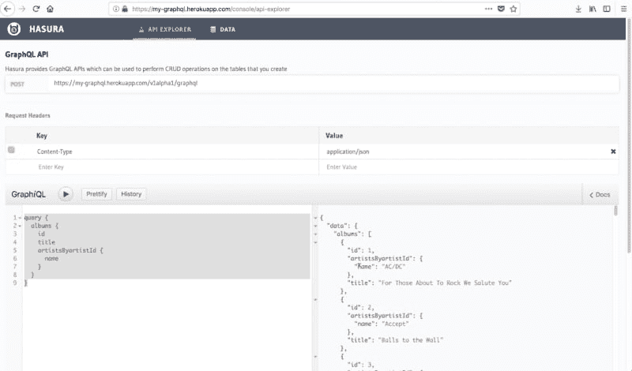

# Hasura GraphQL 引擎入门

> 原文：<https://dev.to/hasurahq/getting-started-with-the-hasura-graphql-engine-45nn>

<figure> 

<figcaption>任何 Postgres 数据库上的即时实时 graph QL API</figcaption>

</figure>

## TL；速度三角形定位法(dead reckoning)

1.  [介绍 Hasura GraphQL 引擎](#1)
2.  Heroku 上的基本[部署，并连接到现有的 Heroku Postgres 数据库。](#2)
3.  使用 Docker 的基本[部署，并与现有的](#3) [Postgres 数据库](https://hasura.io/learn/database/postgresql/introduction/)集成。
4.  使用[内置的访问控制](#4)，以及一个与 Auth0 集成的示例[。](#5)
5.  [社区资源](#6)

## 介绍 Hasura GraphQL 引擎

Hasura GraphQL 引擎是一个高性能的 GraphQL 服务器，它通过 Postgres 为您提供即时的实时 GraphQL APIs。

Hasura 帮助您构建由 Postgres 支持的 GraphQL 应用程序，或者使用 Postgres 为现有应用程序逐步迁移到 GraphQL。

Hasura 的一些功能包括:

*   使用**现有的实时数据库**:将它指向一个现有的 Postgres 数据库，立即获得一个现成的 GraphQL API
*   **实时**支持:通过使用订阅将任何 GraphQL 查询转换为实时查询。
*   **动态访问控制**可以和你的 auth 系统集成(比如:auth0，firebase-auth)。
*   内置对**强大查询**的支持:过滤、分页、模式搜索、批量插入、更新、删除突变。
*   一个**管理控制台 UI** &受 Rails 启发的模式迁移
*   **Postgres ❤️** :支持 [Postgres 类型](https://hasura.io/learn/database/postgresql/core-concepts/3-postgresql-data-types-columns/) (PostGIS/geo-location 等。)，将视图变成*图形*，用突变触发存储函数或过程。

<figure>

<figcaption>Hasura 管理控制台允许您创建和查看 Postgres 数据库中的表，并使用嵌入式 GraphiQL 接口查询它们。</figcaption>

</figure>

您可以在 Heroku 上部署 Hasura，或者使用 Docker 容器。

## Heroku 入门

下面是如何在 Heroku 免费层上进行 Hasura 的基本部署:

[https://www.youtube.com/embed/jUObpSl6dTE](https://www.youtube.com/embed/jUObpSl6dTE)

如果你已经在 Heroku Postgres 上运行，Hasura 也可以直接连接给你 GraphQL APIs。你可以在这里得到一步一步的说明[。](https://docs.hasura.io/1.0/graphql/manual/deployment/heroku/using-existing-heroku-database.html)

## Docker 入门

要让 Hasura GraphQL 引擎和一个新的 Postgres 实例作为 Docker 容器运行，只需遵循这里的三个步骤。这是在您的本地环境中安装 Hasura 的最简单的方法。

如果您想在现有的 Postgres 数据库上运行 Hasura，请遵循本指南[将 Hasura GraphQL 引擎部署为独立的 docker 容器](https://docs.hasura.io/1.0/graphql/manual/deployment/docker/index.html)并将其连接到您的 Postgres 实例。

在本视频中，我们将 Hasura 添加到现有的 Gitlab 实例中，并使用 GraphQL 查询它:

[https://www.youtube.com/embed/a2AhxKqd82Q](https://www.youtube.com/embed/a2AhxKqd82Q)

## 使用内置门禁系统

Hasura 附带了一个细粒度的动态访问控制系统，该系统还可以与现有的身份验证系统(如 Auth0 或自定义实现)集成。

例如，假设您希望与 Auth0: 集成

[https://www.youtube.com/embed/15ITBYnccgc](https://www.youtube.com/embed/15ITBYnccgc)

同样，您也可以将 Hasura 与其他身份验证提供者集成在一起。[该页面](https://docs.hasura.io/1.0/graphql/manual/auth/authentication/webhook.html#auth-webhook-samples)有一个不断更新的样本集成列表。

## 社区资源

Hasura 是一个开源项目，你可以在这里找到 repo [。如果有你想看到的特性，或者你想修复的错误，请在这里](https://github.com/hasura/graphql-engine)创建一个问题[(或者，提交一个拉请求😀).](https://github.com/hasura/graphql-engine/issues)

更多即时支持，还可以加入[哈苏拉不和谐](https://discord.gg/hasura)。