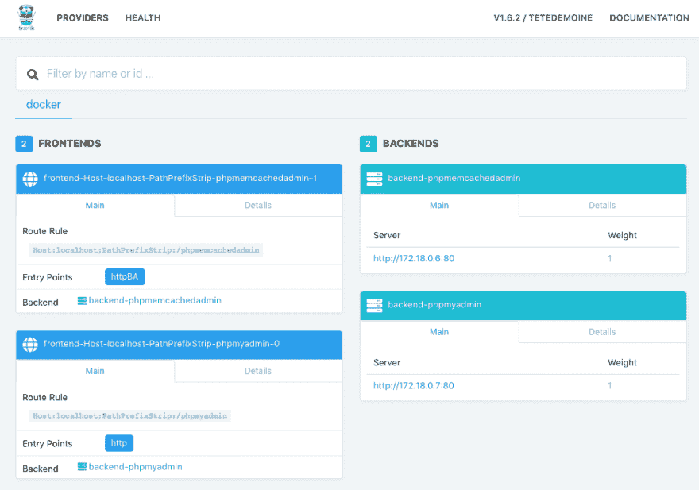

# 外壳中的幽灵——第一部分:本地主机

> 原文：<https://dev.to/ebreton/ghost-in-a-shell---part-i--localhost-5he9>

[T2】](https://res.cloudinary.com/practicaldev/image/fetch/s--T55qb7I---/c_limit%2Cf_auto%2Cfl_progressive%2Cq_auto%2Cw_880/https://manu.breton.ch/blog/conteimg/2018/05/featured-image-4.png)

来自 Ghost 基金会的最后一篇博客“[在 5 年和 300 万美元之后，这是我们从建造 Ghost](https://blog.ghost.org/5/) 中学到的一切”，让我大开眼界。

不仅仅是公司模式:一个基金会，它的所有者将**而不是**能够有意出售；但尤其是产品背后真正的爱:

> 当我们做任何事情时，你可以绝对肯定的是，我们的唯一目的是为了正确的理由，尽我们所能制造出最好的产品。

来自 WordPress，玩过 Jekyll 和 Hugo，只能上钩试试 Ghost。因此，我很高兴地投入到 doc 和安装过程中，以体验该产品。

# 目标

这个(短)系列博客的总体目标是能够在一个人心爱的服务器上容易地产生多个(独立的)幽灵博客。

它是为那些希望接触 Ghost 机制，并需要轻松地在这里或那里生成/删除博客的开发人员/运营人员设计的。

我不会去浏览博客本身的代码，无论是关于写博客的话题，还是创建一个主题。我将把我的分享限制在 Ghost 的安装端，以及如何简化/自动化这个过程。

当一天结束时，你会不会觉得自己像一个开发者，你可能会在 [Ghost(Pro)](https://ghost.org/) 服务中找到更好的价值，它会更好地托管你的博客，并保持它们运行和更新。

在这第一篇(几篇)博客中，我将关注在 localhost 上安装实例。目的是在本地建立一个沙盒，尽可能与我们最终的产品相似(希望如此)。

# 遵循正道

我继续前进，点击 Ghost 网站的[开发者>文档](https://ghost.org/developers/)链接，向下滚动一点，找到设置东西的预期入口:

[T2】](https://res.cloudinary.com/practicaldev/image/fetch/s--usKVF43_--/c_limit%2Cf_auto%2Cfl_progressive%2Cq_auto%2Cw_880/https://manu.breton.ch/blog/conteimg/2018/05/setup.png)

点击设置框后，我可以在“*我想在我自己的服务器上安装 Ghost*”和“*我想快速试用 Ghost*”之间进行选择。我认为我很幸运，我点击了第二个选项:[本地安装指南](https://docs.ghost.org/v1.0.0/docs/install-local)。

> TL；本地安装的 DR 版本，是不是想利用 Ghost CLI 的超级好用的命令:`ghost install local`

从那里我偶然发现了

*   我的环境的当前配置
*   它的节点版本
*   以及我对 JavaScript 栈知识的缺乏。

我很快切换到我的一台运行 Ubuntu 的服务器上，在那里调整所有版本也很痛苦...在我的 10 分钟时间盒结束时，我无法让 ghost-cli 正确执行自己。

我(很快)再次切换到 Docker 图像，这就对了...

# 谢谢 Docker！

DockerHub 上有一个官方镜像(即由 docker hub 工作人员维护的镜像)，即 [ghost](https://hub.docker.com/_/ghost/) ，其中有一些可用命令的示例。

回到我的 Mac 上，我创建了一个简单的 Makefile:

```
NAME?=ghost-local
DOMAIN?=localhost
PORT?=3001

dev: 
    # Simply start a ghost container making it directly available through $$PORT
    docker run --rm -d --name ${NAME} \
        -v $(shell pwd)/instances/${NAME}:/var/lib/ghost/content \
        -p ${PORT}:2368 \
        -e url=http://${DOMAIN}:${PORT} \
        ghost:1-alpine 
```

Enter fullscreen mode Exit fullscreen mode

> 如果/当复制粘贴时，确保使用制表符缩进(而不是空格)

运行`make`是让我的博客在 [http://localhost:3001](http://localhost:3001) 上运行的唯一办法

运行`NAME=another PORT=3002 make`在 [http://localhost:3002](http://localhost:3002) 上运行第二个博客

## Docker 参数

对上面传递的参数的快速解释:

*   `--rm`将在停止时移除容器，从而防止在生成具有相同${NAME}的新容器时发生冲突
*   `-d`将以守护模式运行容器
*   `--name ${NAME}`将命名您的容器。这是可选的，但是最好在下面一行中为容器和数据卷定义相同的名称...
*   `-v $(shell pwd)/instances/${NAME}:/var/lib/ghost/content`会将 Ghost 文件本地挂载到您的文件系统的子文件夹*中。/实例*。这将持久化数据(并允许您稍后偷偷进入代码)。
*   `-p ${PORT}:2368`在本地${PORT}上公开博客
*   `-e url=http://${DOMAIN}:${PORT}`告诉 ghost 将使用什么 URL 来访问它。

## 一点点的清理

在下一步之前，您可以用`docker stop ghost-local another`停止容器。但是，由于这些卷，数据不会丢失。

此外，下次你用同样的名字写博客时，还会用到它们。

# 谢谢 Traefik！

我最初的目标实现了，我去拿奖金...

## 奖金

第一个是能够在端口 80 上服务，并让博客位于不同的路径上。大约

*   [http://localhost/ghost-local](http://localhost/ghost-local)
*   [http://localhost/another-ghost](http://localhost/another-ghost)

## “生产-堆栈”伴侣

我有一个被戏称为[“prod-stack”的 repo](https://github.com/ebreton/prod-stack) ，它为我提供了这种路由功能(以及其他功能)。它基于 Traefik(和 NGinx ),允许我快速设置一个代理、一个 DB 和一个 memcached。

它在我的 Mac 上运行，因此对我来说这个解决方案是免费的。只能买了:)

亲爱的读者，我已经利用这个博客在 github 上打开了我的 prod-stack，并且我还对 Readme 做了一些整理(尽管它仍然是一个草稿，而不是真正的文档)。

下面是拉取和运行所有 docker 容器的快速通道设置:

```
$ git clone git@github.com:ebreton/prod-stack.git
Cloning into 'prod-stack'...
...
$ cd prod-stack
$ make
cp etc/traefik.toml.sample etc/traefik.toml
cp etc/db.sample.env etc/db.env
sed -i s/password/auMr9jsMrPnX0Oatb9j4yX2AYBN2jTQV/g etc/db.env
Generated etc/db.env
docker-compose pull
Pulling nginx-entrypoint ...
... 
```

Enter fullscreen mode Exit fullscreen mode

一旦日志稳定下来，您可以使用`Ctrl-C`返回命令行，使用`docker ps`检查堆栈是否正在运行。

Traefik 仪表板将在 [http://localhost:8081](http://localhost:8081) 上提供，用户*测试/测试*

[T2】](https://res.cloudinary.com/practicaldev/image/fetch/s--NYtdEDEa--/c_limit%2Cf_auto%2Cfl_progressive%2Cq_auto%2Cw_880/https://manu.breton.ch/blog/conteimg/2018/05/traefik.png)

如果你有好奇心去尝试，请不要犹豫反馈感谢[问题](https://github.com/ebreton/prod-stack/issues)。

## 添加`make traefik`

在确保 Traefik 正在运行之后，我将这个命令添加到 Makefile:

```
traefik:
    # Start a ghost container behind traefik on path $$NAME
    # Beware of --network used, which is the same one traefik should be using
    docker run --rm -d --name ${NAME} \
        -v $(shell pwd)/instances/${NAME}:/var/lib/ghost/content \
        -e url=http://${DOMAIN}/${NAME} \
        --network=proxy \
        --label "traefik.enable=true" \
        --label "traefik.backend=${NAME}" \
        --label "traefik.frontend.entryPoints=http" \
        --label "traefik.frontend.rule=Host:${DOMAIN};PathPrefix:/${NAME}" \
        ghost:1-alpine 
```

Enter fullscreen mode Exit fullscreen mode

这些参数与前面命令的参数相似，但有以下变化:

*   ＄{ PORT }不再公开，因为 Traefik 将处理路由
*   `--network=proxy`在 Traefik 运行的网络中启动容器(值`proxy`是任意的，来自“prod-stack”的默认配置)
*   Traefik 使用`--label key=value`来创建合适的路线

运行`make traefik`将会在[http://localhost/ghost-local](http://localhost/ghost-local)上运行一个博客

运行`NAME=another-ghost make traefik`在[http://localhost/another-ghost](http://localhost/another-ghost)上运行第二个博客

# 结论

**首先**，我想在我的本地机器上轻松生成幽灵博客，

*   [http://localhost:3001](http://localhost:3001)
*   [http://localhost:3002](http://localhost:3002)

原生文档并没有让我不耐烦，主要是因为我知道用 Docker 会很快很流畅。

**其次**，我想使用标准端口(一开始是 80)，并根据博客的路径路由它们，

*   [http://localhost/ghost-local](http://localhost/ghost-local)
*   [http://localhost/another-ghost](http://localhost/another-ghost)

它是由 Traefik(和我的“prod-stack”)免费提供的，我必须承认我在使用 make 时获得了很多乐趣。然而，对于开发人员来说，结果仍然是一个，肯定还没有准备好投入生产(尽管栈的名字是这样的)。

然而，由于 Let's Encrypt、DB 和一些管理这一切的简单方法，堆栈可以提供 HTTPs...我将在下一部分中深入探讨这个问题，以获得更健壮的东西...可能

*   [https://manu.breton.ch/blog](https://manu.breton.ch/blog)？