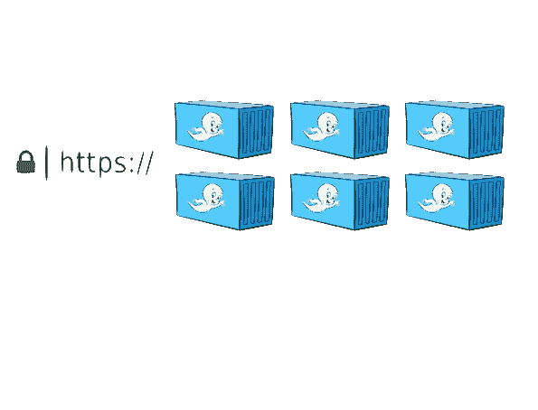

# 外壳中的幽灵——第二部分:HTTPs 是标准

> 原文：<https://dev.to/ebreton/ghost-in-a-shell---part-ii---https-is-the-norm-1jj4>

[T2】](https://res.cloudinary.com/practicaldev/image/fetch/s--xOR_M476--/c_limit%2Cf_auto%2Cfl_progressive%2Cq_auto%2Cw_880/https://manu.breton.ch/blog/conteimg/2018/05/image-blog-2-3.png)

概述上下文分三点:

*   本系列的目标是促进(自动)幽灵博客的产生
*   这篇博客是在第一部分——本地主机——之后写的，在那篇文章中，我关注的是一个人的电脑
*   目标受众是希望轻松构建/消除 ghost 实例的开发人员/运营人员

如果你感兴趣，请坐，不要拘束，我会尽力 1)让你阅读舒适，2)带你去一个神奇的世界，在那里鬼魂会凭空出现...3)给你一根会弹出的魔杖:

*   [https://my.domain.com/ghost-local](https://my.domain.com/ghost-local)
*   [https://my.domain.com/another-ghost](https://my.domain.com/another-ghost)
*   [https://my.domain.com/name-it](https://my.domain.com/name-it)

# 开胃品:回购

为了实现我的承诺，我将利用两个资源库:

1.  我已经在第一篇博客中介绍过了。这个回购将免费充当路由器和代理，包括与让我们加密的讨论
2.  空壳里的幽灵，基本上就是博客背后的素材。

通过克隆这两个人，并设置一些变量，你将能够和我们的老朋友`make`一起创建你的 ghost 实例

## 产品堆栈的快速设置

为了给你留一张去第一个博客的返程票，这里有几个必要的步骤来让*产品栈*启动并服务:

```
$ git clone git@github.com:ebreton/prod-stack.git
Cloning into 'prod-stack'...
...
$ cd prod-stack
$ make
cp etc/traefik.toml.sample etc/traefik.toml
cp etc/db.sample.env etc/db.env
sed -i s/password/auMr9jsMrPnX0Oatb9j4yX2AYBN2jTQV/g etc/db.env
Generated etc/db.env
docker-compose pull
Pulling nginx-entrypoint ...
... 
```

Enter fullscreen mode Exit fullscreen mode

一旦日志稳定下来，您可以使用`Ctrl-C`返回命令行，使用`docker ps`检查堆栈是否正在运行。

Traefik 仪表板将在 [http://localhost:8081](http://localhost:8081) 上可用，通过用户*测试/测试*的基本认证进行“保护”

## 快速设置空壳鬼

嗯，你应该已经在这里安装了 *make* 、 *docker* 和 *prod-stack* 。

你已经准备好用`make`在 [http://localhost:3001](http://localhost:3001) 上，或者用`make traefik`在[http://localhost/ghost-local](http://localhost/ghost-local)上创建一个博客了。

让我们看看如何做得更好！

> 从这里开始，用`make`运行容器将被称为**独立模式**。用`make traefik`运行一个容器将被称为 **traefik 模式**(多么有创意！)

# 启动器:环境变量

这两种模式使用环境变量，默认值在 [*中定义。env*](https://github.com/ebreton/ghost-in-a-shell/blob/master/.env) 文件。

如果你碰巧删除了这个文件，`make`会投诉

```
$ rm .env
$ make
.env file is missing
make: *** [check-env] Error 1 
```

Enter fullscreen mode Exit fullscreen mode

如果*。env* 被找到，你将能够用`make vars`
来检查它的值

```
$ make vars
# values that will be used to create the blog URL
  NAME=ghost-local
  PROTOCOL=http
  DOMAIN=localhost
  PORT=3001
  URI=ghost-local 
```

Enter fullscreen mode Exit fullscreen mode

更改实例的配置就是更改这些变量:

*   要么直接在*里。环境*文件
*   或者在您的环境中，例如在您的终端中(或在您的*中)添加`export NAME=blog`。bashrc* 当谈到其他一些随时间变化较小的变量时，例如*协议*
*   或者在命令行中，例如`PORT=3002 make`

```
$ export NAME=blog
$ PORT=3002 make vars
# values that will be used to create the blog URL
  NAME=blog
  PROTOCOL=http
  DOMAIN=localhost
  PORT=3002
  URI=ghost-local 
```

Enter fullscreen mode Exit fullscreen mode

这些变量应该是不言自明的，尤其是当你想到*协议://域:端口/URI* 时，但是拼写这些单词也无妨，所以这里有一个变量的快速总结，包括它们的默认值和使用它们的模式

| 可变的 | 描述 | 缺省值 | 由独立/ traefik 模式使用 |
| --- | --- | --- | --- |
| `NAME` | 对于 docker 容器和数据文件夹 | 幽灵-本地 | 两者 |
| `PROTOCOL` | 要构建 URL | 超文本传送协议（Hyper Text Transport Protocol 的缩写） | traefik |
| `DOMAIN` | 要构建 URL | 本地主机 | 两者 |
| `PORT` | 要构建 URL | Three thousand and one | 单独的 |
| `URI` | 要构建 URL | ${NAME} | traefik |

# 主菜:HTTPs

因此，我们希望在[http://my.domain.com/my-blog](http://my.domain.com/my-blog)上运行一个实例

我猜下面的命令不会让你感到太震惊:

`DOMAIN=my.domain.com URI=my-blog make traefik`

你可能会直接跳到[http **S**://my . domain . com/my-blog](https://my.domain.com/my-blog)的`PROTOCOL=https DOMAIN=my.domain.com URI=my-blog make traefik`

这很好，如果你也预料到了

*   DNS 配置，即 my.domain.com 已经指向您的服务器
*   traefik 配置，特别是如果您已经按照 prod-stack/ [README](https://github.com/ebreton/prod-stack/blob/master/README.md) 中的指示在 *traefik.toml* 文件中设置了自己的电子邮件地址。

> 顺便说一下，不要忘记更改用于访问 Traefik dashboard 的基本身份验证(在 prod-stack/ [README](https://github.com/ebreton/prod-stack/blob/master/README.md) 中也指出了这一点)

在这种情况下，您实际上可以在您的环境中运行`export PROTOCOL=https`和`export DOMAIN=my.domain.com`，并简单地运行`URI=my-other-blog make traefik`。

如果你没有预料到...良好的...你现在知道该怎么做了:

1.  在您的首选提供商处设置 DNS 配置
2.  在生产堆栈中调整 Traefik 配置
3.  通过向您的环境添加一些变量来简化您的过程

作为奖励，你还可以强制将 http 重定向到 http* *s* *(以及 raw【domain.com】的到*的[www.domain.com](http://www.domain.com)的*作为额外奖励)。这是由 Nginx 完成的，并通过 repo 中的[配置样本](https://github.com/ebreton/prod-stack/blob/master/etc/002-redirect-to-https.conf.sample)，您只需将其移动到*。/etc/conf.d* 文件夹，然后重启堆栈

```
$ cd /path/to/prod-stack
$ mv ./etc 002-redirect-to-https.conf.sample ./etc/conf.d/002-redirect-to-https.conf
$ make
... 
```

Enter fullscreen mode Exit fullscreen mode

做所有这些会

*   重定向[http://domain.com/blog](http://domain.com/blog)到[https://www.domain.com/blog](https://www.domain.com/blog)(这大大超出了我们最初的目标，但是嘿！那很好，免费，可选)
*   为[www.domain.com](http://www.domain.com)从 Let's Encrypt 获取证书
*   为博客服务

但是还有更多...

# 消化:帮手

我们已经使用了`make vars`，它列出了环境变量的值。

还有其他几个助手命令，如下表所示:

| 命令 | 描述 | 使用的变量 |
| --- | --- | --- |
| `make vars` | 显示所有环境变量的值 | 全部 |
| `make ps` | 显示正在运行的容器 | 没有人 |
| `make shell` | 连接到给定的虚拟容器 | 名字 |
| `make logs` | 跟踪给定 Ghost 容器的日志 | 名字 |
| `make stop` | 停止给定的虚拟容器 | 名字 |

这里没什么可说的，它们只是标准 docker 命令的方便包装器。

# 甜点(结论)

我必须承认，我对第二篇博客的结果相当满意。

我们现在只有一点点工作要处理:技术债务！

更严重的是，到目前为止所做的选择，对他们大多数人来说，都是捷径。

*   Ghost 正在开发模式下运行，
*   并且仍然使用 *sqlite* 。
*   更不用说没有监控也没有任何备份(顺便说一句，不要忘记你有 [Ghost(Pro)](https://ghost.org/features/) 来减轻你的负担)。

因此，这是一个非常大的红色免责声明非常合适的时间:

> 不要在生产中使用此堆栈

# 下一个？

我将在下一篇博客中更深入地研究 Ghost 设置:它的运行模式和数据库...