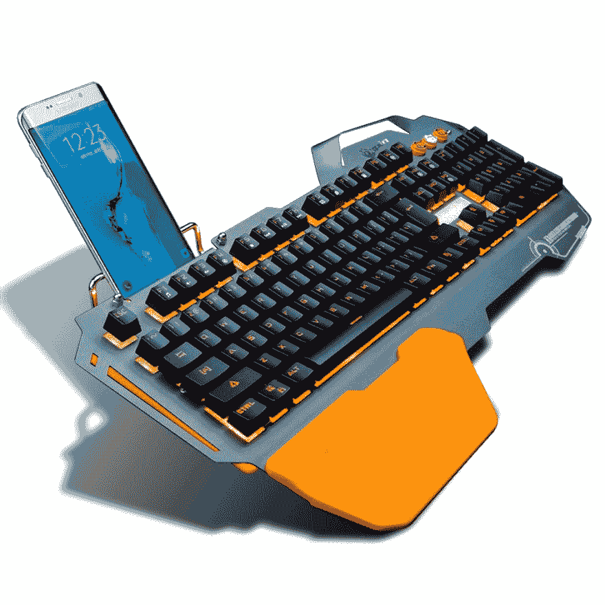

# 给程序员、软件工程师、编码员和开发人员的礼物

> 原文：<https://dev.to/joshualjohnson/gifts-for-programmers-software-engineers-coders-and-developers-4gdb>

又到了一年的这个时候了！你需要为你生命中的程序员、软件工程师或程序员找一份礼物！你可能在为计算机程序员寻找那些完美的小玩意，为程序员寻找最好的礼物，甚至为软件工程师寻找有趣的礼物。你找对地方了！我为程序员收集了一系列独特的礼物，相信会帮助你找到合适的礼物。

## 给 50.00 美元以下程序员的廉价礼物

[T2】](https://res.cloudinary.com/practicaldev/image/fetch/s--z0ZIKLHj--/c_limit%2Cf_auto%2Cfl_progressive%2Cq_auto%2Cw_880/https://ua1.us/wp-content/uploads/2018/02/leonardo-davinci-flying-machine-desk-accessory-195x300.jpg)

**莱昂纳多·达芬奇飞行机器桌配件**

所有的开发者时不时都需要灵感。莱昂纳多·达芬奇是一位杰出的工程师和问题解决者。世卫组织的发明被认为是遥遥领先于他们的时代。你还能得到比解决问题大师更好的灵感吗？这给了你的开发者为他们自己建造飞行器的机会，也给了他们一个糟糕的桌面配件，作为一个话题。

[在亚马逊上购买](http://amzn.to/2BIFEpI)

[T2】](https://res.cloudinary.com/practicaldev/image/fetch/s--ys2Ab-G---/c_limit%2Cf_auto%2Cfl_progressive%2Cq_auto%2Cw_880/https://ua1.us/wp-content/uploads/2018/02/crazy-aarons-thinking-putty.jpg)

**思考油灰**

Thinking putty 供需要帮助思考问题的开发人员使用。不得不说这几年真的帮了我不少。我甚至发现，当我觉得我需要让我的手忙起来的时候，这是非常放松的。这份礼物对每个开发者来说都是完美的。Thinking putty 已经成为开发文化的一部分。

[在亚马逊上购买](http://amzn.to/2opU1qH)

[T2】](https://res.cloudinary.com/practicaldev/image/fetch/s--4kip_H2p--/c_limit%2Cf_auto%2Cfl_progressive%2Cq_auto%2Cw_880/https://ua1.us/wp-content/uploads/2018/02/zen-garden-desk-accessory.jpg)

**禅园书桌配件**

如果你认识一个最近压力很大的开发人员。一个一直向你抱怨他们觉得工作时无法放松的人。他们被最后期限所困扰。或者他们只是很难适应他们的工作环境。这对他们来说是最完美的礼物。这个礼物会给他们的工作空间带来一点禅意。每隔一段时间，给他们 10 分钟的休息时间来逃避工作和在花园里玩耍的压力。

[在亚马逊上购买](http://amzn.to/2EUC5yx)

[T2】](https://res.cloudinary.com/practicaldev/image/fetch/s--eZdg26E1--/c_limit%2Cf_auto%2Cfl_progressive%2Cq_auto%2Cw_880/https://ua1.us/wp-content/uploads/2018/02/rubber-duck-debugger.jpg)

**橡皮鸭调试器**

橡皮鸭调试器可以追溯到很久以前的开发历史。它已经在开发人员的文化中根深蒂固。当一个开发人员很难找到他们代码中的 bug 发生在哪里时，他们通常不得不与别人讨论。只是为了互相交流想法。这个过程被称为“橡皮鸭”或“橡皮鸭调试”橡皮鸭是这种互动的象征。这只橡皮鸭是独一无二的，因为它是一只巨大的橡皮鸭，你生活中的开发者可以把它放在他的桌子上并自豪地展示。

[在亚马逊上购买](http://amzn.to/2sEIJUC)

[T2】](https://res.cloudinary.com/practicaldev/image/fetch/s--bTVoJWPL--/c_limit%2Cf_auto%2Cfl_progressive%2Cq_auto%2Cw_880/https://ua1.us/wp-content/uploads/2018/02/earth-medals-3d-metal-models.jpg)

**地球金属 3D 金属模型**

每隔一段时间，开发人员必须从他们正在进行的工作中休息一下。平均来说，一个开发人员每天要工作 10 多个小时来编写代码。然而，当他们休息的时候，他们的思维还在继续。有什么比给他们一个组装模型更好的方法来帮助他们放松呢？这将会给他们放松的机会，远离代码，但是仍然使用他们的头脑和双手来构建一些东西！

[在亚马逊上购买](http://amzn.to/2HAfSUZ)

## 给程序员的礼物从 50.00 美元到 100.00 美元

[T2】](https://res.cloudinary.com/practicaldev/image/fetch/s--hJEHYCyB--/c_limit%2Cf_auto%2Cfl_progressive%2Cq_auto%2Cw_880/https://ua1.us/wp-content/uploads/2018/02/7pin-backlit-gaming-keyboard.jpg)

**7 针 LED 背光游戏键盘**

作为一名开发人员，你会发现你大部分时间都花在键盘上。键盘是你用来创造奇迹的工具。当你是一名开发人员，你有一个糟糕的键盘，你几乎不能等待编码。这个键盘对大多数开发者来说是一个完美的礼物。

[在亚马逊上购买](http://amzn.to/2olzkNp)

[T2】](https://res.cloudinary.com/practicaldev/image/fetch/s--2HcrDXy2--/c_limit%2Cf_auto%2Cfl_progressive%2Cq_auto%2Cw_880/https://ua1.us/wp-content/uploads/2018/02/standing-desk-mat.jpg)

**站立书桌抗疲劳站立垫**

如果你知道一个开发者选择站着写代码，这对他们来说是最好的礼物。与简单的站立垫相比，波峰和波谷可以促进血液流动，锻炼更多的肌肉。平坦的站立垫或根本没有垫会导致疲劳。这个垫子将帮助你生活中的开发人员在得到站立锻炼的同时放松并更好地编码。

[在亚马逊上购买](http://amzn.to/2sO14im)

[T2】](https://res.cloudinary.com/practicaldev/image/fetch/s--5M9-LlGk--/c_limit%2Cf_auto%2Cfl_progressive%2Cq_auto%2Cw_880/https://ua1.us/wp-content/uploads/2018/02/ecosphere-closed-aquatic-ecosystem.jpg)

**全封闭水生生态系统**

对于那些在你生活中寻找和平与宁静的开发者来说，有什么比一个阴阳和谐相处的完全平衡的生态系统来维持这个完全封闭的系统的可持续发展更好的方式呢？

[在亚马逊上购买](http://amzn.to/2sLEM0w)

[T2】](https://res.cloudinary.com/practicaldev/image/fetch/s--32LAg89e--/c_limit%2Cf_auto%2Cfl_progressive%2Cq_auto%2Cw_880/https://ua1.us/wp-content/uploads/2018/02/miawheels-adjustable-and-foldable-scooter.jpg)

**MiaWheels 全可调可折叠踏板车**

这绝对是为那些在大型科技园区工作的移动开发人员准备的。这个学校非常适合从一栋建筑到另一栋建筑。这款滑板车可完全调节，以适应您的个人骑行风格，并采用可折叠设计，可随身携带。

[在亚马逊上购买](http://amzn.to/2CB28Wo)

## 价值 100 美元以上的昂贵礼物送给程序员

[T2】](https://res.cloudinary.com/practicaldev/image/fetch/s--T5QBcnP3--/c_limit%2Cf_auto%2Cfl_progressive%2Cq_auto%2Cw_880/https://ua1.us/wp-content/uploads/2018/02/lego-millennium-falcon-toy.jpg)

**乐高星球大战千年隼套装**

任何同时也是《星球大战》粉丝的开发者都会因为这份礼物而爱上你。是千年隼！还有它的乐高！这份礼物你会错在哪里？

[在亚马逊上购买](http://amzn.to/2BKhL0Y)

[T2】](https://res.cloudinary.com/practicaldev/image/fetch/s--IHtnoKMR--/c_limit%2Cf_auto%2Cfl_progressive%2Cq_auto%2Cw_880/https://ua1.us/wp-content/uploads/2018/02/halter-standing-desk.jpg)

**桌面站立桌**

如果你生活中的开发商曾经提到过立式办公桌，这款将是他们的完美之选。这款立式办公桌可放置在您现有的办公桌上，您可以在工作时将它抬起并站立起来。

[在亚马逊上购买](http://amzn.to/2oqmgq3)

[T2】](https://res.cloudinary.com/practicaldev/image/fetch/s--ien58knZ--/c_limit%2Cf_auto%2Cfl_progressive%2Cq_auto%2Cw_880/https://ua1.us/wp-content/uploads/2018/02/jelly-fish-aquarium.jpg)

**办公桌上的水母鱼缸**

如果你生活中的开发者也是一个享受自然之美的人，这是给他们的完美礼物。这个水母水族馆的设计完全符合你的心情。它具有超过 14 种不同颜色的 LED 背光。

[在亚马逊上购买](http://amzn.to/2Fnwui0)

[T2】](https://res.cloudinary.com/practicaldev/image/fetch/s--5Np9GzuM--/c_limit%2Cf_auto%2Cfl_progressive%2Cq_auto%2Cw_880/https://ua1.us/wp-content/uploads/2018/02/azio-retro-typewriter-inspired-mechanical-meyboard.jpg)

**Azio 复古打字机灵感机械键盘**

这份礼物非常适合你生活中痴迷于他们用来工作的工具的开发人员。这是一个模仿古董打字机的独特键盘。

[在亚马逊上购买](http://amzn.to/2CCKyRO)

给程序员、软件工程师、程序员和开发人员的礼物首先出现在 [UA1 实验室](https://ua1.us)。