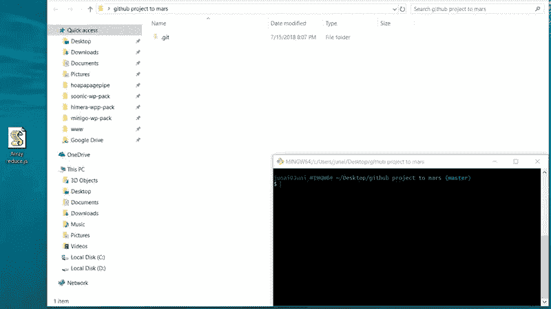
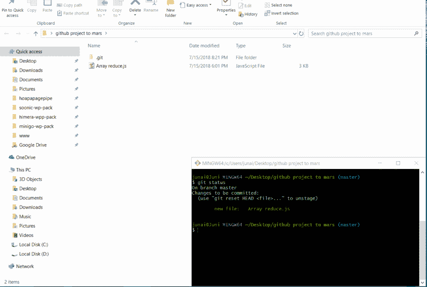

# git push origin master Git 和 Github——必须知道进行第一次提交的命令

> 原文：<https://dev.to/juni/git-and-github---must-know-commands-to-make-your-first-commit-333c>

你想学习 github，如何为开源做贡献？你不知道如何使用 github 的所有功能？

Git 环境是一个巨大的环境，当您必须处理更大的项目时，有时会变得非常复杂。现在几乎每个软件公司都使用 github 作为他们的第一个版本控制系统。

通过理解这些必须知道的命令，你会成为一个更好的网站开发者。

我假设您已经克隆了您的存储库，并准备好进行更改和推送。所以让我们开始吧。

### [git status]

检查是否已经有一些变更被 git 跟踪到了存储库中？`git status`将列出任何被更改的文件。

### [t1【去把它给我。∮你知道吗](#git-add-)

这是在对项目文件进行一些更改后运行的第一个命令。

该命令分析所有存储库文件，并将当前目录和所有子目录中所有修改过的和新的(未跟踪的)文件添加到暂存区(也称为索引)，从而准备将它们包含在下一个`git commit`中，我将在接下来的几行中解释。与中的模式匹配的任何文件。gitignore 文件将被`git add .`
 忽略

### 【git commit-am "您的提交消息"】

`git commit -am`将更改的文件添加到提交中，提交消息在引号内(在哈丁中)声明。使用选项-am 允许您在一个命令中为提交添加和创建消息。

* * *

The `-a` flag is used in git to add all the files to your commit and then you'll have to run another command where you write your commit message.

`m`标志用于将提交消息连接到您的提交，例如“git commit -m”您的消息。

* * *

使用此命令时要非常小心，因为它会将所有已更改的文件添加到您的提交中，这在许多情况下可能是您不需要的。您可以使用`git add`将单个文件添加到暂存区。例如，`git add file1.js image.png index.php`只将“file1.js”、“image.png”和“index.php”添加到暂存区，然后您可以用`git commit -m "your commit message"`创建一个提交。

因此`git commit -am "your commit message"`是你必须知道的第二个命令。

### 【git 推送原点主】

您已经准备好将您的第一个提交推送到远程存储库。这里的`push`用于推送您的更改，这需要一个分支来调用它`origin`，然后指定分支名称`master`(默认分支总是存在于任何存储库中。

所以`git push origin master`将获取您在上面几节中所做的本地提交，并将其上传到 github 上的远程服务器，以便其他人进行协作。

下一步是什么？现在你已经知道了如何进行第一次提交并将其推送到远程存储库，下面是你在开始团队项目工作时应该知道的一些其他命令。

### 【git 拉】

假设您现在是在同一个存储库上工作的另一个开发人员，那么您将不得不使用这个命令在进行任何提交之前获取您刚刚推送到存储库的变更。如果你不拉，GitHub 会对你大喊，你需要先拉。

### 【git check out-b " new-branch "】

当一个项目有多个开发人员在工作时，您会经常需要这个命令。它为您创建了一个新的分支，分支的名称用引号括起来(这里的另一个问题是分支的名称必须用连字符分隔)。

你可以在上面的 gif 中看到，在你运行命令的文件夹的名字后面写着(master)。该(主)是在每个存储库中创建的默认分支。如果您在命令行中看到(master ),那么“git check out-b”new-branch 将基于 master 分支创建一个新分支。换句话说，您签出的分支将基于您在命令行中看到的分支名称，因此要小心。

一旦您签出到一个分支，您将能够在一个分离的环境中工作，拥有来自 master 的所有文件。这样，如果你搞砸了什么，你只要回到主分支，你就可以拿回初始文件。许多专业开发人员喜欢这样工作。

## 期末笔记

以下是我们目前所学的要点:

| Git 作业 | 笔记 | Git 命令 |
| **状态** | 列出您已更改的文件以及仍需添加或提交的文件: | `git status` |
| **添加文件** | 将一个或多个文件添加到暂存(索引): | `git add <filename>`
T1】 |
| **提交** | 将更改提交到 head(但尚未提交到远程存储库): | `git commit -m "Commit message"` |
|  | 提交您使用`git add`添加的任何文件，并提交自那以后您更改的任何文件: | `git commit -a` |
| **按下** | 将更改发送到远程存储库的主分支: | `git push origin master` |
| **从远程存储库更新** | 将远程服务器上的更改提取并合并到您的工作目录中: | `git pull` |
| **分支机构** | 创建一个新分支并切换到它: | `git checkout -b <branchname>` |

要成为一名更好的软件开发人员，你需要学习这些工作流程，因为它们不仅能提高你的工作效率，还能增强你的工作方式的信心，让你知道如果你破坏了什么东西，它是可以恢复的。

## 还有最后一些提示

*   永远不要提交私钥/ api 密钥/证书。
*   集成 linters、代码检查器和美化器，如 js appeller(但首先要问你的团队是否使用它们)
*   使用描述性提交消息和分支名称。
*   为每个新功能创建一个分支，并在功能合并到主功能后删除该分支。
*   用相应的标签号标记您的提交消息(如果您在 agile 环境中工作)

[在 atlassian 上阅读更多关于一些高级 git 命令的信息](https://www.atlassian.com/git/tutorials/what-is-git)