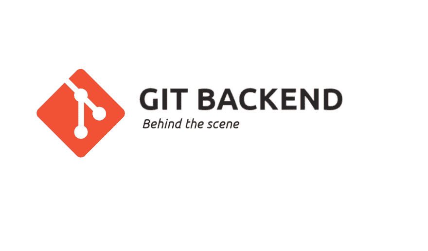
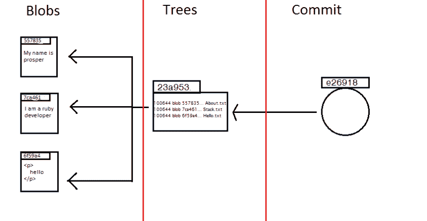
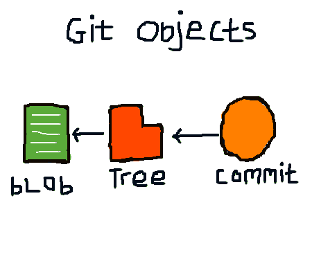
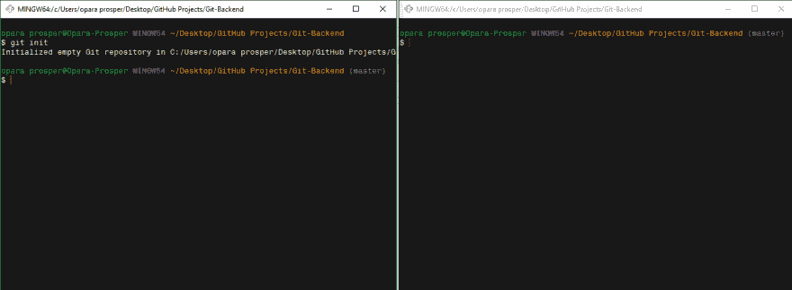

# GIT 后端(幕后)

> 原文：<https://dev.to/kodekage/git-backend-behind-the-scene-12l5>

[T2】](https://res.cloudinary.com/practicaldev/image/fetch/s--3iNiTlvX--/c_limit%2Cf_auto%2Cfl_progressive%2Cq_auto%2Cw_880/https://thepracticaldev.s3.amazonaws.com/i/nuaudq3junzpq0qanj88.png)

### 简介

我一直在挖掘 git 的内部结构，以便真正理解工具**的基础知识**，并深入了解 Git 如何做它所熟知的事情——**版本控制**。在本文中，我打算通过用简单的语言尽可能多地展示 git 的内部结构来与您分享我的发现，以便任何 Git 用户理解这个令人惊叹的工具背后的核心概念。

**重要的**:这篇文章不是 Git 材料的介绍，但是它的目的是向你展示 Git 是如何跟踪你的项目文件的不同版本的。如果您是 Git 新手，请跟随这个 [Git 文档](https://git-scm.com/doc)阅读该文档，或者下载 [progit](https://git-scm.com/book/en/v2) 获得 Git basic 的精彩解释，然后您可以回来阅读这篇文章以更深入地了解 Git。

### GIT 前端(你已经知道的)

你现在肯定知道 git 的核心是一个版本控制系统(VCS)，供人们使用(*现在我没有说开发人员，任何人都可以使用 git，例如我使用 Git 来跟踪这篇文章的各种版本，因为我在发布之前编写和修改了*)来跟踪项目文件(文档)的不同版本/迭代。

在 Git 之前，存在许多 VCS，例如 CVS、subversion、perforce，它们都被归类在**中央版本控制系统(CVCS)** 下，这意味着所有版本化的文件都存储在一个数据库中，每个其他人(客户端)都必须连接到中央数据库(所有提交都进入这个单一的数据库)。

另一方面，Git 属于**分布式版本控制系统(DVCS)** 的范畴，这意味着不存在人们必须将文件推送到或保存到的中央数据库。每台 Git 用户计算机都充当文件的数据库，这意味着每个从事该项目的人在他们克隆项目时，都在他们的本地计算机上拥有该项目的全部历史。那么这个数据库在你电脑的什么位置呢？我敢肯定，如果你使用 Git 检查你的项目目录，你只会看到你的项目的子目录和文件。我会揭露这个饭桶的魔力

### GIT 内部

[T2】](https://res.cloudinary.com/practicaldev/image/fetch/s--9fOU592e--/c_limit%2Cf_auto%2Cfl_progressive%2Cq_auto%2Cw_880/https://thepracticaldev.s3.amazonaws.com/i/qgug2w2ycdl9fq7obxcf.png)

使项目目录成为 git 存储库的是位于该项目目录中的隐藏的**`.git directory`**。**。git** 文件夹包含 git **对象数据库**，这是 Git 神奇之处。这个文件夹是有意隐藏的，以避免触动心灵的故事(文件变更，错误)，并保持 Git 的完整性。如果你是一个 windows 极客，你可以通过启用`show hidden files`功能来查看这个文件夹，[如果你不知道如何做这个](https://www.laptopmag.com/articles/show-hidden-files-windows)，跟随这个教程，如果你是一个 mac 用户，[这里是你的链接](https://ianlunn.co.uk/articles/quickly-showhide-hidden-files-mac-os-x-mavericks/)。

**。git 目录**包含了一些其他的目录和文件，看起来像这样:

```
- .git/
  - hooks
  - info/
    - exclude
  - objects/
    - info
    - pack
  - refs/
    - heads
    - tags
  - config
  - description
  - HEAD 
```

Git 能够有效地管理项目的不同版本，因为它被设计用来跟踪文件内容，并将跟踪的内容作为**对象**存储在**对象数据库**中。

### 对象目录

Git 作为一个内容可寻址文件系统工作，这意味着 Git 使用一个`key:value`对格式存储它的文件(对象),其中键是 Git 存储内容(称为对象)的地址，内容是值。

Git 使用 **SHA-1(安全散列算法)**为每个存储对象生成一个唯一的密钥。SHA-1 生成 40 个字符长的字母数字字符，以引用存储在对象数据库中的对象，例如`f7de3a39b026386f8f826bc230a112ae792ec035`

这个**对象目录**是 Git 存储每个对象的位置，即**对象目录是对象数据库**。

[T2】](https://res.cloudinary.com/practicaldev/image/fetch/s--Mg5Jgj4W--/c_limit%2Cf_auto%2Cfl_progressive%2Cq_auto%2Cw_880/https://thepracticaldev.s3.amazonaws.com/i/lxhve46c3heu4g9ifv5e.png)

Git 在对象数据库(对象目录)中存储了三种主要的对象类型，它们是:

*   blob 对象 - Git 将文件内容存储为 blob。值得注意的是，blobs 不包含文件名或文件模式，而是 Git 正在版本化的文件的严格内容。SHA-1 用作 blob 内容(值)的文件名(键)。

*   树对象 -树对象就像目录，它们包含 blob 对象和其他树对象。树对象是您上次提交时工作目录的快照。

*   **提交对象** -提交对象基本上存储了当前检出分支的最后一次提交的细节(这被称为**父**),一个指向提交的当前树对象的指针，提交者的名字，以及实际的提交消息。

Git 对象类型被组织在 git 在试图存储对象时自动创建的子目录中。子目录使用 SHA-1 的前两个字符命名，对象存储在使用剩余的 38 个哈希键命名的文件中。

```
 Objects/
    f7/
      de3a39b026386f8f826bc230a112ae792ec035 
```

## 付诸行动

在这一节中，我们将做一些版本控制，亲眼看看 Git 对象是如何被创建并存储在对象数据库中的，我相信在这一节结束时，一切都会变得更有意义。

我将与 **git bash** 合作进行演示。

*   打开您的终端/cmd 和 Cd，进入您选择的任何目录，键入命令`$ git init`创建一个空的 Git 存储库。在我的例子中，我得到了消息`Initialized empty Git repository in C:/Users/opara prosper/Desktop/GitHub Projects/Git-Backend/.git/`,你肯定会得到一个类似的消息，但是有不同的目录。

*   打开一个新的终端，将 cd 放入项目目录中，并将两个终端并排放置，这将使我们能够跟踪。git 目录。

[T2】](https://res.cloudinary.com/practicaldev/image/fetch/s--Wd6pmkPe--/c_limit%2Cf_auto%2Cfl_progressive%2Cq_auto%2Cw_880/https://thepracticaldev.s3.amazonaws.com/i/th4anb0k8uz80k850w5k.PNG)

*   创建一个新的文件`example.txt`来包含`Hello world`作为它的内容——你可以通过在你的终端上输入下面的命令`cat > example.txt`来做到这一点，然后在新的一行上输入内容，保存并使用 **CTRL D** 退出

*   在你打开的第二个终端上输入这个命令`find .git/objects -type f`你将不会得到任何响应，因为在 objects 目录中没有任何东西，但是很快就会改变。

*   现在，在我们最初打开的第一个终端上，键入命令`git add example.txt`将文件移动到暂存区域。

*   导航回您打开的第二个终端并键入`find .git/objects -type f`。现在你会得到一个类似于这个`.git/objects/70/c379b63ffa0795fdbfbc128e5a2818397b7ef8`的响应，你的会有所不同，因为 SHA-1 为 git 对象创建了随机键。这意味着一个对象已经被添加到 Git 的对象数据库中，但是我们还不知道那是什么。如果你输入`git cat-file -p 70c379b63ffa0795fdbfbc128e5a2818397b7ef8`，你会注意到 *hello world* 被返回，但是文件名 example.txt 不在其中，这加强了我关于 Git 是一个内容跟踪器的声明。

当您运行`git add example.txt`命令时，git 抓取了 eample.txt 中的内容，并将其压缩到 Git 对象数据库中，并使用 SHA-1 为其提供了唯一的标识符**70c 379 b 63 FFA 0795 fdbfbc 128 e5a 2818397 b7ef 8**。为了检查对象的类型，这是键入下面的命令`git cat-file -t 70c379b63ffa0795fdbfbc128e5a2818397b7ef8`，在我们的例子中，返回一个*斑点*，意味着新创建的对象是一个斑点对象。

*   回到我们的第一个终端，键入下面的命令`git commit -m "I created an example.txt file"`来提交您的更改(即，将您的更改从临时区域移动到。git 目录)。

*   导航回到第二个终端并键入`find .git/objects -type f`，这一次您会注意到两个新的对象被添加到 objects 目录中，在我的例子中；

```
.git/objects/70/c379b63ffa0795fdbfbc128e5a2818397b7ef8
.git/objects/7a/68edc879868601bf427c8c2238bbc8752c33b3
.git/objects/f2/9f2741b30ecc1529da7dbae4aff9974b69e271 
```

让我们检查这些对象，抓取任何对象并键入`git cat-file -t 7a68edc879868601bf427c8c2238bbc8752c33b3`。在我的例子中，`commit`被返回，这意味着这个对象是一个**提交对象**，要查看这个对象，将`-t`标志从我们之前的命令更改为`-p`，即`git cat-file -p 7a68edc879868601bf427c8c2238bbc8752c33b3`，你会得到如下所示的响应；

```
tree f29f2741b30ecc1529da7dbae4aff9974b69e271
author OPARA-PROSPER <oparaprosper79@gmail.com> 1541583214 +0100
committer OPARA-PROSPER <oparaprosper79@gmail.com> 1541583214 +0100

I created an example.txt file 
```

让我们仔细看看这意味着什么。第一行*tree f 29 f 2741 b 30 ECC 1529 da 7 DBA E4 aff 9974 b 69 e 271*是一个指针，指向我们上次提交时创建的第二个对象(该对象始终是一个树对象)，第二和第三行包含有关提交者的信息，最后一行包含提交消息。

*   现在我们将检查使用`git cat-file -t f29f2741b30ecc1529da7dbae4aff9974b69e271`在提交的同时创建的第二个对象。返回一个`tree`响应，这意味着该对象是一棵树，我们可以通过将`-t`标志改为`-p`来查看该树对象的内容，即`git cat-file -p f29f2741b30ecc1529da7dbae4aff9974b69e271`，这将返回一个如下所示的响应；

```
100644 blob 70c379b63ffa0795fdbfbc128e5a2818397b7ef8    example.txt 
```

回想一下我的解释，树对象就像包含 blobs 和其他树的目录，它们也是您上次提交时工作目录当前状态的快照。上次提交时，我们工作目录中唯一的文件是 *example.txt* 文件，这是我们的树对象包含的内容，但这次是在我们运行 git add 命令来存放我们的更改时创建的 blob 对象。这是因为 Git 不跟踪文件，而是跟踪内容。

我们的树对象包含关于文件模式(100644，这意味着这是一个普通文件)、对象类型、SHA-1 键和从中提取内容的文件名的信息。

## 总结起来

您进行的更改越多，存放和提交的新 blobs、tree 和 commit 对象就越多，这些对象将在对象数据库中被创建和引用。

总之，这实际上就是 Git 如何在幕后跟踪我们对项目文件所做的更改。