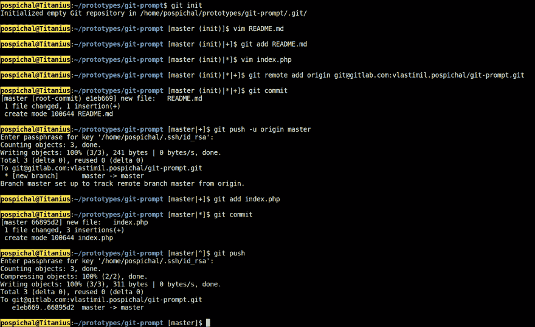

# Bash 中的 Git 提示符

> 原文：<https://dev.to/vlasales/git-prompt-in-bash-47ph>

## 尽在一画中

[T2】](https://res.cloudinary.com/practicaldev/image/fetch/s--jSbHrwQr--/c_limit%2Cf_auto%2Cfl_progressive%2Cq_auto%2Cw_880/https://thepracticaldev.s3.amazonaws.com/i/lm7u82xwzedxk2jay1mr.png)

## 源代码

```
# ~/.bashrc

__git_status() {
    STATUS=$(git status 2>/dev/null |
    awk '
    /^On branch / {printf($3)}
    /^You are currently rebasing/ {printf("rebasing %s", $6)}
    /^Initial commit/ {printf(" (init)")}
    /^Untracked files/ {printf("|+")}
    /^Changes not staged / {printf("|?")}
    /^Changes to be committed/ {printf("|*")}
    /^Your branch is ahead of/ {printf("|^")}
    ')
    if [ -n "$STATUS" ]; then
        echo -ne " [$STATUS]"
    fi
}

PS1='\[\033[07;33;01m\]\n\u@\h\[\033[00m\]:\[\033[01;34m\]\w\[\033[00m\]$(__git_status)\$ ' 
```

那都是乡亲们！