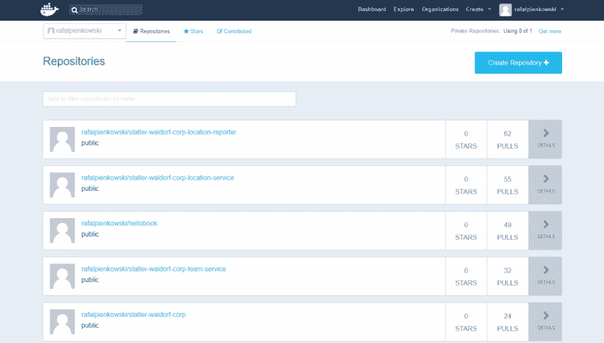
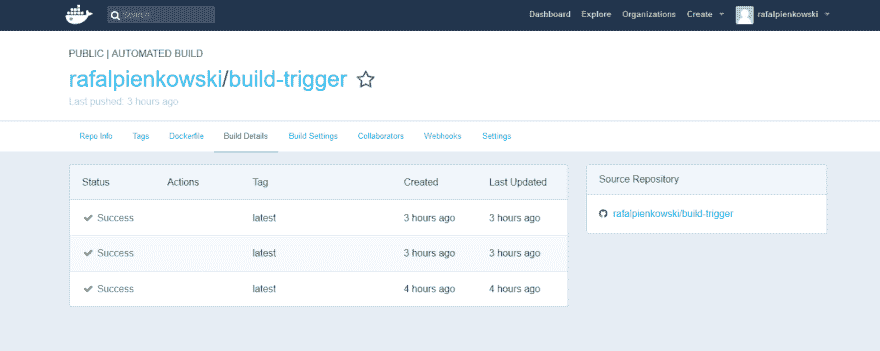

# GitHub & Docker Hub 合理的婚姻

> 原文：<https://dev.to/rafalpienkowski/github--docker-hub-a-reasonable-marriage-373k>

前段时间我发表了一篇关于用 [Wercker](https://wercker.com/) 配置 CI/CD 的文章。

 [## 带 Wercker 的 CI/CD

### rafal Pienkowski 3 月 9 日 18 时 15 分阅读

#productivity #devops #docker #deployment](/rafalpienkowski/cicd-with-wercker--51k)

现在我决定尝试 Docker Hub 的自动构建功能。我得说我真的很惊讶。这很简单，而且在某些情况下很有用。

“自动构建”选项隐藏在“创建”按钮之后，但是创建新的 Docker Hub 自动构建的整个过程非常简单，可以在下图中看到:

[T2】](https://res.cloudinary.com/practicaldev/image/fetch/s--58mk4Q9r--/c_limit%2Cf_auto%2Cfl_progressive%2Cq_66%2Cw_880/https://raw.githubusercontent.com/rafalpienkowski/resources/master/github-docker-hub-marriage/creation.gif)

*注意:*如您所见，还有一个选择，也可以采用位存储库。

该过程以自动构建而不是存储库结束。与存储库相比，自动构建包含更多选项:

*   我们可以看到使用了什么 docker 文件
*   构建细节我们有构建的历史。我们还可以查看每个构建的细节。另外，我们有一个到 GitHub 库的链接，里面有源代码。
*   构建设置我们可以根据源代码分支更改图像的标签，手动触发构建，或者根据源代码中的标签设置构建触发器。

[T2】](https://res.cloudinary.com/practicaldev/image/fetch/s--pf7z9D6g--/c_limit%2Cf_auto%2Cfl_progressive%2Cq_auto%2Cw_880/https://raw.githubusercontent.com/rafalpienkowski/resources/master/github-docker-hub-marriage/dashboard.png)

默认情况下，每次提交 GitHub 上的主分支后，都会触发构建。开始构建和将图像发布到我们的存储库中需要一些时间。自动化构建的整个设置以正确的 docker 文件创建结束。在提交到 GitHub 存储库之前，可以在本地机器上测试 Dockerfile。

在我看来，从 GitHub 复制 README.md 文件，粘贴到 Repo info 标签页的完整描述中，才是杀手级功能。我喜欢它。

### 是否涵盖了所有需求？

简单的答案是否定的。很抱歉，但在我看来，该功能并没有满足生产就绪解决方案的所有期望。例如，我们无法建立一个包含构建、单元和集成测试的 CI 工作流，并部署到一个如今至关重要的存储库中。

### 功能专为谁而设？

我认为对于任何概念证明(PoC)项目，一个可以单独开发或在我们需要准备一些专用 docker 图像供我们使用的情况下的附带项目。

### 最后一句话

这是我的主观看法。你可以不同意我的观点。我也对你的意见感兴趣，尤其是如果你利用了那个功能的话。如果你对这个功能的使用有任何其他想法，请在评论中给出你的建议。

干杯。