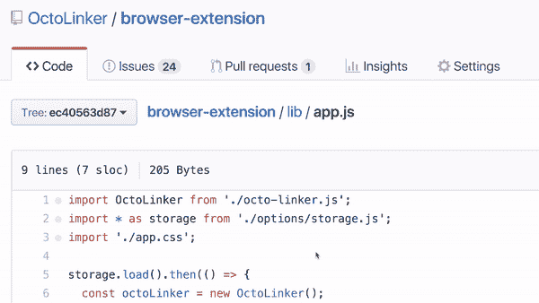

# GitHub 扩展提高您的生产力

> 原文：<https://dev.to/theoutlander/github-extensions-to-boost-your-productivity-4d02>

以下是我使用的 GitHub 扩展。它们将帮助您提高在 GitHub 上的工作效率。请在评论中分享你最喜欢的扩展。

* * *

**[八叉树](https://github.com/buunguyen/octotree)通过左侧面板**
 ，可以在浏览器内轻松浏览源代码

* * *

**[【github-dashboard】](https://github.com/muan/github-dashboard)提供了过滤 Github.com 活动仪表板上事件的能力**

* * *

**[Sourcegraph](https://about.sourcegraph.com/) 允许在代码**
 内进行定义和查找引用

* * *

**[Octolinker](https://github.com/OctoLinker/OctoLinker) 通过将模块导入转换成可点击的链接，可以更有效地浏览代码，这样你就可以很容易地查看它们的源代码**

* * *

**[github-repo-size](https://github.com/harshjv/github-repo-size) 在 GitHub**
 上显示存储库大小和单个文件大小

* * *

**[refined-github](https://github.com/sindresorhus/refined-github) 简化了 github 界面，增加了几个有用的功能**

不再有最近推动树枝引起的跳跃
(它们被移到一边)

反应头像显示谁对评论
 做出了反应

该选项用于在合并一个 PR 时等待检查

可点击的问题引用和拉式请求

链接到问题的关闭提交或拉取请求

* * *

ZenHub 是管理 GitHub 问题的一个更好的方法。它支持多重回购板、Epics 和报告——都在 GitHub 中

[T2】](https://res.cloudinary.com/practicaldev/image/fetch/s--gtb3C6tl--/c_limit%2Cf_auto%2Cfl_progressive%2Cq_auto%2Cw_880/https://lh3.googleusercontent.com/jp91d0gW7D9wvI7aeXtIuFLXiYq_kTMC_lZv80t9FTUE5OlmM5Rzlo8A4Ek-HC8j3mLLKJby1A%3Dw640-h400-e365)

* * *

**[github-npm-stats](https://github.com/katranci/github-npm-stats) 在 GitHub repo 上显示 npm 下载统计**

[T2】](https://res.cloudinary.com/practicaldev/image/fetch/s--a_LOqnLQ--/c_limit%2Cf_auto%2Cfl_progressive%2Cq_auto%2Cw_880/https://lh3.googleusercontent.com/0gjsw1qwSb7Dif3RL02oPcTsx2NjlkKe9NOjJL86HzyVulp7akmi2ksSuJHgXj5dJ23lP2Pa%3Dw640-h400-e365)

* * *

**[npmhub](https://github.com/npmhub/npmhub) 显示 npm 对 GitHub repos 的依赖**

[T2】](https://res.cloudinary.com/practicaldev/image/fetch/s--zFTTBojl--/c_limit%2Cf_auto%2Cfl_progressive%2Cq_auto%2Cw_880/https://raw.githubusercontent.com/npmhub/npmhub/master/assets/npm-hub-screenshot.png)

* * *

**[等距贡献](https://github.com/jasonlong/isometric-contributions)渲染 GitHub 贡献图的等距像素艺术版**

[T2】](https://camo.githubusercontent.com/f32bf0587ce69c563b1f06e13dccffa7c74e4a2f/687474703a2f2f636c2e6c792f696d6167652f316a306a336c31523164325a2f636f6e74656e74)

* * *

#### 如果这个扩展列表有帮助，❤️ it 和[在 Twitter 上关注我](https://twitter.com/intent/follow?screen_name=theoutlander)。

* * *

 [## 如何构建自己的 React 样板文件

### 尼克卡尼克 1 月 22 日 1813 分钟阅读

#javascript #webdev #node #react](/theoutlander/build-your-own-react-boilerplate-4b8l)

* * *