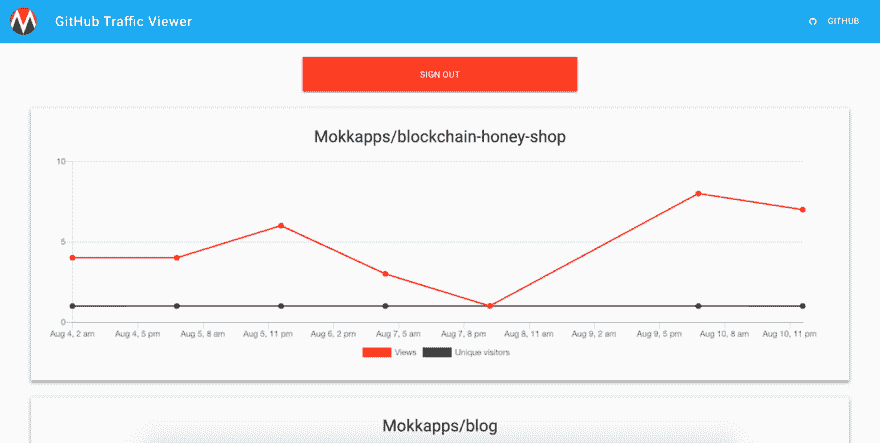

# GitHub 流量查看器

> 原文：<https://dev.to/mokkapps/github-traffic-viewer-1lg1>

我建立了一个网站，可以查看一个账户的所有 GitHub 回购流量视图:

[https://github-traffic-viewer.netlify.com/](https://github-traffic-viewer.netlify.com/)

源代码可从 [GitHub](https://github.com/Mokkapps/github-traffic-viewer-website) 获得。

我的动机(摘自[我的 GitHub traffic CLI 博文](https://dev.to/mokkapps/my-first-npm-package-github-traffic-cli-3le0)):

> 自从我在 GitHub 上发布了我的第一个项目以来，我真的很喜欢查看我的存储库上的流量。看到有多少人访问或克隆我的库真的很有趣。
> 
> 不幸的是，点击所有可用的存储库要花费很多时间，我正在寻找一种更优雅的方式。

用过的技术:Gatsby.js，Netlify，Firebase，React.js

[T2】](https://res.cloudinary.com/practicaldev/image/fetch/s--LwU6UTs---/c_limit%2Cf_auto%2Cfl_progressive%2Cq_auto%2Cw_880/https://s15.postimg.cc/x7qsfmga3/Screen_Shot_2018-08-17_at_22.15.07.png)

让我知道你对它的看法，以及它是否对你有帮助！