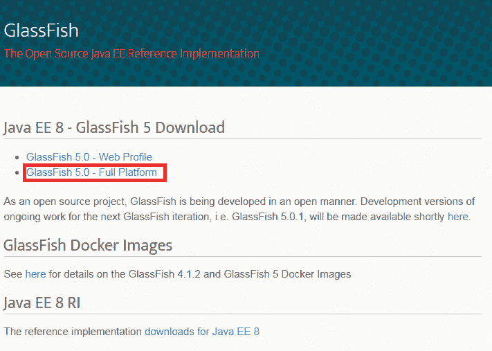
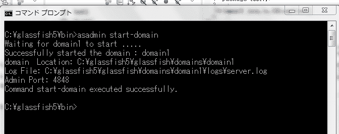
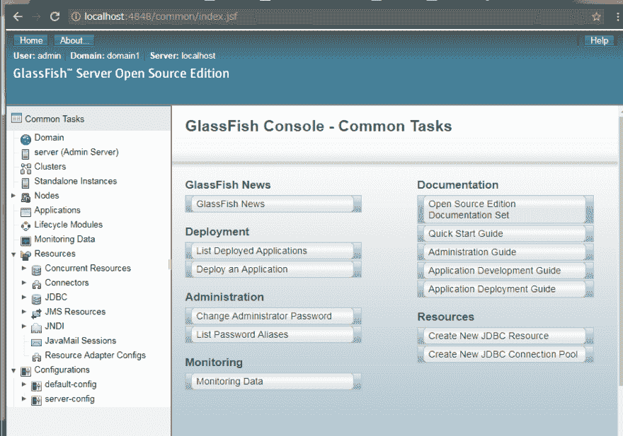
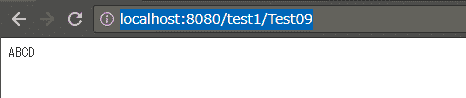

# 关于安装 glasshfish 和部署示例 APP 应用程序的介绍

> 原文：<https://dev.to/programmingmonky/glasshfish-f7h>

本文章将引入具有代表性的 Java APP 应用服务器 GlassFish 并部署样例项目。

[进入 https://javaee.github.io/glassfish/download](https://javaee.github.io/glassfish/download)
，进行 glassfish 的下载。

[https://thepractical dev . S3 . Amazon AWS . com/I/wak r53 w6 mxz 6 B1 O1 XB 22 . png](https://thepracticaldev.s3.amazonaws.com/i/wakr53w6mxz6b1o1xb22.png)

这次选择了全平台。

[T2】](https://res.cloudinary.com/practicaldev/image/fetch/s--edPS8i4W--/c_limit%2Cf_auto%2Cfl_progressive%2Cq_auto%2Cw_880/https://thepracticaldev.s3.amazonaws.com/i/ob69fi0osecd9mt2tcfn.png)

C 解压到正下方后，移动到 C:\glassfish5\bin，执行用于启动服务器的命令 as admin start-domain

```
cd C:\glassfish5\bin
asadmin start-domain 
```

Enter fullscreen mode Exit fullscreen mode

[T2】](https://res.cloudinary.com/practicaldev/image/fetch/s--eSaRpg6e--/c_limit%2Cf_auto%2Cfl_progressive%2Cq_auto%2Cw_880/https://thepracticaldev.s3.amazonaws.com/i/4xskh1x0mngx07x097un.png)

服务器启动后用浏览器访问
[http://localhost:4848](http://localhost:4848)
。
如果正确启动，将显示 glassfish 的菜单

[T2】](https://res.cloudinary.com/practicaldev/image/fetch/s--rbBffoID--/c_limit%2Cf_auto%2Cfl_progressive%2Cq_auto%2Cw_880/https://thepracticaldev.s3.amazonaws.com/i/btfaow074rst9knribk5.png)

配置在制作好的 war 文件
c:\ glassfish5\ glassfish\domains\domain1\ auto deploy
中，从
浏览器中选择

访问时，将显示 APP 应用程序。

[T2】](https://res.cloudinary.com/practicaldev/image/fetch/s--Xa83zVxv--/c_limit%2Cf_auto%2Cfl_progressive%2Cq_auto%2Cw_880/https://thepracticaldev.s3.amazonaws.com/i/02eps407e6kbpylo7biz.png)

已成功访问。

通过此步骤，您可以将自己创建的 APP 应用程序上载到服务器，并通过浏览器进行查看。