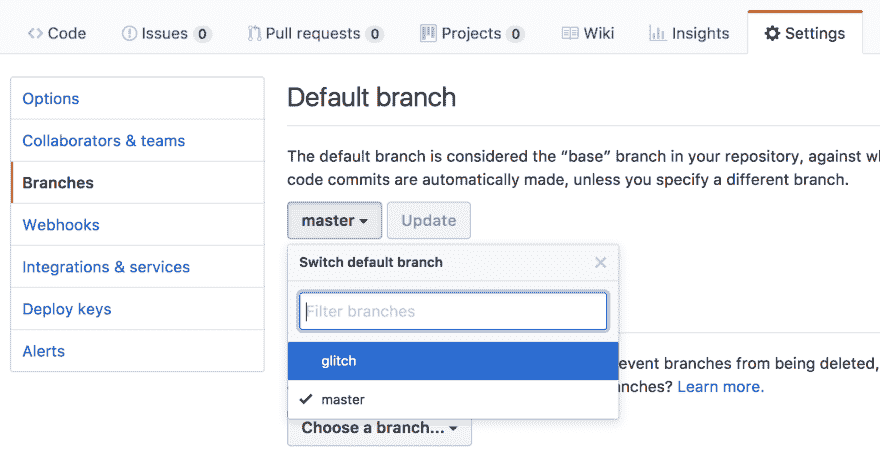

# 格林奇:你不在矩阵里

> 原文：<https://dev.to/jesswest/glitch-youre-not-in-the-matrix-mgj>

*最初出现在 [JavaScript 一月](https://www.javascriptjanuary.com/blog/glitch-youre-not-in-the-matrix)，谢谢[艾米丽](https://twitter.com/editingemily)！*

# [T1】简介](#intro)

你好，我是杰西卡！感谢您花时间阅读我的帖子。🤗我热爱我的工作。为什么？因为我每天都在构建应用程序，写关于它们的文章，然后旅行去谈论它们。我是 Algolia 的开发者拥护者，Algolia 是一个超快的托管搜索 API。大多数时候，我用 JavaScript 开发 web 应用程序，因此我遇到了一些非常酷的事情，比如 [Glitch](https://glitch.com/) 。

# 什么叫小故障

你们中的一些 Javascript 爱好者可能听说过这个叫做 Glitch 的东西，在过去的一年里，它一直在互联网上流传。Glitch 将电力回馈给用户，用于现实生活中的例子；它是一个在线集成开发环境，具有 GitHub 中的协作能力和社区功能。如果您还没有机会使用它，我强烈建议您尝试一下。

[T2】](https://res.cloudinary.com/practicaldev/image/fetch/s--xgUm6GHm--/c_limit%2Cf_auto%2Cfl_progressive%2Cq_66%2Cw_880/https://media.tenor.cimg/036e534a4a45a39713e439f67de3463a/tenor.gif)

Glitch 的优点是减少了启动和运行代码样本所需的时间。很多次，你都有了一个想法，想用一个功能向某人展示，只需要给他们发送单独的代码片段，这些代码片段只是为了*而不是*表达你的观点。然后，你不得不来回发消息，试图找到一个时间来分享屏幕，这样你就可以分享你在本地的东西。即使这样，用户也不知道你的示例在*他们的*计算机上应该是什么样子，所以也许你把代码库发给他们，他们会派生出自己的副本，然后*他妈的*他们用的是 Yarn，你用的是 NPM，他们的版本比你的旧，或者他们没有你有的环境变量。由于在这方面已经花费了太多时间，您感到沮丧，于是通过安全通道将您的 API 密钥发送给他们，但是他们没有。正确设置 gitignore，这样您的 API 键会意外地提交到一个随机的 GitHub repo 中。你哭泣。他们也是。没人开心。

[T2】](https://res.cloudinary.com/practicaldev/image/fetch/s---axzTwpf--/c_limit%2Cf_auto%2Cfl_progressive%2Cq_66%2Cw_880/https://78.media.tumblr.com/6d8094ea45e9bb248c03b65ed45636cd/tumblr_nmgfr7FvDt1t9sksvo1_250.gif)

格林奇改变了这一切。由于其在线 IDE 功能，它允许其他 Glitch 用户实时查看您的示例代码。他们可以使用相同的代码与你配对，而不需要依赖 Hangouts、Zoom、Skype、JoinMe 或任何你正在使用的屏幕共享软件，在这个过程中不会模糊屏幕和丢失人。

您可以看到每个用户在项目中的位置，并且很容易进行协作，即使是在没有视频的消息平台上。

太神奇了。我们以前是怎么生活的？

Glitch 允许你创建无限的项目，一次点击就可以从 GitHub 导入现有的项目，最有趣的是“重新混合”应用程序。Remixing 是一个极好的类似“克隆”的功能，它允许用户使用别人已经建立的东西，插入他们自己的密钥，并在初学者模板的基础上建立。

你可以查看更多关于为什么[毛刺是直接从鱼的嘴里开始](https://blog.fogcreek.com/coding-dinosaurs-newbs-rockstars/)的信息。

现在你知道了*什么是*故障，让我们深入了解一些有助于工作流程的事情。

# 本地工作 vs 毛刺

Glitch 使用的很多功能都是在启动和运行最初的协作，然而，有时您只是想要一点版本控制和一些可靠的表情符号提交消息。好消息是，Glitch 有一个很好的*导入*和*导出*函数供您使用。

[T2】](https://res.cloudinary.com/practicaldev/image/fetch/s--LsUkPUIO--/c_limit%2Cf_auto%2Cfl_progressive%2Cq_auto%2Cw_880/https://gist.githubusercontent.com/JessicaG/024d85342b16731c0c91cb18ddc82428/raw/b19a39258beef678bc2641229df9fef7fcd5e8db/glitch_import-export-gh.png)

如何开始实际上取决于你对启动项目的偏好。你可以在本地启动它，然后将你的项目导入 Glitch，或者看看他们开箱后做了什么，然后导出到 GitHub。

然而，在这个初始项目提交之后，您需要记住 git 工作流的一些事情。

## 遵循 Git 工作流程

Glitch 正在跟踪您的所有项目和版本，但是目前没有恢复的选项。但是作为开发者，让我们面对它，我们打破狗屎。

在处理 Glitch 时，遵循 git 工作流程是很有帮助的。我的意思是，遵循拥有一个干净的主分支并在一个分支中完成所有那些可爱的‘WIP’提交的哲学。

使用一个好的 git 工作流程有助于确保在使用 Glitch 应用程序时减少代码中断。

## 清理你的树枝

去掉不再使用的分支或者已经合并到主目录中的分支总是一个好的经验法则。然而，当您使用带有毛刺的导入和导出功能时，这一点尤其重要。Glitch 处理导出到您的回购的方式是为您创建一个分支，称为“Glitch”。在你导出到 GitHub 并把你的分支合并到 master 之后，你会想要`git branch -D`那个狗屎。这意味着如果你有一个没有删除的旧的“故障”分支，你将会在那个分支上有一些重复的代码，你已经将它们与你的新变化混合在一起了。融合矛盾，乐叹；`git remote prune origin`是你的朋友。

假设你已经清理了你的分支机构，你可以随意进出口没有问题！
[T3】](https://res.cloudinary.com/practicaldev/image/fetch/s--DJA0pXRJ--/c_limit%2Cf_auto%2Cfl_progressive%2Cq_auto%2Cw_880/https://gist.githubusercontent.com/JessicaG/024d85342b16731c0c91cb18ddc82428/raw/b19a39258beef678bc2641229df9fef7fcd5e8db/export_glitch_gh.png)

*ProTip:* 目前，您只能从您的主分行导出和导入 Glitch。然而，解决这个问题的一个方法是，您可以将 GitHub 上的项目分支设置为 master 的上游。

GitHub GUI 有一个区域，你可以很容易地[设置你的默认分支](https://help.github.com/articles/setting-the-default-branch/)为你想要的。嘣！容易得很。

[T2】](https://res.cloudinary.com/practicaldev/image/fetch/s--uUk5jw-D--/c_limit%2Cf_auto%2Cfl_progressive%2Cq_auto%2Cw_880/https://gist.githubusercontent.com/JessicaG/024d85342b16731c0c91cb18ddc82428/raw/6361f6b375a2040c67041fd31fde839c3843342e/gh_screenshot.png)

当您准备再次使用 master 进行默认导入和导出时，一定要将它改回来。😎

## 项目域

Glitch 为所有项目使用一个方便的环境变量`PROJECT_DOMAIN`。当有人重新混合一个项目时，这对于跟踪动态变化的 URL 非常方便。因为我们本地没有，所以我们可以用它来确定何时使用。env 文件在本地或当它出故障时。这有助于我们不要每次都将变量导出到 bash 会话中，也不会占用我们的配置文件的时间。我个人喜欢用 [dotenv](https://www.npmjs.com/package/dotenv) 来管理这个并保持类似。本地的 env 文件，就像我在 Glitch 上一样。

我在我的`server.js`里有一小段代码，用来确保事情不会搞砸。这些笔记让那些正在看我的代码或重新混合一个项目的人，知道*为什么*我有那个，并且，如果*我*忘记了，也是对我的一个很好的提醒。😅

```
// only do if not running on glitch
if (!process.env.PROJECT_DOMAIN) {
  // read environment variables (only necessary locally, not on Glitch)
  require('dotenv').config();
} 
```

Enter fullscreen mode Exit fullscreen mode

# 一个好的自述

因为，*文档*。作为开发人员，我们通常可以把这个放在一边。对于 Glitch 来说，记住文档非常重要，因为人们会根据他们想要构建的东西来搜索项目或示例。你的项目*可能*会出现在那些结果中，所以我们希望彼此友好([内心是个 ruby ist](https://twitter.com/hashtag/minaswan?lang=en))，并通过弄清楚我们的项目实际上是什么来帮助我们的下一个人走向成功。

# 寻求帮助

正如我前面提到的，Glitch 是超级协作的，并且有一个很好的工具允许用户在公共项目上寻求帮助。当你寻求帮助时，为了确保你得到最好的回应，在你寻求帮助的热线周围留下一些评论。当你寻求帮助时，你的请求会和你的评论/问题一起显示在主页上。但是，这仍然是一个新的功能和平台，如果没有马上得到答案，请耐心等待。

[T2】](https://res.cloudinary.com/practicaldev/image/fetch/s--BC9i5W5r--/c_limit%2Cf_auto%2Cfl_progressive%2Cq_auto%2Cw_880/https://gist.githubusercontent.com/JessicaG/024d85342b16731c0c91cb18ddc82428/raw/b19a39258beef678bc2641229df9fef7fcd5e8db/glitch_describe_problem.png)

代码库中的这种上下文对于指导或解决一个或多个开发人员可能遇到的问题非常有用。当您突出显示您正在请求帮助的行时，Glitch 会自动标记您正在使用的语言或框架。就拿这张图来说吧；我在我的`server.js`文件中，用 nunjucks 和 express 执行一个函数，所以它被自动标记为`js`、`nunjucks`和`express`。Saaawwweeeeeeett。这是*超级*对任何来看你需要什么帮助的人都有帮助。也许有一天，我们会在帮助主屏幕上过滤语言，这样你就可以拿起疯狂的 js 票。提示提示，轻推轻推，毛刺窥视。😉

# 公有 vs 私有

你可以选择有一个公共或私人项目，我喜欢从一个私人项目开始，直到我接近完成。这使得任何人都不能在没有完成项目的情况下重新混合你的代码。请记住，你不能在一个*私人*项目上请求帮助，但是如果你正在进行一些绝密的发布，你可以随时打开它或者关闭它。您还可以邀请用户在公共或私人项目需要时帮助协作。

# 结论

所以，就这样了！现在，您已经准备好接管世界，一次一个故障应用程序！即使你不想建造什么东西；去帮助回馈社区也是件好事。所以，当你有空闲时间的时候，也许可以看看是否有人在寻求帮助，作为一个社区，我们只会变得更强大。

[T2】](https://i.giphy.com/media/rxyop0115ZpW8/giphy.gif)

说到社区，个人插几个！

再次感谢阅读！如果你想看看我在 Glitch 上做的一些东西，请查看我们的 [Algolia Glitch 页面](https://glitch.com/algolia)！

我也很高兴能和史蒂夫金内一起组织 T2 恐龙，我们已经是第三年了，我很兴奋。如果你以前没去过，去看看吧，我们玩得很开心，也许你会对这种很酷的语言 Javascript 有所了解。

过来[打声招呼](https://twitter.com/jessicaewest)👋对我来说，再见，对朋友来说！