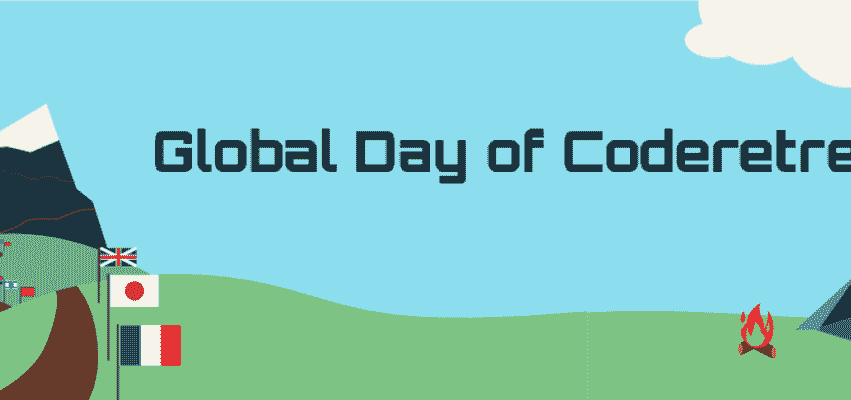

# 全球代码静修日即将到来！

> 原文：<https://dev.to/sebnozzi/global-day-of-code-retreat-soon-3f01>

简单提醒一下，2018 年全球代码务虚会[将很快举行。](https://www.coderetreat.org/)

更准确地说是明年 11 月 17 日。

[T2】](https://res.cloudinary.com/practicaldev/image/fetch/s--O1SUJPtQ--/c_limit%2Cf_auto%2Cfl_progressive%2Cq_auto%2Cw_880/https://thepracticaldev.s3.amazonaws.com/i/4i4431n6s4b1zzzwmjxq.png)

什么是“代码撤退”？这是一个各种背景和经验水平的开发人员聚在一起交流、实践、交流、学习和娱乐的盛会。这是非常有活力的，因为你花了很多时间与像你一样有动力提高和学习的人一起结对编程。

不确定您附近是否有活动？你可以在这里查看:

[https://www.coderetreat.org/events/](https://www.coderetreat.org/events/)

只能推荐！非常值得花时间。