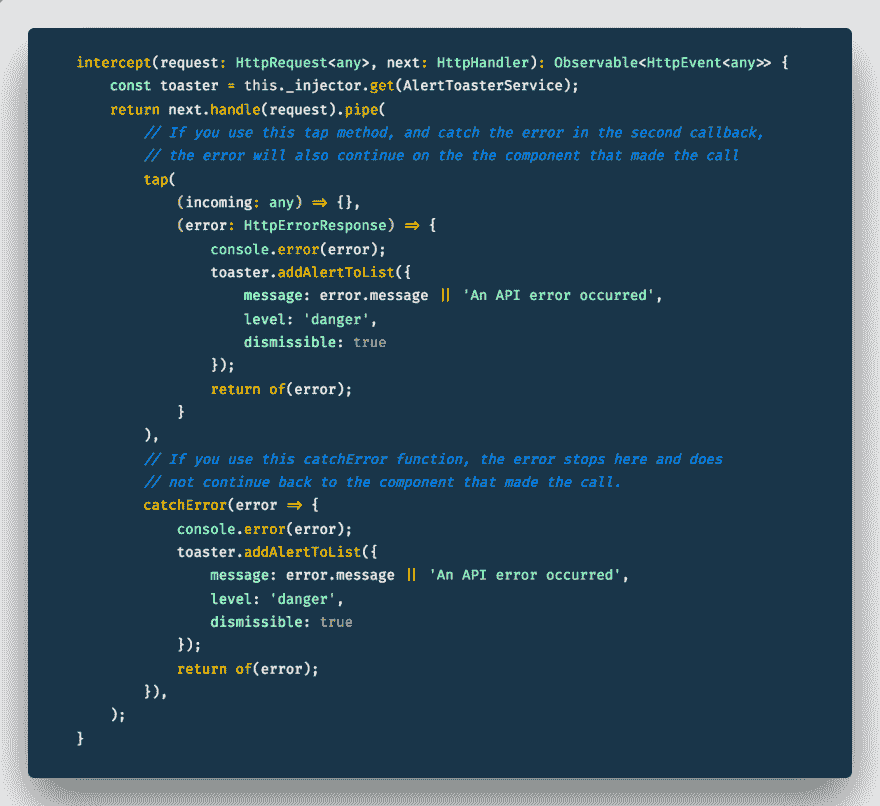

# 角度的全局误差处理

> 原文：<https://dev.to/prestonjlamb/global-error-handling-in-angular-jk4>

你可能想知道为什么我要写一篇关于错误处理的博文，因为我们都写了从不出错的代码。对吗？

[T2】](https://res.cloudinary.com/practicaldev/image/fetch/s--d6bAo347--/c_limit%2Cf_auto%2Cfl_progressive%2Cq_66%2Cw_880/https://www.prestonlamb.com/static/img/dumb-and-dumber-lauging.gif)

如果你和我一样，你知道那不是真的。错误是发展的一部分。我们努力消除尽可能多的缺陷，但仍有一些缺陷会进入生产。因此，当它们发生时，优雅地处理它们是很重要的，这样用户就不会感觉到这些错误的影响。

考虑到这一点，我开始学习如何在 Angular 应用程序中定制错误处理过程。我之前写了一篇博文，详细描述了我如何使用 [HTTP 拦截器](https://dev.to/blog/angular-error-interceptors)在从服务器返回的路上捕获 HTTP 错误，并将它们显示给用户。这篇文章简单地提到了这一点，并涵盖了 Angular 应用程序中出现的另一种错误。如果你需要一个如何实现这些错误处理选项的例子，请查看 StackBlitz 上的[这个例子。我们开始吧！](https://stackblitz.com/edit/global-error-handler)

首先，让我们来谈谈我上面提到的两种方法，它们可以在应用程序中捕获和处理错误。让我们从提供一个错误处理程序开始。Angular 的文档对`ErrorHandler`类做了如下描述:

> 为集中式异常处理提供挂钩。...`ErrorHandler`的默认实现将错误消息打印到控制台。若要拦截错误处理，请编写一个自定义异常处理程序，根据您的应用程序的情况替换此默认值。

本质上，实现`ErrorHandler`类允许您定制应用程序处理错误的方式。除了使用`console.error`将错误输出到控制台，您还可以将错误发送到日志服务，或者将错误记录到 Sentry，或者向用户发送消息，或者您能想到的任何其他方式。对应用程序进行细粒度的控制真的很棒。

(说到 Sentry:任何人如果需要一种方法来记录和跟踪应用程序中出现的错误，无论是有角度的还是其他的，都应该使用它。它所提供的东西令人难以置信。[去看看](https://sentry.io/welcome/)！)

在 Angular 应用程序中处理错误的另一种方法是实现 HTTP 拦截器。Angular.io 对`HttpInterceptor`接口做了如下描述:

> 拦截 HttpRequest 并处理它们。...通常拦截器会在返回 next.handle(transformedReq)之前转换传出的请求。拦截器也可以选择转换响应事件流，方法是对 next.handle()返回的流应用额外的 Rx 操作符。

当使用`HttpInterceptor`处理错误时，您将获取响应事件流，捕捉错误并对该错误进行处理。你的选择和上面的一样:记录错误，发送消息，等等。

我对这两个错误的了解是，它们处理不同的用例。我尝试使用`ErrorHandler`类来处理应用程序中的所有错误。但是它没有正确地捕捉 HTTP 错误。有时它会捕捉到它们，但随后将错误发送到我的警告烘烤服务没有做任何事情。但是在定制的`ErrorHandler`中，捕捉应用程序中抛出的其他错误非常有效。我一实现`HttpInterceptor`接口，HTTP 错误就被正确地捕获并发送给服务，并显示在应用程序中。所以在我看来,`ErrorHandler`类不应该用于处理任何类型的 HTTP 错误。

老实说:这让我很惊讶，也有点令人失望。我希望能够编写代码，在一个地方处理所有错误，并向用户展示。另一方面，这确实有点道理。这两种错误是不同的。它们以不同的方式被捕获和处理是有道理的。也许您想重试失败的 HTTP 调用，但是如果您试图访问一个未定义的属性，您只想将错误输出到控制台。这个设置考虑到了这一点。

尽管在用`HttpInterceptor`捕获 HTTP 错误时，还有最后一件事需要记住。抓住那里的错误并为之干杯并不总是足够的。您可能还需要确保在您进行调用的地方捕捉到错误。比方说，你在应用程序的个人资料页面上打一个电话，获取用户的信息。当信息被获取时，你很可能显示一个加载器。如果调用失败，而您没有捕获到错误，加载器将永远不会消失。所以请记住，您可以添加错误处理程序，在一个地方为所有调用处理错误，但是您可能希望在调用*的任何地方捕获一些或所有调用。

希望你现在能更好地理解角度应用中的错误处理。当你的应用出现错误时，无论你需要做什么，你都可以控制它。

#### **编辑*

自从发表了这篇文章，我学到了另一件关于在拦截器服务中捕捉错误的事情。当你在拦截器服务中的 rxjs Observable 上使用`.pipe()`函数时，你既可以`tap`进入流，也可以使用`catchError`函数；两个都管用。然而，这有很大的不同。如果你使用`catchError`，一切都在那里结束。错误被捕获，但是您不能同时捕获调用 API 的组件中的错误。因此，如果在提交表单时确实显示了 loader 元素，那么在错误发生后就无法隐藏它了。如果使用`tap`函数，您仍然可以查看错误，提示错误消息，然后在调用组件中捕获错误。下面是一个简短的代码示例来帮助解释这一点:

[T2】](https://res.cloudinary.com/practicaldev/image/fetch/s--FXQW5ixc--/c_limit%2Cf_auto%2Cfl_progressive%2Cq_auto%2Cw_880/https://www.prestonlamb.com/statimg/blogPosts/angularGlobalErrorHandling/intercept-function.png)