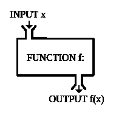

# 用 Java 实现功能

> 原文：<https://dev.to/ajiteshtiwari/go-functional-with-java-45ac>

自从 Java 问世以来，它一直是最受欢迎的语言，因为它的创造者确保了这种语言不会遗漏任何东西，并随着新的变化保持其原创性。

### 功能编程

函数式编程是一种受 lambda 微积分启发的编程概念。在这个概念中，每个计算都被认为是一个函数。尽管这些功能不应该被允许在其范围之外改变状态/数据。
[T3】](https://res.cloudinary.com/practicaldev/image/fetch/s--9zitr8o6--/c_limit%2Cf_auto%2Cfl_progressive%2Cq_auto%2Cw_880/https://upload.wikimedia.org/wikipedia/commons/3/3b/Function_machine2.svg)

#### 为什么？

软件开发是一个迭代的过程，不仅要写代码，还要理解别人写的代码。

你可能会觉得这很有挑战性，反之亦然，:D

如果一个特定对象被使用它作为参数的函数改变了，仅仅是计算出它的状态就要花费很多时间。因此很难预测程序的行为。

把它当成一个没有文档的第三方 API。当调用一个特定的函数时，你不能确定预期的行为。

这与函数式编程的概念不同。通过不允许改变状态和可变数据，它避免了 **[副作用](https://en.wikipedia.org/wiki/Side_effect_(computer_science))** 。

#### 如何？

所有这些理论都没问题，但是作为一名 Java 开发人员，我该如何使用它呢？

你们大多数人一定在思考这个问题。答案是 java 家族的新成员 **Lambda** 。

#### λ

λ是一个像物体一样起作用的函数。可以传到任何地方。可以在需要的时候执行。可以在一行中定义。可以不用类来创建。还有更多。它有助于删除 Java 以前需要的大量样板代码。

```
Syntax - (Parameter Declaration) -> {Lambda Body} 
```

Enter fullscreen mode Exit fullscreen mode

```
Examples -
Without parameters - () -> System.out.println("Hello lambda")
With one parameter - s -> System.out.println(s)
With two parameters - (x, y) -> x + y
With multiple line body - (x, y) -> {} 
```

Enter fullscreen mode Exit fullscreen mode

*酷吧？但是 Java 如何知道哪个 lambda 被映射到哪个函数呢？*

#### 深挖

因为接口是 lambdas 的主干。Java 引入了一个被称为**函数接口**的新概念，lambda 就是根据这个概念定义的。

#### 功能界面

它们类似于 java 中的普通接口，但有一个主要区别。他们遵循萨姆法则。根据 SAM 规则，一个接口只允许有一个抽象方法(SAM)。

这个检查可以在编译时使用 *@FunctionalInterface* 注释来执行。

对于每个 lambda，我们需要创建一个新的功能接口？那不方便。对吗？

看起来 Java 已经解决了这个问题。
包 *java.util.function* 包含了差不多 50 个功能接口。您可能需要他们范围之外的东西，这是极不可能的。

## 功能-接口系列

掌握所有的接口可能看起来很多。相反，如果我们只是了解他们的家庭，我们可以很容易地指向正确的界面。

有 4 类功能接口-

### 消费者——消费并丢弃

```
@FunctionalInterface
public interface Consumer<T> {
    void accept(T t);

    default Consumer<T> andThen(Consumer<? super T> after) {
        Objects.requireNonNull(after);
        return (T t) -> { accept(t); after.accept(t); };
    }
} 
```

Enter fullscreen mode Exit fullscreen mode

它接受一个对象，执行一些动作，不返回任何输出。如此刻薄的:D

##### 例子——

```
Consumer<String> stringConsumer = string -> System.out.println(string); 
```

Enter fullscreen mode Exit fullscreen mode

因为 lambda 函数和 println()都接受相同的参数，所以也可以使用**方法引用**来编写，就像这样-

```
Consumer<String> stringConsumer = System.out::println; 
```

Enter fullscreen mode Exit fullscreen mode

### 函数-映射或变换或计算

```
@FunctionalInterface
public interface Function<T, R> {
    R apply(T t);

    default <V> Function<V, R> compose(Function<? super V, ? extends T> before) {
        Objects.requireNonNull(before);
        return (V v) -> apply(before.apply(v));
    }

    default <V> Function<T, V> andThen(Function<? super R, ? extends V> after) {
        Objects.requireNonNull(after);
        return (T t) -> after.apply(apply(t));
    }

    static <T> Function<T, T> identity() {
        return t -> t;
    }
} 
```

Enter fullscreen mode Exit fullscreen mode

它接受一个对象，对其执行一些操作，然后返回另一个对象。

##### 例子——

```
Function<String, String> stringStringFunction = String::toUpperCase; 
```

Enter fullscreen mode Exit fullscreen mode

### 谓词-测试或过滤

```
@FunctionalInterface
public interface Predicate<T> {
    boolean test(T t);

    default Predicate<T> and(Predicate<? super T> other) {
        Objects.requireNonNull(other);
        return (t) -> test(t) && other.test(t);
    }

    default Predicate<T> negate() {
        return (t) -> !test(t);
    }

    default Predicate<T> or(Predicate<? super T> other) {
        Objects.requireNonNull(other);
        return (t) -> test(t) || other.test(t);
    }

    static <T> Predicate<T> isEqual(Object targetRef) {
        return (null == targetRef)
                ? Objects::isNull
                : object -> targetRef.equals(object);
    }
} 
```

Enter fullscreen mode Exit fullscreen mode

它接受一个对象，并返回一个布尔值。通常定义规则。

##### 例子——

```
Predicate<String> stringPredicate = String::isEmpty; 
```

Enter fullscreen mode Exit fullscreen mode

### 供应商-创建

```
@FunctionalInterface
public interface Supplier<T> {
    T get();
} 
```

Enter fullscreen mode Exit fullscreen mode

它不接受任何东西，但返回一个对象。如此慷慨的:D

##### 例子——

```
Supplier<String> stringSupplier = () -> "Hello, World"; 
```

Enter fullscreen mode Exit fullscreen mode

## 真实世界

现在是时候将我们的知识应用到一些现实世界的挑战中了。让我们从 HackerRank - [camelCase](https://www.hackerrank.com/challenges/camelcase/problem) 中挑选一个基本的编程挑战。

```
Problem - Count number of words in a camelCase string.

Example - saveChangesInTheEditor
Result - 5 
```

Enter fullscreen mode Exit fullscreen mode

所以我们的动机不仅仅是解决这个问题，而是用**功能**的方式来解决。

解决方法很简单，计算字符串中大写字母的数量，结果是 count + 1。

为了以功能性方式做到这一点，我们需要-

*   字符串中的单个字符流，以及
*   帮助过滤大写字符的谓词。

```
Solution -

/* Stream - s.chars()
Predicate - Character::isUpperCase */

static long camelcase(String s) {
    return s.chars().filter(Character::isUpperCase).count() + 1;
} 
```

Enter fullscreen mode Exit fullscreen mode

## 万岁！

一句话，问题就解决了。

这种方法有助于开发人员轻松理解代码片段的行为。上面的代码行很容易理解为从字符串中过滤大写字符并返回(字符数+ 1)的值，没有任何副作用。这正是我们想要的。

虽然变得有功能并不限于上面的例子。它是随着经验发展起来的，因为它是关于我们如何处理一个问题。

Java 开发人员可能需要付出一些额外的努力来学习这种方法，因为我们的大脑被训练来创建比所需更多的代码。:D