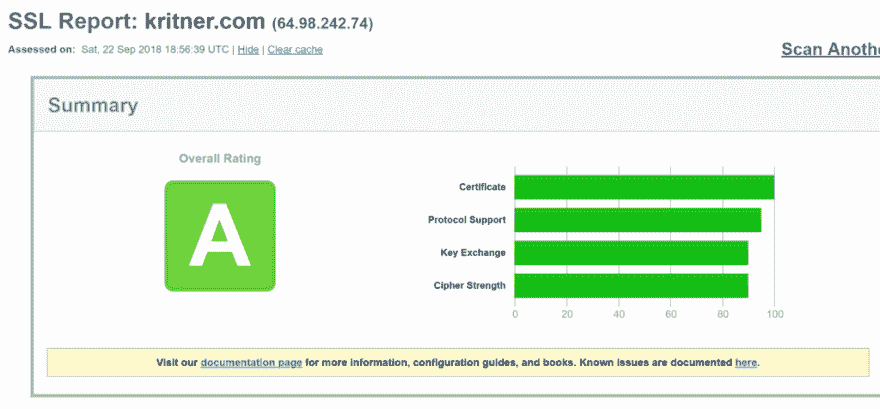
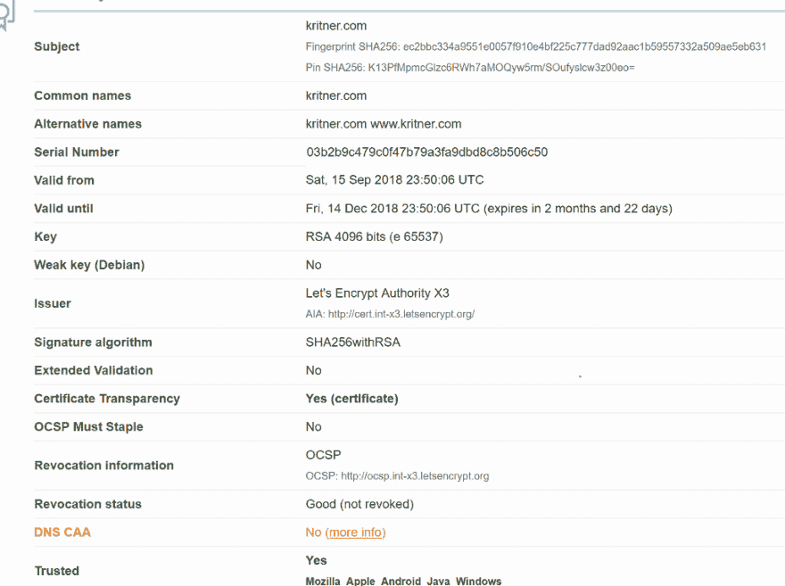
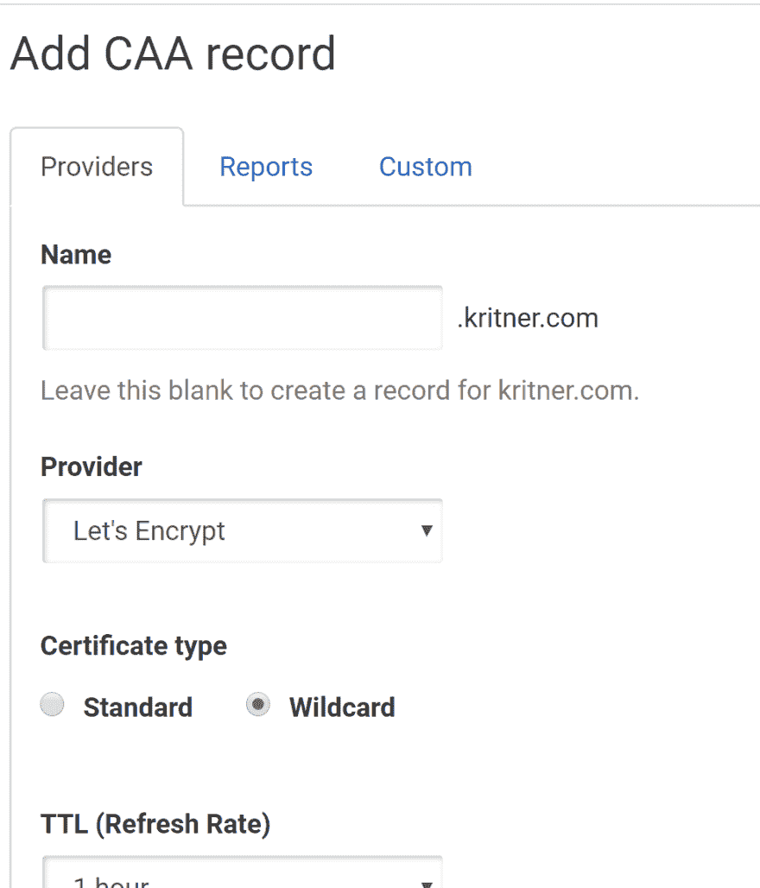
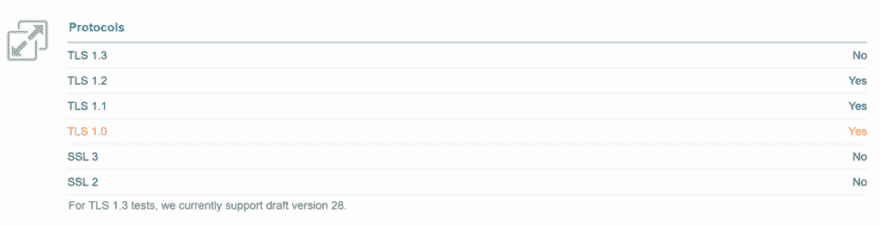
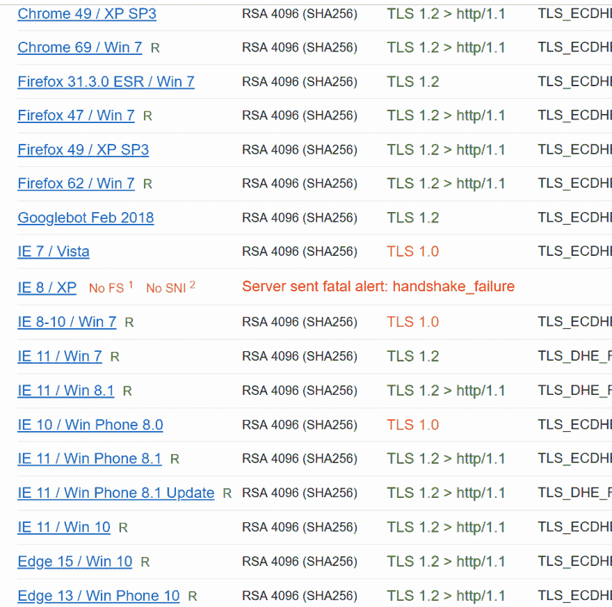
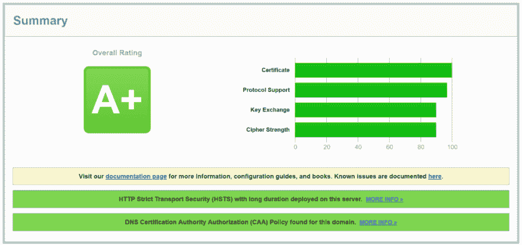

# ssllabs.com 的成绩从“A”变成了“A+”

> 原文：<https://dev.to/kritner/going-from-an-a-to-an-a-on-ssllabscom-3pda>

在之前的一篇文章中，我详细介绍了如何让 nginx 在 docker 上使用 Letsencrypt。总结这篇文章，我已经通过 ssllabs.com 的[运行了我的网站，并获得了“A”的分数。" A "是非常好的，但是我希望把 A 提升到 A+不会太难。](https://www.ssllabs.com/)

幸运的是，这很容易！

以下是我目前在 SSL 实验室工作的基线:

[](https://res.cloudinary.com/practicaldev/image/fetch/s--0GPtw2hr--/c_limit%2Cf_auto%2Cfl_progressive%2Cq_auto%2Cw_880/https://cdn-images-1.medium.com/max/1024/1%2A902RABH0CKLuJNw_4u54og.png)

<figcaption>ssllabs.com 得分</figcaption>

一个" A "，不可怕。这是我第一次真正地浏览这份报告，不太确定应该关注什么，但是让我们看一看。

[T2】](https://res.cloudinary.com/practicaldev/image/fetch/s--1f4AvsCR--/c_limit%2Cf_auto%2Cfl_progressive%2Cq_auto%2Cw_880/https://cdn-images-1.medium.com/max/1024/1%2AMXzlAUsuCxI6JtQqNh9Gwg.png)

绿色和黄色——这看起来很有前途！DNS CAA 下的“更多信息”将我指向[https://blog . qualys . com/SSL labs/2017/03/13/CAA-mandated-by-cabrowser-forum](https://blog.qualys.com/ssllabs/2017/03/13/caa-mandated-by-cabrowser-forum)—tldr 似乎是通过您的 DNS 添加一条记录，将特定 ca 列入白名单，在我的情况下，让我们加密。

我使用 DNSimple 作为我的 DNS，添加记录非常简单(我边打字边做，所以希望我不会搞砸！).

[](https://res.cloudinary.com/practicaldev/image/fetch/s--kNiGCO9Y--/c_limit%2Cf_auto%2Cfl_progressive%2Cq_auto%2Cw_880/https://cdn-images-1.medium.com/max/985/1%2AaX70q7dWLxyfjFPF635b-w.png) 

<figcaption>DNSimple 添加 CAA 记录</figcaption>

好了，CAA 记录已经处理好了，让我们看看 SSL 实验室报告中还有什么内容…

[T2】](https://res.cloudinary.com/practicaldev/image/fetch/s--ch66aEMj--/c_limit%2Cf_auto%2Cfl_progressive%2Cq_auto%2Cw_880/https://cdn-images-1.medium.com/max/1024/1%2Aa1H_VPevIwrKAxosAC5VFw.png)

TLS 和 SSL 是实现 HTTPS 的不同方法，TLS 是 SSL 的继承者。从表面上看，我的站点支持 TLS 1.1 和 1.2 是件好事，支持 TLS 1.0 是件坏事，但不支持所有类型的 SSL 也是件好事。支持 TLS 1.0 是件坏事，这是有道理的，因为它已于 2018 年 6 月 30 日停止使用。

SSL 实验室报告中的大部分警告似乎都集中在支持 TLS 1.0 这一事实上:

[T2】](https://res.cloudinary.com/practicaldev/image/fetch/s--Ml46k9F3--/c_limit%2Cf_auto%2Cfl_progressive%2Cq_auto%2Cw_880/https://cdn-images-1.medium.com/max/981/1%2AhRbljY1w3p51QJhKdRYyzA.png)

所以让我们看看如何通过我的 nginx 配置禁用 TLS 1.0。

#### Nginx 更新

在上一篇文章中，我从映射卷中调出了一个“ssl.conf”文件——尽管到目前为止我还没有对它进行任何修改。因为我很可能*需要*来修改这个文件(SSL 相关的设置应该在这里，不是吗？)，我将把这个文件添加到一个新的 docker 卷中；这样我就可以签入对文件的更改。

我的原始 docker-compose 文件的一个片段:

```
volumes:
 # used to have a copy of config on the DOCKER HOST, can mod from there
 - ${DOCKER_KRITNER_NGINX}:/config 
 # the actual configuration file to use for the reverse proxy (located in current repo directory)
 - ./nginxConfig/nginx.conf:/config/nginx/site-confs/default 
```

文件卷部分的新增内容:

```
# overrides for ssl conf from base image
 - ./nginxConfig/ssl.conf:/config/nginx/ssl.conf 
```

这将允许我的 ssl.conf 文件在 docker 容器中映射，覆盖原始图像的 SSL . conf；这个文件中没有 API 密钥、密码等，所以最好在源代码中保留它的更改。

整个 docker-compose 文件现在看起来像这样:

```
version: '3.6'
services:

 nginx:
 image: linuxserver/letsencrypt
 ports:
 - "80:80"
 - "443:443"
 volumes:
 # used to have a copy of config on the DOCKER HOST, can mod from there
 - ${DOCKER_KRITNER_NGINX}:/config 
 # the actual configuration file to use for the reverse proxy (localted in current repo directory)
 - ./nginxConfig/nginx.conf:/config/nginx/site-confs/default
 # overrides for ssl conf from base image
 - ./nginxConfig/ssl.conf:/config/nginx/ssl.conf
 depends_on:
 - kritnerwebsite
 networks:
 - frontend
 container_name: nginx
 environment:
 - PUID=1001 # get on dockerhost through command "id <user>""
 - PGID=1001
 - EMAIL=kritner@gmail.com
 - URL=kritner.com
 - SUBDOMAINS=www
 - TZ=America/NewYork
 - VALIDATION=dns # using dns validation
 - DNSPLUGIN=dnsimple # via dnsimple, note there is additional configuration require separate from this file
 # - STAGING=true # this should be uncommented when testing for initial success, to avoid some rate limiting

kritnerwebsite:
 image: ${DOCKER_REGISTRY}/kritnerwebsite
 networks:
 - frontend
 expose:
 - "5000"
 restart: always
 container_name: kritnerwebsite

networks:
 frontend: 
```

接下来是 ssl.conf 本身。原始的 ssl.conf 是:

```
## Version 2018/05/31 - Changelog: https://github.com/linuxserver/docker-letsencrypt/commits/master/root/defaults/ssl.conf

# session settings
ssl_session_timeout 1d;
ssl_session_cache shared:SSL:50m;
ssl_session_tickets off;

# Diffie-Hellman parameter for DHE cipher suites
ssl_dhparam /config/nginx/dhparams.pem;

# ssl certs
ssl_certificate /config/keys/letsencrypt/fullchain.pem;
ssl_certificate_key /config/keys/letsencrypt/privkey.pem;

# protocols
ssl_protocols TLSv1 TLSv1.1 TLSv1.2;
ssl_prefer_server_ciphers on;
ssl_ciphers 'ECDHE-RSA-AES128-GCM-SHA256:ECDHE-ECDSA-AES128-GCM-SHA256:ECDHE-RSA-AES256-GCM-SHA384:ECDHE-ECDSA-AES256-GCM-SHA384:DHE-RSA-AES128-GCM-SHA256:ECDHE-RSA-AES128-SHA256:ECDHE-ECDSA-AES128-SHA256:ECDHE-RSA-AES128-SHA:ECDHE-ECDSA-AES128-SHA:ECDHE-RSA-AES256-SHA384:ECDHE-ECDSA-AES256-SHA384:ECDHE-RSA-AES256-SHA:ECDHE-ECDSA-AES256-SHA:DHE-RSA-AES128-SHA256:DHE-RSA-AES128-SHA:DHE-RSA-AES256-SHA256:DHE-RSA-AES256-SHA:!aNULL:!eNULL:!EXPORT:!DES:!RC4:!MD5:!PSK:!aECDH:!EDH-DSS-DES-CBC3-SHA:!EDH-RSA-DES-CBC3-SHA:!KRB5-DES-CBC3-SHA';

# HSTS, remove # from the line below to enable HSTS
#add_header Strict-Transport-Security "max-age=63072000; includeSubDomains; preload" always;

# OCSP Stapling
ssl_stapling on;
ssl_stapling_verify on;

# Optional additional headers
#add_header Content-Security-Policy "upgrade-insecure-requests";
#add_header X-Frame-Options "SAMEORIGIN" always;
#add_header X-XSS-Protection "1; mode=block" always;
#add_header X-Content-Type-Options "nosniff" always;
#add_header X-UA-Compatible "IE=Edge" always;
#add_header Cache-Control "no-transform" always;
#add_header Referrer-Policy "same-origin" always; 
```

这看起来很标准，也很容易理解。在“protocols”下，您可以看到列出了一个 TLSv1，我们将删除它。还有一个关于 HSTS 的注释行，我实在想不出有什么理由让它失效。这两处更改使得整个文件看起来像:

```
## Version 2018/05/31 - Changelog: https://github.com/linuxserver/docker-letsencrypt/commits/master/root/defaults/ssl.conf

# session settings
ssl_session_timeout 1d;
ssl_session_cache shared:SSL:50m;
ssl_session_tickets off;

# Diffie-Hellman parameter for DHE cipher suites
ssl_dhparam /config/nginx/dhparams.pem;

# ssl certs
ssl_certificate /config/keys/letsencrypt/fullchain.pem;
ssl_certificate_key /config/keys/letsencrypt/privkey.pem;

# protocols
ssl_protocols TLSv1.1 TLSv1.2;
ssl_prefer_server_ciphers on;
ssl_ciphers 'ECDHE-RSA-AES128-GCM-SHA256:ECDHE-ECDSA-AES128-GCM-SHA256:ECDHE-RSA-AES256-GCM-SHA384:ECDHE-ECDSA-AES256-GCM-SHA384:DHE-RSA-AES128-GCM-SHA256:ECDHE-RSA-AES128-SHA256:ECDHE-ECDSA-AES128-SHA256:ECDHE-RSA-AES128-SHA:ECDHE-ECDSA-AES128-SHA:ECDHE-RSA-AES256-SHA384:ECDHE-ECDSA-AES256-SHA384:ECDHE-RSA-AES256-SHA:ECDHE-ECDSA-AES256-SHA:DHE-RSA-AES128-SHA256:DHE-RSA-AES128-SHA:DHE-RSA-AES256-SHA256:DHE-RSA-AES256-SHA:!aNULL:!eNULL:!EXPORT:!DES:!RC4:!MD5:!PSK:!aECDH:!EDH-DSS-DES-CBC3-SHA:!EDH-RSA-DES-CBC3-SHA:!KRB5-DES-CBC3-SHA';

# HSTS, remove # from the line below to enable HSTS
add_header Strict-Transport-Security "max-age=63072000; includeSubDomains; preload" always;

# OCSP Stapling
ssl_stapling on;
ssl_stapling_verify on;

# Optional additional headers
#add_header Content-Security-Policy "upgrade-insecure-requests";
#add_header X-Frame-Options "SAMEORIGIN" always;
#add_header X-XSS-Protection "1; mode=block" always;
#add_header X-Content-Type-Options "nosniff" always;
#add_header X-UA-Compatible "IE=Edge" always;
#add_header Cache-Control "no-transform" always;
#add_header Referrer-Policy "same-origin" always; 
```

我想这差不多就是全部了——我们添加了一个 CAA 记录，禁用了 TLSv1，并做了一些修改以支持 docker-compose 文件中的 TLS 更改。

现在来看看 SSL 实验室是怎么想的:

[](https://res.cloudinary.com/practicaldev/image/fetch/s--Murn_XcW--/c_limit%2Cf_auto%2Cfl_progressive%2Cq_auto%2Cw_880/https://cdn-images-1.medium.com/max/1024/1%2AVigwJNwgZ_d--m17AnnjHQ.png) 

<figcaption>aww 耶+</figcaption>

呜哇！A+！下面是与变化相关的 [GitHub PR](https://github.com/Kritner/KritnerWebsite/pull/25) 。

相关:

*   docker-compose、nginx 和 letsencrypt - settings 建立网站，为 https 做所有的事情！