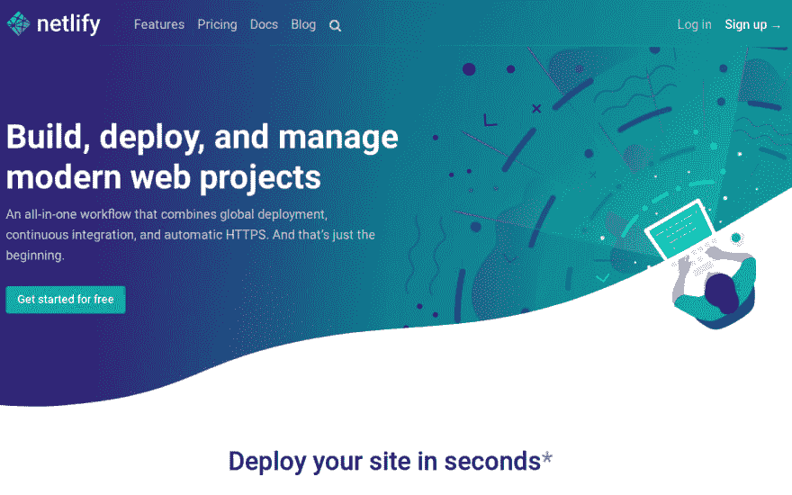
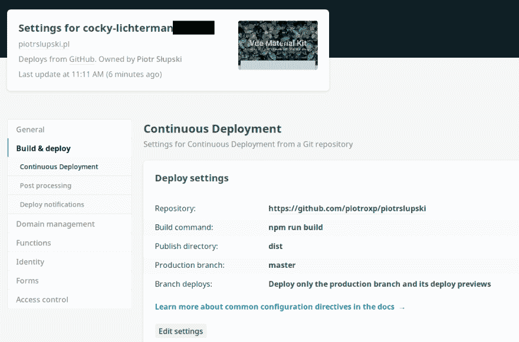

# 与 Netlify 一起在 5 分钟内上线

> 原文：<https://dev.to/piotroxp/going-online-in-5-minutes-with-netlify-3fk5>

# 我终于在[上线了](https://piotrslupski.pl)，用了 5 分钟

昨天，事实证明，我的咨询公司的个人网站是必须的，以便适用于创新和实际硬研发领域的各种项目。

## 我想要什么

坐在屏幕前，我恍然大悟——现在是 2018 年，网络已经变了。我如何用最少的努力托管自己的网站？我可以得到一个 AWS EC2 实例。我可以在某个地方购买托管服务，上传文件。做事有各种经典的方式。这一次，我想检查我们正在建设的基础设施的承诺。

## 我找到了 [Netlify](https://netlify.com)

环顾四周，[我偶然发现了这个 reddit 帖子](https://www.reddit.com/r/webdev/comments/5m8tr4/how_do_i_host_the_website_i_just_built/)，它把我指向了 Netlify。
*在几秒钟内部署你的网站*部分登陆卖给我。注册帐户后，您需要连接到 GitHub 并为 CI 部署选择一个存储库。之后，Netlify 让你使用你想要的构建命令。

[T2】](https://res.cloudinary.com/practicaldev/image/fetch/s--5W8zEwOe--/c_limit%2Cf_auto%2Cfl_progressive%2Cq_auto%2Cw_880/https://thepracticaldev.s3.amazonaws.com/i/qeiy2zir2aocd6gwsoer.png)

您可以允许 netlify 访问您的帐户或特定的存储库。我选择了我的个人网站知识库，是基于一个免费的 Vue.js / Material 设计模板的[。](https://www.creative-tim.com/product/vue-material-kit)。

我还从本地提供商那里买了一个域名，名为 [home.pl](https://home.pl) 。在域配置中将 A DNS 记录设置为指向 cocky-lichter man(Netlify 的部署)后，等了一分钟左右，我开始运行我的新个人网站，由 Netlify 托管。

开箱即用，您可以获得持续集成。将更改推送到 master 后，Netlify 会自动重建 Vue.js 应用程序并部署到生产环境中。

## 总结

从昨天开始，Vue.js、Netlify 和 GitHub 的组合似乎对我很有效。Netlify 对个人项目是免费的，现在它似乎是我最好的选择。我希望你发现这篇文章内容丰富！