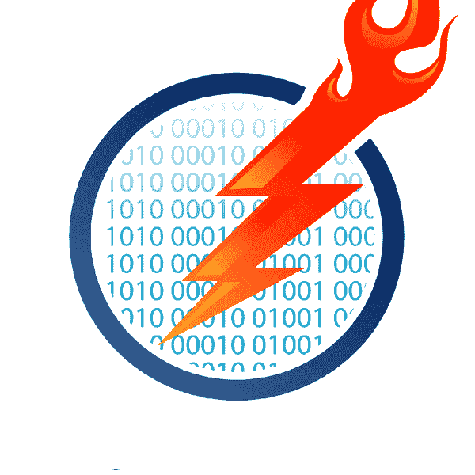

# 早睡不玩魔兽世界-开球

> 原文：<https://dev.to/josegonz321/going-to-bed-early-and-stop-playing-world-of-warcraft---kick-off-18b3>

在我的[上一篇文章](https://dev.to/josegonz321/no-social-media-in-the-mornings---wrap-up-1ifm)中，我提到了我的新挑战，或者我想改进的地方。

但由于可能你没有点击那个链接，(哦你！)，下面是我接下来两个挑战的快速提示:

1.  晚上 10 点早睡。
2.  停止玩 WoW(魔兽世界)

在我们开始这个新的旅程之前，让我们弄清楚为什么我们要做我们正在做的事情。这样我们就不会迷失方向，专注于道路。

## 从你的为什么开始🤔

有时候我们做事情并不知道真正的原因。因为我的注意力持续时间像松鼠一样长，所以我很容易分心。

此外，写下原因会提醒你并激励你为什么会走上这条路。

### 晚上 10 点⌚就寝

1.  (开始)晚上 10 点早点睡觉。
2.  早点醒来...比如早上 6 点。
3.  让我的一天有一个好的开始，不要匆忙，享受我的晨跑，等等。
4.  早点去办公室
    *   避免早高峰
    *   抢先一步
    *   改变我的工作时间(早来早走)
    *   在单口相声之前和一些人交谈/做一些工作
    *   避免下午人力资源高峰
5.  早点回家
    *   早晚餐
    *   **与家人共度更多美好时光**

如果我对你说实话，我想要那张单子上的最后一项。这是我目前的首要任务和动力。

注意早睡会在生活的其他方面产生超级棒的级联效应！这就是我决定继续这个挑战的原因！

### 停止玩魔兽世界👿

这不是游戏。是我。

我是认真的。我是问题，不是游戏。😖

我有上瘾的个性。我很容易被游戏吸引，忘记时间。

最近，我在工作日晚上玩了两个多小时。周末的工作时间比我愿意承认的要多得多(两天的总工作时间都接近两位数)...).

正如我在以前的文章中提到的，这不是我第一次与这种野兽搏斗。

十年前，我对游戏的沉迷驱使我参加了一个 12 步计划。如果您有兴趣了解更多信息，可以查看我的 Developer On Fire 访谈:

 [# 第 308 集|何塞·冈萨雷斯——思想、身体、灵魂](/developeronfire/episode-308--jose-gonzalez--mind-body-soul) [

# 开发商着火了](/developeronfire) [ iTunes ](https://itunes.apple.com/us/podcast/developer-on-fire/id1006105326) [  Overcast ](https://overcast.fm/itunes1006105326/developer-on-fire) [  Android ](http://subscribeonandroid.com/developeronfire.com/rss.xml) [ RSS](http://developeronfire.com/rss.xml)   

<audio id="audio" data-episode="episode-308--jose-gonzalez--mind-body-soul" data-podcast="developeronfire"><source src="https://traffic.libsyn.com/developeronfire/DeveloperOnFire-308-JoseGonzalez.mp3" type="audio/mpeg"> Your browser does not support the audio element.</audio>

           <input type="range" name="points" id="volumeslider" value="50" min="0" max="100" data-show-value="true">      1x  [ x ] 

这一次，它深深地占用了我的个人时间。

以下是它对我的其他影响:

😴睡眠不足
👀🔥燃烧的眼睛
⌛浪费的时间
😡恼火(是的，我是！)
💔不开心
🏃💨不耐烦/急于玩

简而言之，我筋疲力尽，几个月前就应该停止玩这个游戏了。但是永远不会太晚。现在，你将成为这个旅程的一部分。

准备好接受一些冗长的咆哮吧😅

## 总结起来

感谢您花时间阅读本文。

我已经在为这次旅行准备第一天的食物了。我们有一个艰难的开始，但不是我期望的那样！

你的旅程会说些什么？

直到很快！

**更新:**

✅ [Day 1](https://dev.to/josegonz321/going-to-bed-by-10pm-and-stop-playing-world-of-warcraft---day-1-7f6)
✅ [Day 2](https://dev.to/josegonz321/going-to-bed-by-10pm-and-stop-playing-world-of-warcraft---day-2-215a)
✅ [Day 3](https://dev.to/josegonz321/going-to-bed-by-10pm-and-stop-playing-world-of-warcraft---day-3-1jfe)
✅ [Day 4](https://dev.to/josegonz321/going-to-bed-by-10pm-and-stop-playing-world-of-warcraft---day-4-2h93)
✅ [Day 5](https://dev.to/josegonz321/going-to-bed-by-10pm-and-stop-playing-world-of-warcraft---day-5-4hai)
✅ [Day 6](https://dev.to/josegonz321/going-to-bed-by-10pm-and-stop-playing-world-of-warcraft---day-6-57ea)
✅ [Day 7](https://dev.to/josegonz321/going-to-bed-by-10pm-and-stop-playing-world-of-warcraft---day-7-55kn)