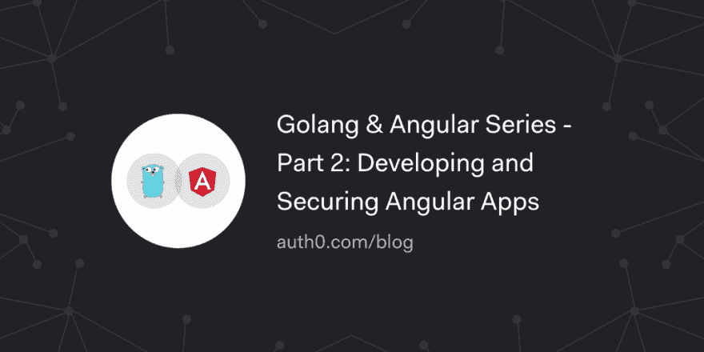

# Golang & Angular 系列-第 2 部分:开发和保护 Angular 应用程序

> 原文：<https://dev.to/auth0/golang--angular-series---part-2-developing-and-securing-angular-apps-1j7l>

在本系列中，您将学习如何使用 Golang 和 Angular 构建现代应用程序。在[第 1 部分——后端——开发和保护 Golang API](https://auth0.com/blog/developing-golang-and-angular-apps-part-1-backend-api/)中，您学习了如何用 Golang 构建一个安全的后端 API 来支持待办事项列表应用程序。现在，在第二部分中，您将使用 Angular 来开发待办事项应用程序的前端。

[读下去🚀](https://auth0.com/blog/developing-golang-and-angular-apps-part-2-angular-front-end/?utm_source=dev&utm_medium=sc&utm_campaign=stack_golang_angular)

[T2】](https://res.cloudinary.com/practicaldev/image/fetch/s--uDJ3wcCi--/c_limit%2Cf_auto%2Cfl_progressive%2Cq_auto%2Cw_880/https://thepracticaldev.s3.amazonaws.com/i/n6a7hcksgcla1yh8d55j.png)