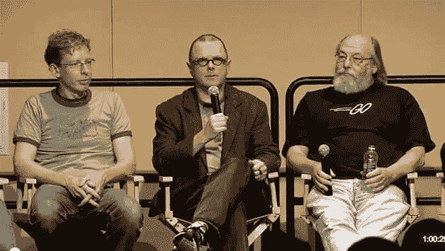
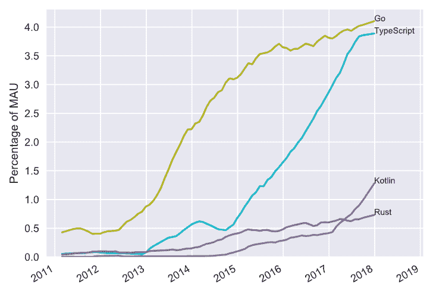
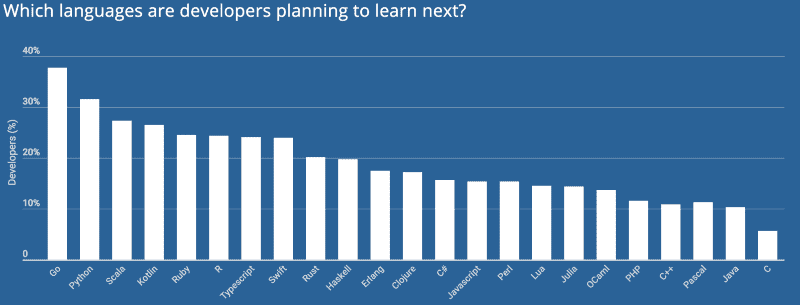

# GoLang，开发人员需要学习的下一门语言

> 原文：<https://dev.to/dizveloper/golang-the-next-language-to-learn-for-developers-pc5>

### 起源故事

有传言说 GoLang 的构思发生在开发人员等待程序编译的间歇。这些开发者厌倦了等待，不再工作。谷歌的三名程序员一如既往地应付自如。2009 年发布了 Go，2012 年发布了 1.0 版本。谷歌的三名工程师(Robert Griesemer、Ken Thompson 和 Rob Pike)创造了一种系统级语言来取代所有其他语言，因为该领域已经有一段时间没有新的语言了，而且现有的语言都没有将多线程作为核心原则。

[T2】](https://res.cloudinary.com/practicaldev/image/fetch/s--opTYcTMa--/c_limit%2Cf_auto%2Cfl_progressive%2Cq_auto%2Cw_880/https://cdn-images-1.medium.com/max/800/1%2A5O-YqwO94QUQ8OkNypcVdQ.png)

这三个人在过去合作过一些大项目。这包括 C 编程语言、Unix、UTF 8、JVM 和其他一些语言。Go 是一段时间以来的第一种语言，在这种语言中，现代工程师被赋予了不具备高效编译、高效执行或编程简易性的能力。这三种语言并不都可以在同一种主流编程语言中使用。Go 试图将所有这些能力整合到一种语言中。

### Go 在谷歌做什么？

好吧，Go 是一种专门针对大型分布式系统和高度可伸缩网络服务器的系统级编程语言。就谷歌的需求而言，它意味着取代 C++和 Java。Go 旨在减轻大型软件系统开发的缓慢和笨拙。再具体一点，围棋帮助解决…

*   缓慢的编译和缓慢的执行
*   使用不同语言子集进行协作的程序员
*   可读性和文档
*   语言一致性
*   版本问题
*   多语言版本
*   依赖性难以维护

### 不要相信我的话

[T2】](https://res.cloudinary.com/practicaldev/image/fetch/s--9XB9s700--/c_limit%2Cf_auto%2Cfl_progressive%2Cq_auto%2Cw_880/https://cdn-images-1.medium.com/max/800/1%2ACx25hkOSMmBIxTHuS3X5Ew.png)

围棋已经在 [**StackOverflow**](https://insights.stackoverflow.com/survey/2018/#most-loved-dreaded-and-wanted) 上攀升至最受喜爱语言的第五位。开发者调查显示，目前 65.6%使用 Go 的开发者，如果有选择的话，会继续使用 Go 而不是其他语言。

[T2】](https://res.cloudinary.com/practicaldev/image/fetch/s--fOa2k3_e--/c_limit%2Cf_auto%2Cfl_progressive%2Cq_auto%2Cw_880/https://cdn-images-1.medium.com/max/800/1%2Ayku8frwOl-BnGkb7fUGm3w.png)

Go 也是 [**Github**](https://www.benfrederickson.com/ranking-programming-languages-by-github-users/) 上发展最快的语言之一，Go 正在碾压它。在 [2016](https://octoverse.github.com/2016/) ，Go 有大约 18.8 万个打开的拉取请求，比上一年增长了 93%。在 [2017](https://octoverse.github.com/) 跃升至 285k，成为 Github 上第 9 大热门语言。

[T2】](https://res.cloudinary.com/practicaldev/image/fetch/s--qQaKNEnC--/c_limit%2Cf_auto%2Cfl_progressive%2Cq_auto%2Cw_880/https://cdn-images-1.medium.com/max/800/1%2A35tEwVztt3EO7jYDeNM-0g.png)

对于很多开发人员来说，Go 已经成为“下一门要学的语言”。据调查，HackerRank 正是如此，围棋遥遥领先。这个评估是从今年二月开始的。

显然，使用谷歌的名字对 Go 的成功和被采用有着重要的影响。你现在感兴趣了，对吧？*假设你没有，在你决定点击一篇关于 GoLang 的文章之前……*

### 一个系统级语言怎么会这么流行？

简单可能是 Go 如此容易被采用的更大原因之一。当你看着所有其他语言和它们的进化，它们不断地引入新的特性，这听起来是一件好事，不要误解我的意思。突出的问题是，这些语言在功能、外观和感觉上越来越相似。围棋是它本来的样子，并不试图成为别的什么样子。它很好地覆盖了自己的基础，但不会把自己拉得太薄。这完全是故意的。三个开发者决定的[合同*](https://www.youtube.com/watch?v=cQ7STILAS0M&feature=youtu.be&t=2m50s) 是他们三个必须就一个特性达成一致，并且这个特性是包含在 Go 中的*正确的*特性。这是为了确保 Go 的简单性和可读性，Rob、Robert 和 Ken 都认为这是绝对重要的。目前对 Go 的想法是，从长远来看，Go 的功能或审美不会有重大变化。开发人员正在考虑添加的唯一建议特性是 ***泛型*** 。languages[FAQ 文档](https://golang.org/doc/faq#generics)提到可能会在某个时候添加泛型，但他们就是感觉不到紧迫性。最终可能会有 Go 2，但可能几年内不会。

### 为什么如此高亢？

Go 团队得出的结论是，随着更多特性和更多功能的加入，在项目中培养新的开发人员，以及在开始编写生产就绪代码的第一时间学习语言方面，会有更大的复杂性和更大的困难。Go 意味着任何开发人员几乎在第一天就能够开始编写生产就绪的代码。

让我们把 javascript 想成一个大多数开发人员都能理解的例子(因为它是国际上最流行的编程语言)。你可以用多种方式编写一个函数，但是在 Go 中，只有一种方式来编写这个函数。为了完全理解您面前的代码，您不必像编写 javascript 函数的开发人员那样，或者像几个月前那样，进行太多的思维跳跃。现在我同意用 javascript 编写可能更有趣，但是 Go 给了你可维护性、简单性和整体更快的生产速度。

### 并发不是并行

需要说明的是， [**并发**并不是固有的**并行**](https://www.youtube.com/watch?v=cN_DpYBzKso) 。**并发**是一种更加结构化的方法，让 ***处理*** 多个流程，而不是 ***同时做*** 一堆事情(或同一件事情的多个实例)。所以并发并不意味着两个进程永远不会同时运行。这将会发生，但更多的是关于所述过程的交流。知道何时做某事，以及如何做。所以在围棋中，它们是用来对话的。尽管您可以创建并行性，但这并不是全部。

为了更好地解释这个想法，想象一下(本着最近结束的世界杯的精神)一个足球队在比赛。该领域中的每个玩家都是一个单独的进程(在这种情况下为 GoRoutine)。他们都在奔跑和交流，球(数据)是他们的触发点或交流点。守门员并不总是在移动，但当球在他们半场内的某个地方时，他会做出相应的动作，而且肯定是在靠近禁区的时候。每个玩家(GoRoutine)都有自己独立的工作要做，但要和其他人协调。如果我们纯粹谈论并行性，每个玩家都会独自玩游戏，对其他玩家的行为不感兴趣。

### Go 的并发解决方案:

**GoRoutine**(*执行*)
Go 编程语言中的 Go routine 是一个轻量级线程，由 Go runtime 管理。如果你只是在一个函数前加上“go ”,这意味着它将与代码的其余部分同时执行。

**通道** ( *通信* )
通道是连接并发 GoRoutines 的管道。您可以通过通道从 GoRoutine 向 GoRoutine 发送值和信号。这允许同步执行。

**选择** *(协调)*
Go 中的 Select 语句可以让你等待和观察一个通道上的多个操作。将 GoRoutines 和 channels 结合起来将展示 Go 中并发的真正威力。