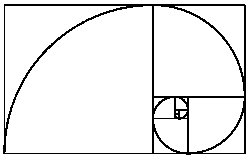

# F#中的黄金搜索算法

> 原文：<https://dev.to/juanclr/golden-search-algorithm-in-f-45bo>

# 开始

我在大学的一门课上用 python 写了黄金搜索算法的代码，我真的发现这个方法很有趣，所以我决定用函数式编程语言(F#)复制这个方法。这个方法你可能不太熟悉，我给你简单介绍一下。

# 设定

让我们从定义什么是数值方法开始。数值方法是一种程序，通过这种程序，你几乎总是通过执行纯粹的算术和逻辑计算来获得某些问题的近似解。
现在你可能会问自己黄金搜索算法从何而来？实际上，这很有趣，因为它来自黄金比例，你可能听说过黄金比例，但对那些没有听过的人来说，这是一个小背景。

#### 黄金比例:

黄金分割率是一个大约等于 1.618 的特殊数字，它多次出现在几何、艺术、建筑，甚至自然中，它也出现在其他领域。
[](https://res.cloudinary.com/practicaldev/image/fetch/s--4EtixNdV--/c_limit%2Cf_auto%2Cfl_progressive%2Cq_auto%2Cw_880/https://thepracticaldev.s3.amazonaws.com/i/pxvsits0nh491c1zqybm.png) 
也就是说，黄金搜索算法是一种用于为[单峰函数](https://en.wikipedia.org/wiki/Unimodality)寻找极值(最小值或最大值，在这种情况下为最小值)的算法，通过连续缩小已知存在极值的值的范围。
因此，我们的目标是在 F#中为单峰函数“F”编写方法，其范围是[a，b]，x1 < x2。

# 流程

我们想简化算法，所以我们在这个区间内求值:

*   [a，x1]和[x2，b]

之后，我们在函数 **f(x)** 中评估 **x1** 和 **x2** ，这将给出下一个条件:

*   如果 **f(x1) < f(x2)** ，新的间隔将是[a，x2]
*   如果 **f(x1) > f(x2)** ，新的间隔将是[x1，b]

为了得到我们的 **x1** 和 **x2** ，我们使用 **R** 和**(1-R)**(R =黄金比例值)，来得到区间中相同的相对位置。
得到 **x1** 和 **x2** 的方程式为:

*   x1 = a + (1 - R)(b - a)
*   x2 = a + R(b - a)

# 生成代码

首先，我们必须明白这个函数是递归的，这意味着我们将重复做这个过程的某个部分。

我们是这样开始的:

*   首先，我们为将要使用的 **f(x)** 创建一个函数(在这种情况下，我们将使用**f(x)= 0.5 xe^(−x)^2**):

```
let funcion (x) :float =
(0.5 - (x*(System.Math.E))**(((-1.0)*x)**(2.0))) 
```

Enter fullscreen mode Exit fullscreen mode

*   在这种情况下定义我们的变量 **a = 0** ， **b = 2** 和 **R = (-1 + sqrt(5))/2** ，还有 **x1 = a** 和 **x2 = b** 。我们还为计数器创建了一个变量，它将记录找到最小值需要多少次迭代。

*   创建循环，剩下的代码将在循环中。我们创建了一个变量 Break，它从 true 开始，当我们将这个变量设为 true 时，循环将会中断。在这种情况下，当 a 和 b 相同时，循环将停止。

```
while (Break=true) do
    if ((System.Math.Round(a,6)) = (System.Math.Round(b,6))) then
        Break <- false 
```

Enter fullscreen mode Exit fullscreen mode

*   创建两个新变量，它们将包含 **f(x1)** 和 **f(x2)** 。

    *   f1 = f(x1)
    *   f2 = f(x2)
*   在我们在流程中定义的条件下检查 **f1** 和 **f2** 。

```
 if (f1>f2) then
        a <- a
        b <- x2
    elif (f1<f2) then
        a <- x1
        b <- b
    else
        Break <- false 
```

Enter fullscreen mode Exit fullscreen mode

*   用我们在过程中提供的公式重新计算 **x1** 和 **x2** 的值。

```
 x1 <- a + (1.0 - R)*(b-a)
    x2 <- a + R*(b-a) 
```

Enter fullscreen mode Exit fullscreen mode

*   最后，我们打印我们的结果，结果将在每次迭代中显示，但是如果您想只显示最终结果，就不要打印了。

你可以在这里获得完整的代码以及如何运行它的说明[。](https://github.com/juanclr/FPNumMethods)

# 现实生活应用

黄金搜索是一种优化方法，主要用于解决数学和现实生活中的问题。可以通过优化解决的问题非常普遍，下面是一些例子:

*   我们应该如何优化财富和资源以促进可持续发展？
*   我们如何优化我们的国家预算，使每一块钱都用得其所？

甚至还有一些基于优化算法的创业公司:

*   [通知](https://www.inform-software.com/)。
*   [安托普蒂马](http://www.antoptima.com/site/en/index.php/)
*   [Dynadec](http://dynadec.com/) 。

如果你的成本函数是单峰的，当你想找到你的成本最小化的点或你的产量最大化的点时，你也可以在现实生活中作为一个商人使用这个特定的方法(黄金搜索)。

# 结论

最后，我想以我对函数式编程的看法作为结束。学习基础知识非常有趣，但有点难以适应，以下是我发现的一些缺点:

*   很难将纯粹的功能组合成一个完整的应用程序。
*   在我的例子中，递归感觉不自然。
*   您可能会遇到诸如内存使用和速度等性能问题。

但我也发现了一些优点:

*   调试更容易。
*   测试更容易。
*   并发编程更容易实现。

总之，我真的很喜欢这种体验，但我可能不会再使用函数式编程，因为我更喜欢面向对象的编程，并且有更多的经验。