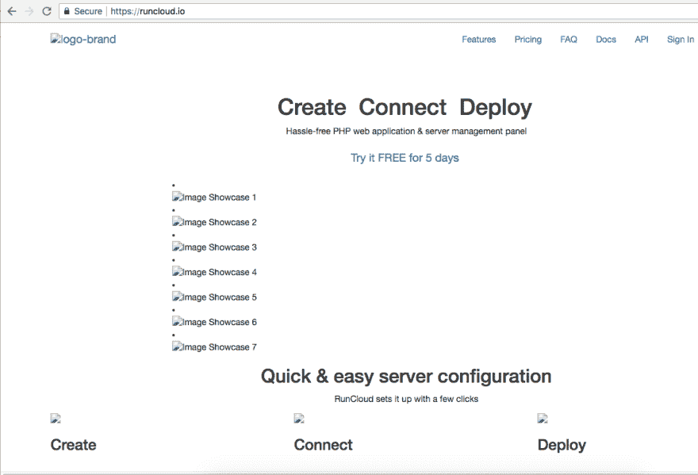

# Google dns dan AWS CloudFront

> 原文：<https://dev.to/k4ml/google-dns-and-aws-cloudfront-5dmc>

Bermula dengan nak buka website [runcloud](https://runcloud.io/) tak boleh - imej tiba-tiba tak keluar.

[T2】](https://res.cloudinary.com/practicaldev/image/fetch/s--t-M5yncz--/c_limit%2Cf_auto%2Cfl_progressive%2Cq_auto%2Cw_880/https://thepracticaldev.s3.amazonaws.com/i/2whflwioqa5121o1onr5.png)

Rupanya domain cf1.cdn.runcloud.io tak dapat resolve kalau guna Google dns server 8.8.8.8\.

```
dig ns-02.cloudfront.net @8.8.8.8

; <<>> DiG 9.8.3-P1 <<>> ns-02.cloudfront.net @8.8.8.8
;; global options: +cmd
;; Got answer:
;; ->>HEADER<<- opcode: QUERY, status: NOERROR, id: 17627
;; flags: qr rd ra; QUERY: 1, ANSWER: 1, AUTHORITY: 0, ADDITIONAL: 0

;; QUESTION SECTION:
;ns-02.cloudfront.net.      IN  A 
```

Enter fullscreen mode Exit fullscreen mode

Manakala kalau guna Cloud Flare dns 1.1.1.1 dapat pula:-

```
dig cf1.cdn.runcloud.io @1.1.1.1

; <<>> DiG 9.8.3-P1 <<>> cf1.cdn.runcloud.io @1.1.1.1
;; global options: +cmd
;; Got answer:
;; ->>HEADER<<- opcode: QUERY, status: NOERROR, id: 18693
;; flags: qr rd ra; QUERY: 1, ANSWER: 9, AUTHORITY: 0, ADDITIONAL: 0

;; QUESTION SECTION:
;cf1.cdn.runcloud.io.       IN  A

;; ANSWER SECTION:
cf1.cdn.runcloud.io.    295 IN  CNAME   dih3ogc1nwj1a.cloudfront.net.
dih3ogc1nwj1a.cloudfront.net. 55 IN A   13.33.172.61
dih3ogc1nwj1a.cloudfront.net. 55 IN A   13.33.172.64
dih3ogc1nwj1a.cloudfront.net. 55 IN A   13.33.172.69
dih3ogc1nwj1a.cloudfront.net. 55 IN A   13.33.172.83
dih3ogc1nwj1a.cloudfront.net. 55 IN A   13.33.172.113
dih3ogc1nwj1a.cloudfront.net. 55 IN A   13.33.172.135
dih3ogc1nwj1a.cloudfront.net. 55 IN A   13.33.172.144
dih3ogc1nwj1a.cloudfront.net. 55 IN A   13.33.172.203

;; Query time: 89 msec
;; SERVER: 1.1.1.1#53(1.1.1.1)
;; WHEN: Tue Apr 24 19:59:11 2018 
```

Enter fullscreen mode Exit fullscreen mode

Lepas post kat group telegram #devkini dan Jomweb Johor, rupanya memang ada [masalah](https://twitter.com/mrw/status/988755906925154305?s=21) dengan Google dns.

Pada masa ini juga aku baru perasan dns 1.1.1.1 dah boleh guna daripada Digi. Sebelum ini tak boleh sebab Digi [block semua access ke port 53](https://twitter.com/k4ml/status/981330105329790976) kecuali untuk 8.8.8.8\. Tapi kenalan kat Twitter bagitahu kat tempat dia masih tak boleh sebab 1.1.1.1 digunakan untuk IP captive portal !

Jadi ada orang guna public IP address untuk private network. Tapi rupanya ia [sesuatu yang biasa](https://news.ycombinator.com/item?id=16717058) . Banyak device seperti Cisco yang menggunakan 1.1.1.1 sebagai ip.

Seorang rakan dalam group telegram devkini berkongsi artikel yang [mencadangkan IP range DoD (Department of Defence)](https://blog.erratasec.com/2013/12/dod-address-space-its-not-conspiracy.html) sebagai alternative untuk private IP. Ini kerana 30.0.0.0/8 block telah diberikan kepada DoD tetapi ia hanya digunakan untuk rangkaian dalaman DoD dan ip tersebut tidak routable ke mana-mana. Jadi tidak ada risiko ip tersebut tiba-tiba digunakan seperti mana yang berlaku kepada 1.1.1.1 yang diberikan oleh APNIC kepada CloudFlare awal bulan ini. Ini suatu yang praktikal bagi organisasi besar (seperti telco dan isp) yang telah pun kehabisan private ip range.

Ok, itu saja cerita untuk malam ini.