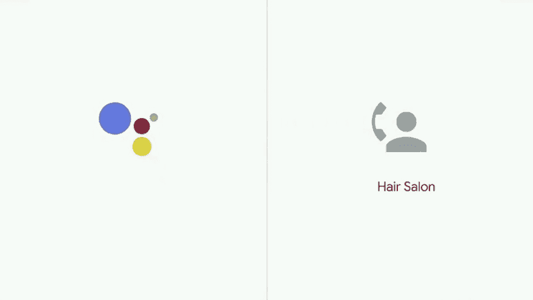

# 关于伦理的对话？

> 原文：<https://dev.to/khophi/google-duplex---the-conversation-about-ethics-2nce>

如果不知道什么是双工:

[https://www.youtube.com/embed/wqhxVwXI6q8](https://www.youtube.com/embed/wqhxVwXI6q8)

就我而言，我不在乎和机器人说话，不管我是否知道，只要它能完成工作，就能以完整的方式传达思想。

见鬼，我们每天都和 Siri、谷歌助手和 Alexa“交谈”。

谷歌的 Duplex 更像是反过来，助理发起对话，而且做得如此之好，就像人类一样。

它在伦理上是错误的吗？道德含义是什么？

> <video loop="" controls=""><source src="https://video.twimg.com/ext_tw_video/994027975866798080/pu/pl/cWBzUhCFuB1St77l.m3u8?tag=3" type="application/x-mpegURL"></video>无限的🇬🇧🇺🇸@无限的人Google duplex:一个能够自动呼叫但说话像人类的 ai&理解对话的上下文/细微差别，这使它能够适应并摆出人类的姿势。人有权利知道自己是否在和一台机器说话吗？
> 
> 关于这个2018 年 5 月 09 日上午 01:37不得不进行一场严肃的伦理辩论

这种机器人应该在这种呼叫一开始就“否认”自己吗？

如果你知道这是一个机器人打来的电话，而这个机器人告诉你，这是一个机器人，你会接吗？

还有一个有趣的场景:

> 凯文·凯利@ Kevin 2 Kelly当一个 Google Duplex 来电时，Google Duplex 助手接电话会发生什么？他们是否表明自己的身份，并通过代码来完成交易？2018 年 05 月 09 日上午 04:53