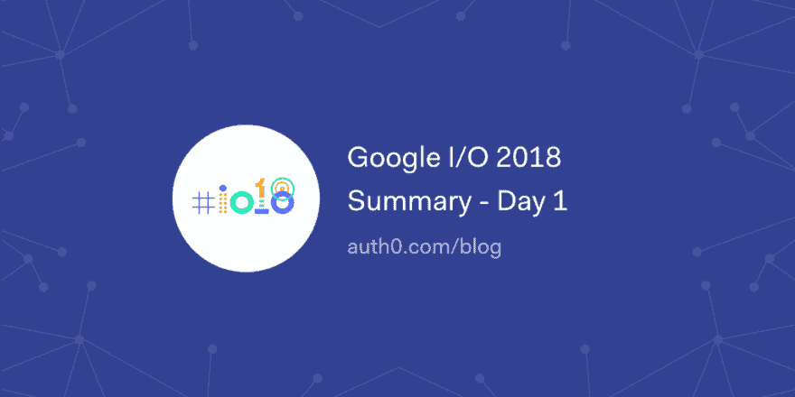

# 谷歌 I/O 2018 总结-第 1 天

> 原文：<https://dev.to/auth0/google-io-2018-summary---day-1-4gd2>

5，000 多名开发人员、设计人员和管理人员齐聚一堂，参加谷歌今年最大的活动！第一天包括谷歌首席执行官桑德尔·皮帅的一般性开幕主题演讲，由谷歌开发者产品组副总裁 Jason Titus 和其他几个人主持的开发者主题演讲。

[读下去🎡](https://auth0.com/blog/googleio-summary-day-one/?utm_source=dev&utm_medium=sc&utm_campaign=googleio_summary)

[T2】](https://res.cloudinary.com/practicaldev/image/fetch/s--4M-4A-85--/c_limit%2Cf_auto%2Cfl_progressive%2Cq_auto%2Cw_880/https://thepracticaldev.s3.amazonaws.com/i/on8yx6c757ui9vpo0efy.png)