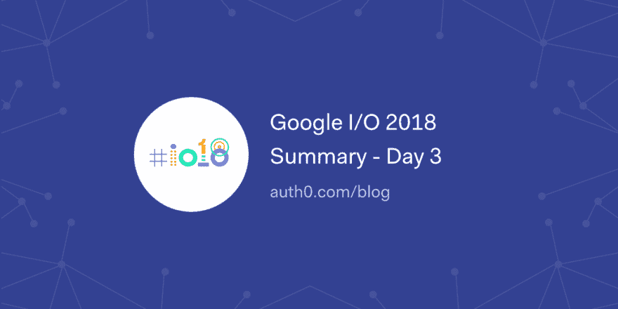

# 谷歌 I/O 2018 总结-第 3 天

> 原文：<https://dev.to/auth0/google-io-2018-summary---day-3-2kg9>

Google I/O 18 的最后一天由几个讲座组成，包括 Node.js、无服务器部署、Tensorflow、Android 安全。

阅读第三天发生的事情🎡
[T5】](https://res.cloudinary.com/practicaldev/image/fetch/s--YwaMzgl8--/c_limit%2Cf_auto%2Cfl_progressive%2Cq_auto%2Cw_880/https://thepracticaldev.s3.amazonaws.com/i/m74byljympnrykdzeapv.png)