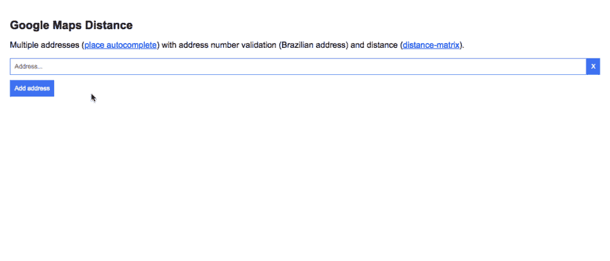

# 谷歌地图距离

> 原文：<https://dev.to/giovanigenerali/google-maps-distance-3n82>

多个地址( [place autocomplete](https://developers.google.com/places/web-service/autocomplete) )带地址号验证(巴西地址)和距离([距离矩阵](https://developers.google.com/maps/documentation/distance-matrix/start))。

[T2】](https://res.cloudinary.com/practicaldev/image/fetch/s--2CpzBW6_--/c_limit%2Cf_auto%2Cfl_progressive%2Cq_66%2Cw_880/https://thepracticaldev.s3.amazonaws.com/i/erfiuf0en4tb9a21ghoy.gif)

## Github

[https://github.com/wgenial/googlemaps-distance](https://github.com/wgenial/googlemaps-distance)

## 预览

[http://htmlpreview.github.io/?https://github . com/wgenial/Google maps-calculate-distance/blob/master/index . html](http://htmlpreview.github.io/?https://github.com/wgenial/googlemaps-calculate-distance/blob/master/index.html)