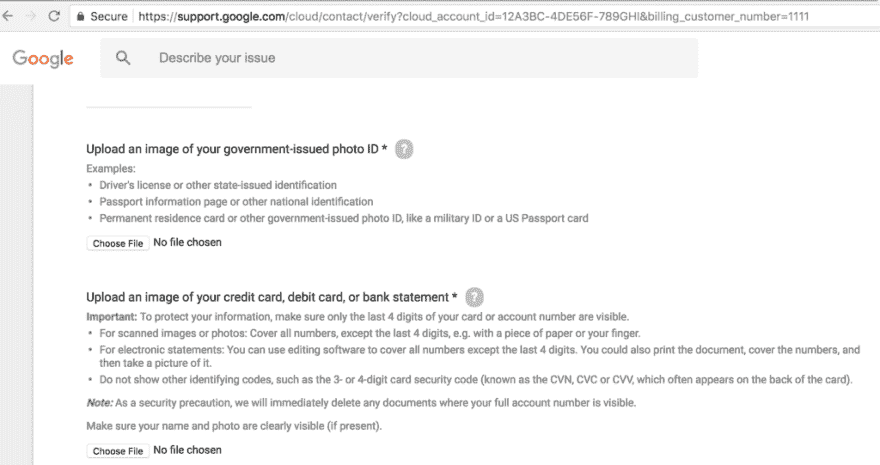

# 谷歌支持和“合法”网络钓鱼

> 原文：<https://dev.to/securestep9/google-support-and-legit-phishing-415f>

[@Google](http://twitter.com/Google) 疯了吗？合法支持页面要求上传我的政府颁发的身份证照片和我的信用卡照片！到谷歌云？？来“验证”云账户？？网络罪犯将会感谢谷歌的#网络钓鱼礼物！

[T2】](https://res.cloudinary.com/practicaldev/image/fetch/s--YHjWiEz9--/c_limit%2Cf_auto%2Cfl_progressive%2Cq_auto%2Cw_880/https://cdn-images-1.medium.com/max/1024/1%2AL26fWqTd34RxxRWsEocoqA.png)

如果你想亲自尝试，下面是链接(真正的谷歌支持页面，而不是网络钓鱼):

[验证支付信息以继续](https://support.google.com/cloud/contact/verify?cloud_account_id=12A3BC-4DE56F-789GHI&billing_customer_number=1111)

当然，这种方法的问题是，我们已经在安全意识课程中教授用户二十年了，现在一个合法的网站永远不会使用这种行为来“验证”他的帐户，这就是钓鱼网站所做的…