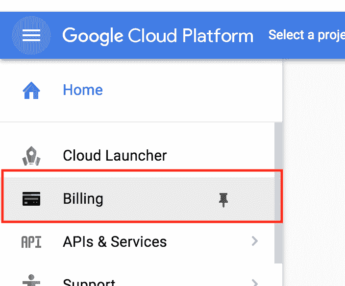
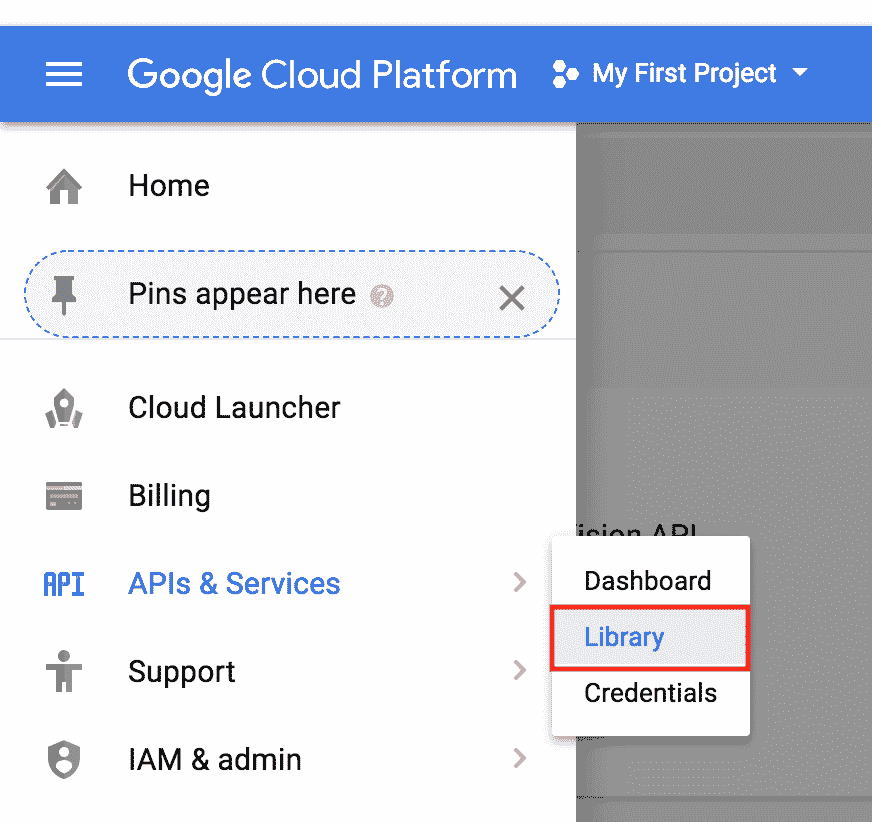
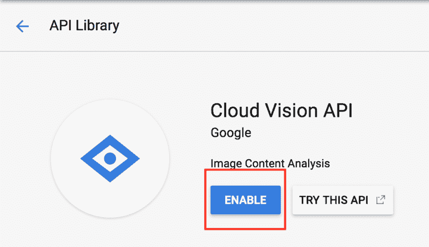
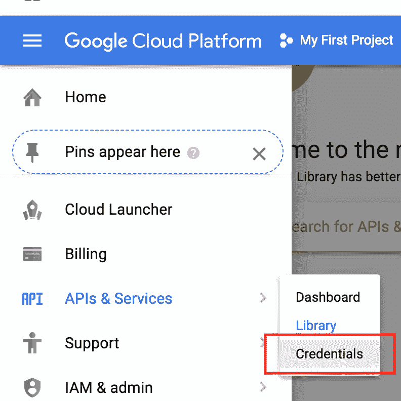
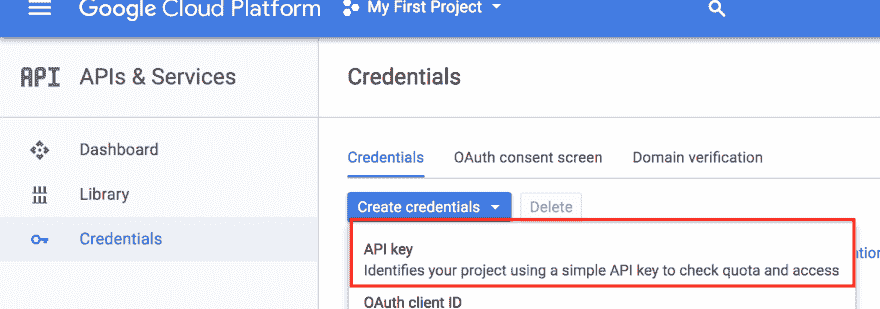
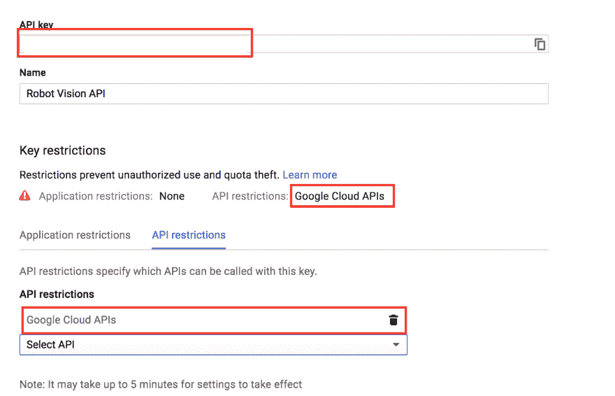

# 使用 Raspberry Pi 和 Node 的 Google Vision API

> 原文：<https://dev.to/ladvien/google-vision-api-using-raspberry-pi-and-node-k96>

这是一个将 Raspberry Pi Zero W 连接到 Google Vision API 的快速入门指南。

## 1。获得一个帐户

可悲的是，谷歌视觉 API 并不是一个完全免费的服务。在编写 API 的时候，一个帐户每月提供 1000 次免费的 Google Vision API 调用。那么，每 1000 次通话收费 1 美元。

我知道，我知道，不算太糟。但这不是一个商业项目。我想用它做一个小机器人。如果我的妻子因为我决定将图像流式传输到 API 而收到 40 美元的账单，那么，这将是一个死机器人。无论如何，我想我还是会探索便便和笑声的服务。

去拜访客户

*   [谷歌控制台](https://console.cloud.google.com/)

使用现有的 Google 帐户登录或创建一个。

## 2。输入帐单信息

现在，可怕的部分来了，你必须在开始之前输入你的账单信息。记住，如果你打 1000 次以上的电话，你将被收费。

[T2】](https://res.cloudinary.com/practicaldev/image/fetch/s--NbWyjDBK--/c_limit%2Cf_auto%2Cfl_progressive%2Cq_auto%2Cw_880/https://ladvien.cimg/google-vision-billing.png)

同样，如果您的免费通话次数超过 1000 次，您将需要付费。(什么？我已经说过了吗？哦。)

## 2。启用云视觉 API

在设置了计费信息之后，我们仍然需要启用 Cloud Vision API。这是一个安全特性，本质上，所有的谷歌 API 都是默认禁用的，所以如果有人意外进入，他们不会到处释放地狱。

[T2】](https://res.cloudinary.com/practicaldev/image/fetch/s--eNv9cE20--/c_limit%2Cf_auto%2Cfl_progressive%2Cq_auto%2Cw_880/https://ladvien.cimg/enable-cloud-vision.png)

现在搜索`Vision`并点击按钮。这里应该有一个炫目的`Enable`按钮。按下它。

[T2】](https://res.cloudinary.com/practicaldev/image/fetch/s--hTrBeqgw--/c_limit%2Cf_auto%2Cfl_progressive%2Cq_auto%2Cw_880/https://ladvien.cimg/cloud-vision-enable-button.png)

我们需要做的最后一件事是获取 API 密钥。这需要包含在用于认证的 API 调用头中。

不要让任何人得到你的 API 密匙。并且不要在代码中硬编码它。相信我，它会咬你的。如果这个意外地被推送到网络上，网络爬虫会很快找到它，你将会支付数十亿美元。

让这篇文章吓你一跳。

*   [Dev 将 AWS 密钥放在 Github 上](https://www.theregister.co.uk/2015/01/06/dev_blunder_shows_github_crawling_with_keyslurping_bots/)

我们去拿你的 API 密匙。找到`Credentials`部分

[T2】](https://res.cloudinary.com/practicaldev/image/fetch/s--owbwQ_YO--/c_limit%2Cf_auto%2Cfl_progressive%2Cq_auto%2Cw_880/https://ladvien.cimg/google-cloud-vision-credentials.png)

您可能看不到任何创建的凭证，因为您可能还没有创建任何凭证。

让我们创建一个新的 API 键。
[T3】](https://res.cloudinary.com/practicaldev/image/fetch/s--ssOVto8T--/c_limit%2Cf_auto%2Cfl_progressive%2Cq_auto%2Cw_880/https://ladvien.cimg/google-vision-create-credentials.png)

我会给这个键起一个有意义的名字，并且只限于 Google Cloud API。

[T2】](https://res.cloudinary.com/practicaldev/image/fetch/s--LqxC3Am4--/c_limit%2Cf_auto%2Cfl_progressive%2Cq_auto%2Cw_880/https://ladvien.cimg/cloud-vision-create-api-key.png)

继续复制您的 API 密钥，因为我们将在下一步中需要它。

## 3。Raspberry Pi 侧面设置

本文顶部列出的文章将帮助您为这一步设置 Raspberry Pi。但是如果你在做不同的事情，大部分对你来说仍然有效。然而，当我们谈到关于环境变量的部分时，对于其他版本的 Linux 来说会有所不同。

从你的 Pi 开始。

并更新所有软件包

```
sudo pacman -Syu 
```

Enter fullscreen mode Exit fullscreen mode

我们将为 Google Cloud Vision API 创建一个环境变量。这是为了避免将 API 键硬编码到代码中。*那将会工作*，但是我强烈建议您继续使用我的方法，设置一个环境变量管理器来处理 API。

通过键入
切换到根用户

```
su 
```

Enter fullscreen mode Exit fullscreen mode

输入您的密码。

我们要做的下一件事是将你的 Google Vision API Key 作为一个环境变量添加到`/etc/profile`文件中，这将导致它在启动时被初始化。

类型，用实际的 API 键替换`YOUR_API_KEY`。

```
echo 'export GOOGLE_CLOUD_VISION_API_KEY=YOUR_API_KEY' >> /etc/profile 
```

Enter fullscreen mode Exit fullscreen mode

现在重新启动 Pi 以使其生效。

```
sudo reboot 
```

Enter fullscreen mode Exit fullscreen mode

重新登录。让我们检查一下，确保它正在加载 API 键。

```
echo $GOOGLE_CLOUD_VISION_API_KEY 
```

Enter fullscreen mode Exit fullscreen mode

如果您的 API 键得到回应，那么您就可以开始了。

## 4。项目设置

让我们创建一个项目目录。

```
mkdir google-vis
cd google-vis 
```

Enter fullscreen mode Exit fullscreen mode

现在让我们初始化一个新的节点项目。

```
npm init 
```

Enter fullscreen mode Exit fullscreen mode

如果您愿意，可以随意定制包的详细信息。如果你像我一样懒，按回车键直到你回到命令提示符。

让我们添加所需的节点库。是一个。axios 库，支持异步 web 请求。

```
npm axios 
```

Enter fullscreen mode Exit fullscreen mode

[ ](https://res.cloudinary.com/practicaldev/image/fetch/s--bK-y6To1--/c_limit%2Cf_auto%2Cfl_progressive%2Cq_auto%2Cw_880/https://ladvien.cimg/hepburn.png) {:。另外，让我们创建一个资源目录并下载我们可爱的测试图像。啊，赫本小姐！

下载图像时，确保您在`google-vis/resources`项目目录中。

```
mkdir resources
cd resources
wget https://ladvien.cimg/hepburn.png 
```

Enter fullscreen mode Exit fullscreen mode

## 5。NodeJS Code(节点代码)

在`go-vis`目录下创建一个名为`app.js`
的文件

```
nano app.js 
```

Enter fullscreen mode Exit fullscreen mode

然后粘贴下面的代码，通过键入 CTRL+O 并使用 CTRL+X 退出来保存文件

```
// https://console.cloud.google.com/
const axios = require('axios');
const fs = require('fs');

const API_KEY = process.env.GOOGLE_CLOUD_VISION_API_KEY

if (!API_KEY) {
  console.log('No API key provided')
} 

function base64_encode(file) {
    // read binary data
    var bitmap = fs.readFileSync(file);
    // convert binary data to base64 encoded string
    return new Buffer(bitmap).toString('base64');
}
var base64str = base64_encode('./resources/audrey.jpg');

const apiCall = `https://vision.googleapis.com/v1https://ladvien.cimg/:annotate?key=${API_KEY}`;

const reqObj = {
    requests:[
        {
          "image":{
            "content": base64str
          },
          "features":[
                {
                    "type":"LABEL_DETECTION",
                    "maxResults":5
                },
                {
                    "type":"FACE_DETECTION",
                    "maxResults":5            
                },
                {
                    "type": "IMAGE_PROPERTIES",
                    "maxResults":5
                }
            ]
        }
      ]
}

axios.post(apiCall, reqObj).then((response) => {
    console.log(response);
    console.log(JSON.stringify(response.data.responses, undefined, 4));
}).catch((e) => {
    console.log(e.response);
}); 
```

Enter fullscreen mode Exit fullscreen mode

这段代码获取 API key 环境变量，并从中创建一个程序常量。

```
const API_KEY = process.env.GOOGLE_CLOUD_VISION_API_KEY 
```

Enter fullscreen mode Exit fullscreen mode

这就是我们避免硬编码 API 键的方法。

## 6。奔跑

让我们运行程序。

```
node app.js 
```

Enter fullscreen mode Exit fullscreen mode

如果一切顺利，您应该得到类似于下面的输出

```
data:  {  responses:  [  [Object]  ]  }  }  [  {  "labelAnnotations":  [  {  "mid":  "/m/03q69",  "description":  "hair",  "score":  0.9775374,  "topicality":  0.9775374  },  {  "mid":  "/m/027n3_",  "description":  "eyebrow",  "score":  0.90340185,  "topicality":  0.90340185  },  {  "mid":  "/m/01ntw3",  "description":  "human hair color",  "score":  0.8986981,  "topicality":  0.8986981  },  {  "mid":  "/m/0ds4x",  "description":  "hairstyle",  "score":  0.8985265,  "topicality":  0.8985265  },  {  "mid":  "/m/01f43",  "description":  "beauty",  "score":  0.87356544,  "topicality":  0.87356544  }  ],  ....  ] 
```

Enter fullscreen mode Exit fullscreen mode

## 6。还有更多...

这篇文章很短，是一个很好的开端。然而，这里有很多潜力。例如，使用 Raspberry Pi 相机发送您自己的图像

*   拉斯皮卡姆
*   [pi-摄像机](https://www.npmjs.com/package/pi-camera)

请随时询问关于如何使用输出的任何问题。

还有其他特征检测请求。

*   [谷歌视觉 API -其他功能](https://cloud.google.com/vision/docs/other-features)

不过，我打算结束这篇文章，继续讨论我的视觉检测系统。一旦我算出随机梯度下降。