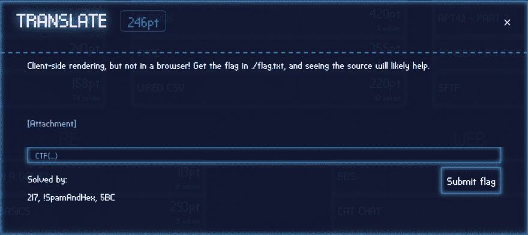
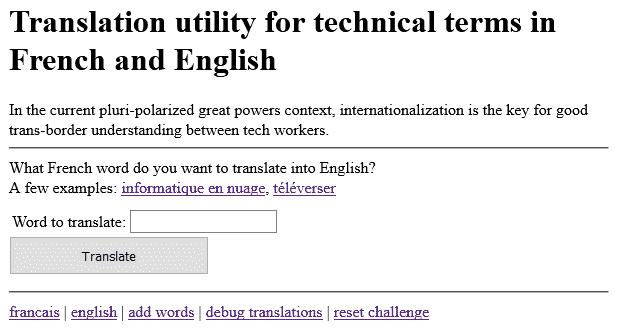
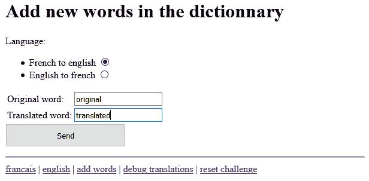
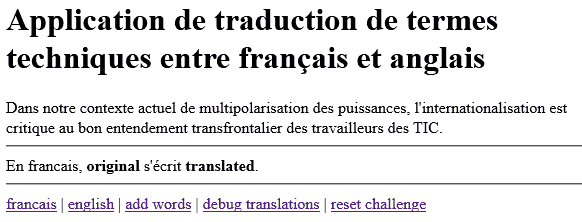
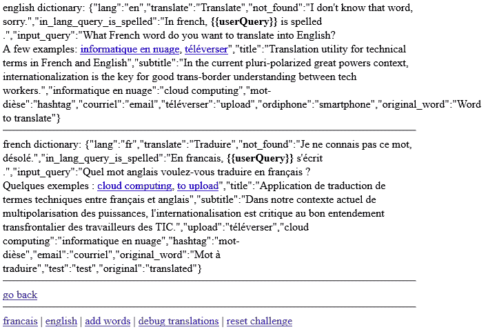
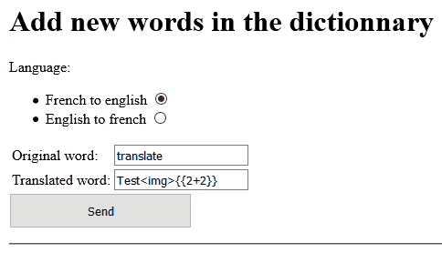
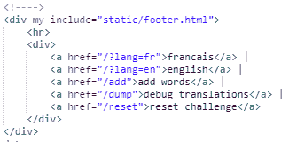

# GoogleCTF 2018:翻译文章

> 原文：<https://dev.to/antogarand/googlectf-2018-translate-writeup-4g58>

# 简介

今年，谷歌又一次举办了一场夺旗大赛。
目标是发现各种应用程序中的漏洞，从而找到`flag`并获得积分。

你可以在这里查看网站:[网站](https://capturetheflag.withgoogle.com)

挑战应该保持在线，直到它们被打破，因为它们不再被监控。

这篇文章将涵盖网络**翻译**挑战的解决方案。

# 挑战:翻译

[T2】](https://res.cloudinary.com/practicaldev/image/fetch/s--F13bY3Hc--/c_limit%2Cf_auto%2Cfl_progressive%2Cq_auto%2Cw_880/https://gitlab.com/AntonyGarand/blogposts/raw/master/assets/challenge.png)

附件包含了挑战本身的链接:[http://translate.ctfcompetition.com:1337](http://translate.ctfcompetition.com:1337)

## 信息收集

这是一个帮助我们在法语和英语之间翻译单词的网络应用程序。

下面是几个应用程序的截图:

**指标**

[](https://res.cloudinary.com/practicaldev/image/fetch/s--4CyKDKNG--/c_limit%2Cf_auto%2Cfl_progressive%2Cq_auto%2Cw_880/https://gitlab.com/AntonyGarand/blogposts/raw/master/assets/translate_index.png)

**添加翻译**

[](https://res.cloudinary.com/practicaldev/image/fetch/s--JBZmlUAz--/c_limit%2Cf_auto%2Cfl_progressive%2Cq_auto%2Cw_880/https://gitlab.com/AntonyGarand/blogposts/raw/master/assets/add_translation.png)

[](https://res.cloudinary.com/practicaldev/image/fetch/s--8V6O0UZ1--/c_limit%2Cf_auto%2Cfl_progressive%2Cq_auto%2Cw_880/https://gitlab.com/AntonyGarand/blogposts/raw/master/assets/add_translation_result.png)

**查看译文**

[](https://res.cloudinary.com/practicaldev/image/fetch/s--5x2eCZRJ--/c_limit%2Cf_auto%2Cfl_progressive%2Cq_auto%2Cw_880/https://gitlab.com/AntonyGarand/blogposts/raw/master/assets/view_translation.png)

**转储**

[](https://res.cloudinary.com/practicaldev/image/fetch/s--iVkj14mL--/c_limit%2Cf_auto%2Cfl_progressive%2Cq_auto%2Cw_880/https://gitlab.com/AntonyGarand/blogposts/raw/master/assets/debug_translations.png)

## 解决挑战

### 1。入口点

当查看源代码时，我们可以注意到它是一个 AngularJS 应用程序:

[](https://res.cloudinary.com/practicaldev/image/fetch/s--94EvrYCA--/c_limit%2Cf_auto%2Cfl_progressive%2Cq_auto%2Cw_880/https://gitlab.com/AntonyGarand/blogposts/raw/master/assets/source_angular.png) 

但奇怪的是，页面上没有 JavaScript，因为这个应用程序是服务器端呈现的。

我们需要做的第一件事是找到一个 XSS，并在这个页面中注入我们自己的代码。

我的第一个尝试是添加一个包含 HTML 或角模板内容的单词:

[](https://res.cloudinary.com/practicaldev/image/fetch/s--UdVGlGMP--/c_limit%2Cf_auto%2Cfl_progressive%2Cq_auto%2Cw_880/https://gitlab.com/AntonyGarand/blogposts/raw/master/assets/translate_xss_test.png) 

但是这个没有成功，因为它已经被杀毒了。

这个注入的关键在调试页面，它包含以下 JSON:

```
{  "lang":  "fr",  "translate":  "Traduire",  "not_found":  "Je ne connais pas ce mot, désolé.",  "in_lang_query_is_spelled":  "En francais,\n<b>{{userQuery}}</b> s'écrit\n <b ng-bind=\"i18n.word(userQuery)\"></b>.",  //  ...  "original_word":  "Mot à traduire",  "test{{2+2}}":"test{{2+2}}"  } 
```

注入的单词位于对象的根，紧挨着应用程序的原始键。

与我们注入的单词不同，原始键内部的表达式被正确地渲染和求值。
这个可以通过覆盖`translate`键来测试:

[](https://res.cloudinary.com/practicaldev/image/fetch/s--Nc0HB7R2--/c_limit%2Cf_auto%2Cfl_progressive%2Cq_auto%2Cw_880/https://gitlab.com/AntonyGarand/blogposts/raw/master/assets/translate_xss_poc_1.png)

[](https://res.cloudinary.com/practicaldev/image/fetch/s--F8-0g1Xy--/c_limit%2Cf_auto%2Cfl_progressive%2Cq_auto%2Cw_880/https://gitlab.com/AntonyGarand/blogposts/raw/master/assets/translate_xss_poc_2.png)

因为我们可以用新的未赋值的值覆盖原来的 JSON 键，所以我们可以继续！

注意:我现在注意到我们也可以覆盖`in_lang_query_is_spelled`键来改变我们的单词是如何呈现的，但是最终解决方案保持不变。

还要注意，虽然这个切入点对每个人来说都是常见的，但是许多团队从这里找到了替代的解决方案。我将写下我的经历和我认为的通往这面旗帜的最短路径，但会在资源部分链接其他有趣的技巧和文章。

### 2。转储源

当查看页脚源代码时，我们可以看到一个自定义的`my-include="static/footer.html"`属性。

[T5】](https://res.cloudinary.com/practicaldev/image/fetch/s--X2744wDs--/c_limit%2Cf_auto%2Cfl_progressive%2Cq_auto%2Cw_880/https://gitlab.com/AntonyGarand/blogposts/raw/master/assets/footer_source.png)

如果我们试图用`my-include="flag.txt"`创建自己的 div 会发生什么？

嗯，没那么简单！

这里是将`translate`翻译成`<div my-include="flag.txt"></div>`时的索引页:

[](https://res.cloudinary.com/practicaldev/image/fetch/s--tH0aI_Jy--/c_limit%2Cf_auto%2Cfl_progressive%2Cq_auto%2Cw_880/https://gitlab.com/AntonyGarand/blogposts/raw/master/assets/flag_error_include.png)

my-include 指令只允许我们读取`js`、`json`或`html`文件，而`flag.txt`文件不是这些格式。

因为我们可以读取 js 文件，所以让我们试着检查应用程序源代码！

我在这里的第一次尝试是查找应用索引，比如`index.js`、`app.js`，但是没有成功。

大多数 NodeJS 应用程序都有一个常用的文件是`package.json`，用来列出依赖关系和管理应用程序入口点:

```
<div my-include="package.json">{ "name" : "ctfssr",
 "version": "0.0.1",
 "main": "./srcs/index.js",
 "dependencies": {
  "domino": "=2.0.2",
  "express": "=4.16.3",
  "vm2": "=3.6.0",
  "memcached-promisify": "latest",
  "uuid": "latest",
  "cookie-parser": "latest"
 }
}
</div> 
```

因此,`srcs/index.js`应该是应用程序的入口点，正如在`package.json`文件的`main`键中所描述的。

嗯，事实证明并非如此:

```
<div my-include="srcs/index.js">Couldn't load template: Error: ENOENT: no such file or directory, open './srcs/index.js'</div> 
```

搜索了一会儿入口点， [@molnar_g](https://twitter.com/molnar_g) 终于在 CTF 结束后给了我解决方案:`srcs/server.js`

我会记下把`server.js`添加到我的入口点模糊列表中！

有了这些信息，我们就可以转储服务器的来源了！

本文将重点介绍主要部分，但如果你想要完整的源代码，应该将它添加到 GoogleCTF github 项目中:[https://github.com/google/google-ctf](https://github.com/google/google-ctf)

或者你可以在网站还在运行的时候就从网站上下载。

源代码中有趣的部分是 SSR 是如何在 renderWithAngular 函数中完成的:

```
function renderWithAngular(givenScope, lang, fs, ip) {
  try {
    // Remember the AngularJS sandbox? Only 2010's kids remember.
    const sandbox = new NodeVM ({
      require: {
        // ...
        import: [
          `./srcs/sandboxed/angularjs_for_domino.js`,
          `./srcs/sandboxed/app.js`,
          `domino`
        ],
    // ...
    let renderAngularApp = sandbox.run(`
      const domino = require('domino');
      const initAngularJS = require('./srcs/sandboxed/angularjs_for_domino.js');
      const angularApp = require('./srcs/sandboxed/app.js');

      module.exports = async (givenScope, lang, fs, ds) => {
          // ...
          initAngularJS(window);
          try {
            await angularApp(window, givenScope, i18n, lang);
            return window.document.innerHTML;
          } catch (error) {
            return 'You broke my AngularJS :( ' + error + '
          }
    `, 'server.js'); 
```

这让我们可以找到更多要提取的内容，特别是`./srcs/sandboxed/app.js`应用程序！
app . js 文件包含`paramsController`和`myInclude`指令:

```
// App functionnality
app.controller('paramsController', function($window, $scope, i18n) {
    $scope.window = $window;
    $scope.i18n = i18n;
    for (const k of Object.keys(givenScope)) {
        $scope[k] = givenScope[k];
    }
}); 
```

```
// A directive to load internationalized templates.
app.directive('myInclude', ($compile, $sce, i18n) => {
    var recursionCount = 0;
    return {
        restrict: 'A',
        link: (scope, element, attrs) => {
            if (!attrs['myInclude'].match(/\.html$|\.js$|\.json$/)) {
                throw new Error(`Include should only include html, json or js files ಠ_ಠ`);
            }
            // ...
            element.html(i18n.template(attrs['myInclude']));
            $compile(element.contents())(scope);
        }
    };
}); 
```

前面代码中有趣的部分是`paramsController`中的`$scope`赋值和`myInclude`指令中的`i18n.template`用法。

为了加载一个外部文件，myInclude 指令使用了`i18n.template`，来自 i18n 服务。

我没有在这里添加`i18n.js`源代码，但是它的行为类似于`fs.readFileSync`，做了一点额外的解析。

由于`paramsController`向应用程序的`$scope`添加了`i18n`变量，这意味着我们可以在我们的 HTML 中使用它！

### 3。提取旗帜

为值为`FLAG::{{i18n.template('flag.txt')}}::ENDFLAG`的`translate`添加翻译应该提取标志:

[](https://res.cloudinary.com/practicaldev/image/fetch/s--3tTzfFVa--/c_limit%2Cf_auto%2Cfl_progressive%2Cq_auto%2Cw_880/https://gitlab.com/AntonyGarand/blogposts/raw/master/assets/flag.png)

# 参考文献

[谷歌 CTF 2018](https://capturetheflag.withgoogle.com/)

[挑战本身](http://translate.ctfcompetition.com:1337)

[替代性报道](https://auxy233.github.io/Google-CTF-web-partial/#translate)
这个团队没有转储源代码，而是对当前作用域的变量进行了修改。

[monlar_g 的推文](https://twitter.com/molnar_g/status/1011102786367512579)给我`server.js`路径