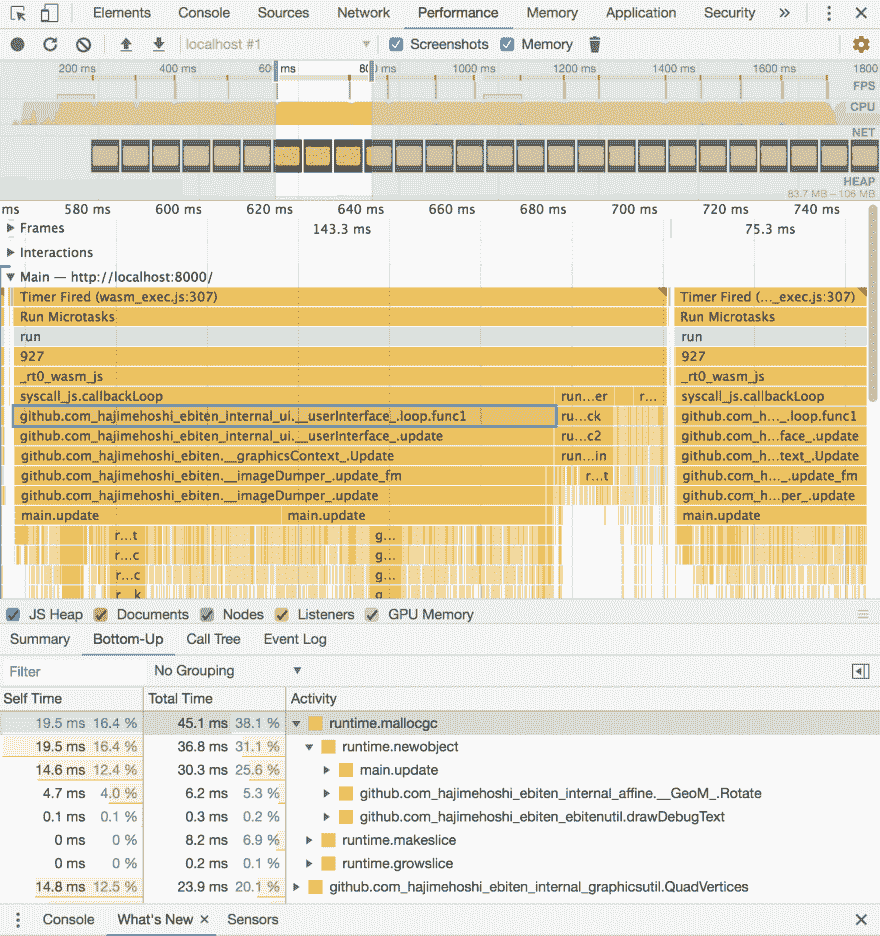

# GopherJS vs WebAssembly for Go

> 原文：<https://dev.to/hajimehoshi/gopherjs-vs-webassembly-for-go-148m>

**编辑**:最新的 GopherJS/Wasm 对比，参见 [Wasm 基准测试结果](https://github.com/hajimehoshi/wasm-bench)

* * *

大家好！

这篇文章描述了我对 Go 的新 WebAssembly 端口[的实验。WebAssembly 端口现在在 Go 的 master 分支上可用，您需要自己编译 Go。](https://github.com/golang/go/issues/18892)

# TL；博士；医生

*   我已经创建了 [GopherWasm](https://github.com/hajimehoshi/gopherwasm) ，一个不可知的 WebAssembly 包装器，它在 GopherJS 和 WebAssembly 端口上都工作。
*   GopherJS 和 WebAssembly 的性能取决于浏览器。在某些环境下，GopherJS 比 WebAssembly 快，而在其他环境下则较慢。以 Ebiten 'sprite '为例，`(GopherJS on Chrome) > (WebAssembly on Firefox) > (GopherJS on Firefox) > (WebAssembly on Chrome)`有 5000 个 sprite。

# 上浏览器

在网络浏览器上运行 Go 应用一定很牛逼。不用说，围棋是一门很牛逼的语言。本文不讨论围棋有多好:-)

有一个 transpiler 从 Go 到 JavaScript - [GopherJS](https://github.com/gopherjs/gopherjs/) 作者 [Richard Musiol](https://github.com/neelance) 。这也使得 Go 程序可以同时在浏览器和 Node.js 上运行，你可以使用 Go 的所有特性。编译结果是相当可读的 JavaScript。由于一些开销，性能一般。为了精确地模拟 Go 行为，GopherJS 增加了一些开销，比如对切片的索引访问的边界检查。在浏览器上执行像 WebAssembly 这样的二进制文件似乎比用 JavaScript 模拟 Go 行为更有效。

与 JavaScript 相比，WebAssembly 是一种基于性能的格式。大多数现代浏览器都支持 WebAssembly。WebAssembly 顾名思义是低级语言，预计 WebAssembly 二进制是从其他语言生成的。其实 C，C++和 Rust 已经支持 WebAssembly 端口了。

[最新的 Go 版本 1.11](https://tip.golang.org/doc/go1.11) 支持 GopherJS 的同一个作者 Richard Musiol 的 WebAssembly port。现在 Go 1.11 即将发布，但是你可以通过自己编译来测试最新 Go 的 WebAssembly APIs。您为 WebAssembly 编译的程序在浏览器和 Node.js 上都可用。您可以使用 Go 的所有功能，包括 goroutines。您可以从 Go 调用任何 JavaScript 函数，并且可以将 Go 函数作为 JavaScript 回调来传递。API 在 [`syscall/js`包](https://tip.golang.org/pkg/syscall/js/?GOOS=js&GOARCH=wasm)中定义。WebAssembly 的环境变量是`GOOS=js`和`GOARCH=wasm`。由于 WebAssembly 是基于性能的格式，这应该比 GopherJS 快，对吗？不幸的是，事实并非如此。这个我以后再描述。

# Ebiten

Ebiten 是我设计的一个非常简单的 2D 游戏库。这基本上是一个 OpenGL 包装器。这在 GopherJS 的 WebGL 浏览器上运行，实际上你可以看到一些例子在[网站](https://hajimehoshi.github.io/ebiten/)和[jsgo 游乐场](https://play.jsgo.io/github.com/hajimehoshi/ebiten/examples/flappy)上运行 [Dave Brophy](https://github.com/dave) 。最近(其实是今天！)我修复了 Ebiten(主分支)接受最新 Go 编译器的 WebAssembly 编译，除了音频部分。因此，Ebiten 现在可以在 GopherJS 和 WebAssembly 上工作了！

# 将 GopherJS 库移植到 WebAssembly

我说过，Ebiten 已经可以和 GopherJS 一起工作了。GopherJS 的 API 类似于 WebAssembly，但有所不同。比如 GopherJS 的`js.Object`对应的就是`syscall/js`的`js.Value`。

*   [GopherJS API](https://godoc.org/github.com/gopherjs/gopherjs/js)
*   [`syscall/js` API](https://tip.golang.org/pkg/syscall/js/?GOOS=js&GOARCH=wasm)

那么，如何编写同时接受 GopherJS 和 WebAssembly 的库呢？当然，编写类似的重复代码是很容易的，但是难道没有更好的方法吗？

我已经创建了 [GopherWasm](https://github.com/hajimehoshi/gopherwasm) ，一个不可知的 WebAssembly 包装器。如果您使用 GopherWasm，您的库将自动在 GopherJS 和 WebAssembly 端口上工作！ [GopherWasm API](https://godoc.org/github.com/hajimehoshi/gopherwasm/js) 与`syscall/js`几乎相同。唯一不同的是`js.ValueOf`在 GopherWasm 中接受`[]float32`或其他切片，而在`syscall/js`中不接受。我已经[提交](https://github.com/golang/go/issues/25532)来解决`syscall/js.ValueOf`接受这样的切片，所以在不久的将来情况可能会改变。

# 性能对比

我用我的 Ebiten 示例“sprites”比较了 GopherJS 和 WebAssembly 端口之间的性能。

*   [精灵(GopherJS)](https://jsgo.io/github.com/hajimehoshi/ebiten/examples/sprites)
*   [精灵(WebAssembly)](https://storage.googleapis.com/ebiten-test/index.html)

[T2】](https://res.cloudinary.com/practicaldev/image/fetch/s--XSz82o35--/c_limit%2Cf_auto%2Cfl_progressive%2Cq_auto%2Cw_880/https://thepracticaldev.s3.amazonaws.com/i/7fdraepf6f6k9cn3dxxe.png)

通过按左箭头键或右箭头键，您可以更改精灵的数量，并查看 FPS(每秒帧数)如何变化。

在我的 MacBook Pro 2014 上，我通过显示 5000 个精灵进行了非常粗略的测量:

```
GopherJS on Chrome:     55-60 FPS
GopherJS on Firefox:    20-25 FPS
WebAssembly on Chrome:  15-20 FPS
WebAssembly on Firefox: 40-45 FPS 
```

Enter fullscreen mode Exit fullscreen mode

*   Chrome:版本 67.0.3396.87(官方版本)(64 位)
*   火狐浏览器:60.0.2 (64 位)
*   ebiten:460 c 47 a9 ebaa 21 bcce 730 a 460 a7f 87 fa 6 CBE 56 ed
*   go:534 ddf 741 f 6a 5 fc 38 FB 0 bb 3 e 3547d 3231 c 51 a 7 be

这是一个非常有趣的结果。在这个实验之前，我认为 WebAssembly 应该总是比 GopherJS 快。然而，结果取决于浏览器。对于 5000 个精灵，结果是`(GopherJS on Chrome) > (WebAssembly on Firefox) > (GopherJS on Firefox) > (WebAssembly on Chrome)`。我猜不同浏览器的优化方式是不同的。

我粗略地分析了一下，看起来分配(`runtime.mallocgc`)是 WebAssembly 上最繁重的任务。这是不同于 GopherJS 的趋势。我不确定 WebAssembly 上对象如何分配的细节，但至少 WebAssembly 需要与 GopherJS 不同的优化。

[T2】](https://res.cloudinary.com/practicaldev/image/fetch/s--lNyUuTXP--/c_limit%2Cf_auto%2Cfl_progressive%2Cq_auto%2Cw_880/https://thepracticaldev.s3.amazonaws.com/i/0gcl7n9t51xpv5kwupm4.png)

我打算做优化尽量保持 60 FPS。敬请期待！

# 二进制大小比较

```
-rw-r--r--    1 hajimehoshi  staff  7310436 Jun 16 05:23 sprites.js
-rw-r--r--    1 hajimehoshi  staff   278394 Jun 16 05:23 sprites.js.map
-rwxr-xr-x    1 hajimehoshi  staff  8303883 Jun 16 04:03 sprites.wasm 
```

Enter fullscreen mode Exit fullscreen mode

看起来 WebAssembly 二进制文件稍微大一点。

# 附录-如何做实验

## 安装 Ebiten 等库

```
go get -u github.com/hajimehoshi/ebiten/...
go get -u github.com/hajimehoshi/gopherwasm
go get -u github.com/gopherjs/gopherjs 
```

Enter fullscreen mode Exit fullscreen mode

## 获取最新的 Go 并编译

```
cd git clone https://go.googlesource.com/go go-code
cd go-code/src

# Compile Go. ./all.bash is also fine if you want to run tests.
./make.bash 
```

Enter fullscreen mode Exit fullscreen mode

## 为 WebAssembly 编译一个 Ebiten 示例

```
cd /path/to/your/wasm/project

# Compile 'sprites' example for WebAssembly
GOOS=js GOARCH=wasm ~/go-code/bin/go build -tags=example -o sprites.wasm github.com/hajimehoshi/ebiten/examples/sprites

# Copy wasm_exec.js
cp ~/go-code/misc/wasm/wasm_exec.js . 
```

Enter fullscreen mode Exit fullscreen mode

准备一个 HTML 文件来运行 wasm 文件。本文件基于`~/go-code/misc/wasm/index.html`。

```
<!DOCTYPE html>
<script src="wasm_exec.js"></script>
<script>
// Polyfill
if (!WebAssembly.instantiateStreaming) {
  WebAssembly.instantiateStreaming = async (resp, importObject) => {
    const source = await (await resp).arrayBuffer();
    return await WebAssembly.instantiate(source, importObject);
  };
}

const go = new Go();
WebAssembly.instantiateStreaming(fetch("sprites.wasm"), go.importObject).then(result => {
  go.run(result.instance);
});
</script> 
```

Enter fullscreen mode Exit fullscreen mode

随心所欲运行 HTTP 服务器。

## 运行 GopherJS 服务器

```
gopherjs serve --tags=example 
```

Enter fullscreen mode Exit fullscreen mode

然后访问`http://localhost:8080/github.com/hajimehoshi/ebiten/examples/sprites/`查看示例。