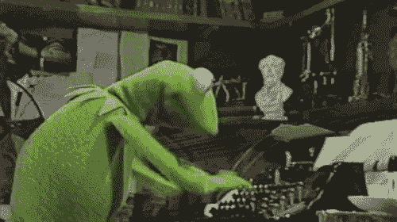
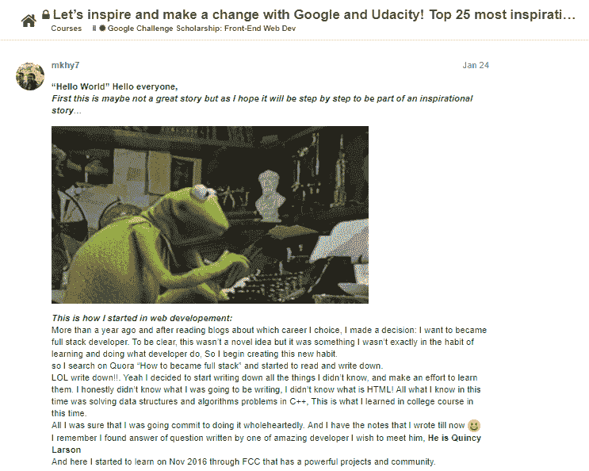
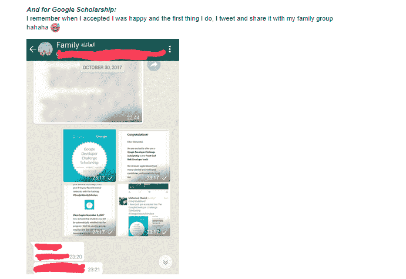
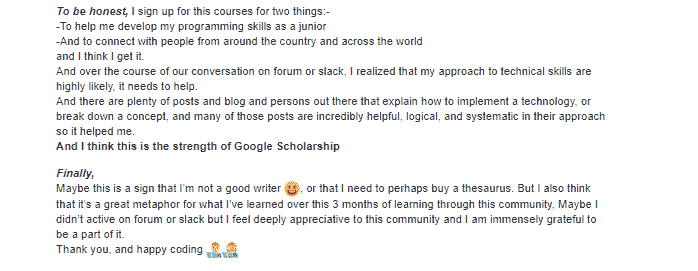
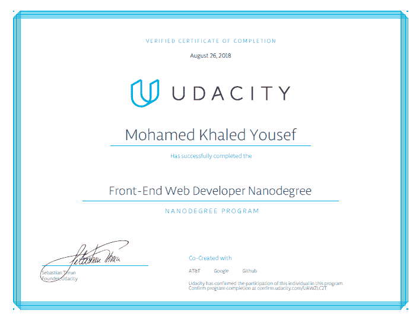

# 从前端纳米学位毕业

> 原文：<https://dev.to/this_mkhy/graduated-from-front-end-nanodegree-33c7>

## 本周我完成了来自 Udacity 和 Google 的前端 Nanodegree

 
**在这里你可以读到两件事，一是我如何开始学习 web 开发背后的故事，二是我从 Udacity Nanodegree 得到了什么？**

### 耶！我终于毕业了！经过 9 个月的紧张学习和专注工作，我做到了。我记得我面对的每一堂课，每一个问题，每一个项目。事实上，我记得 6 个多月前发生的一切。

什么！9 个多月以来更为准确...

自从奖学金宣布后，我就开始申请，然后当我被录取开始攻读纳米学位。真的，我非常荣幸能在 10，000 名学生中被选中参加由 Udacity 和 Google 提供的为期 3 个月的挑战，然后成为获得 6 个月 Google 开发者纳米学位的 10%全额奖学金的学生之一。我记得当我检查我的电子邮件时，哇:)
在纳米学位开始之前，Udacity 要求我们写一篇励志故事。我试着写一个简单的:

## 这里我了解到的亮点

我了解了可访问性、OOP JS 技术、闭包、“this”关键字、测试工具和新的 ES6 规范。我还学会了如何使用 API 为应用程序获取数据，如何使用 Git 版本控制系统，以及如何建立离线网站。最后，我了解了 React UI 库的强大之处。

## 在这里你可以找到所有 Nanodegree 的项目

*   [动物交易卡](https://github.com/mohamedkhaledyousef/Front-End-Projects/tree/master/3-Animal%20Trading%20Cards)
*   [像素美工师](https://github.com/mohamedkhaledyousef/Front-End-Projects/tree/master/6-Pixel%20Art%20Maker)
*   [投资组合](https://github.com/mohamedkhaledyousef/mohamedkhaledyousef.github.io)
*   [记忆游戏项目](https://github.com/mohamedkhaledyousef/Memory-Game-Project)
*   [街机游戏项目](https://github.com/mohamedkhaledyousef/ArcadeGame)
*   [进纸阅读器测试](https://github.com/mohamedkhaledyousef/Feed-Reader-Testing)
*   [餐厅点评 App](https://github.com/mohamedkhaledyousef/Restaurant-Reviews-App)
*   [我在阅读一款图书追踪应用](https://github.com/mohamedkhaledyousef/MyReads-A-Book-Tracking-App)
*   [在 Minia 中反应 Wow)](https://github.com/mohamedkhaledyousef/React-Wow-In-Minia)

## 我想说的最后一件事是回顾过去，一年前事情对我来说并不容易。

在开始纳米学位之前，我有很多感受和恐惧，我感到害怕，因为我总是觉得我需要更多的学习，所以我认为市场需要比我更多的技能。我认为有 x -技术，概念和趋势，我不仅应该知道，但它必须掌握。我知道这可能是我性格中的一个缺点，这让我害怕申请工作，因为我认为我没有资格申请。
无论如何，我努力摆脱我所遭受的恐惧，现在我认为我对自己的技能和我能做好的事情有了一些信心。

## 最后，从这里，真的感谢所有社区，导师和评论家，特别感谢谷歌和 Udacity 在这个神奇的旅程中获得这个证书

[T2】](https://res.cloudinary.com/practicaldev/image/fetch/s--8uwnj-Qt--/c_limit%2Cf_auto%2Cfl_progressive%2Cq_auto%2Cw_880/https://i.imgur.com/PLFiifS.png)