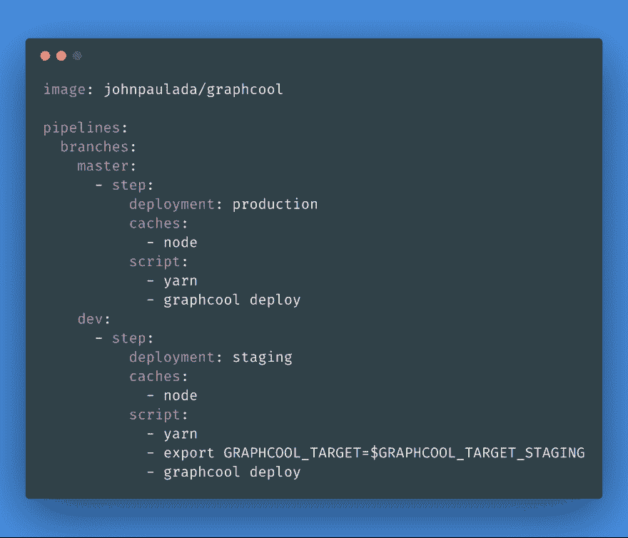

# 使用位桶管道的 GraphCool 连续部署

> 原文：<https://dev.to/johnpaulada/graphcool-continuous-deployment-with-bitbucket-pipeline-akd>

> 这最初发布在 [GAPLabs 工程博客](https://medium.com/gaplabs-engineering/graphcool-continuous-deployment-with-bitbucket-pipelines-cc1788e01c00)上。
> 
> 如果你能自动化它，你应该。

我们都试图以此为生，但这并不总是容易的。自动化不是最容易做到的事情。但应该是。并且持续部署具有位桶管道的 GraphCool 服务器。因为我们每天都在使用 Bitbucket，所以毫无疑问我们会选择使用 Bitbucket 管道作为我们的服务。

为了部署 GraphCool 服务器，我们只需执行以下步骤:

1.  安装 GraphCool CLI。
2.  安装依赖项。
3.  运行`graphcool deploy`。

## bitbucket-pipelines.yml

[T2】](https://res.cloudinary.com/practicaldev/image/fetch/s--6oG1HDul--/c_limit%2Cf_auto%2Cfl_progressive%2Cq_auto%2Cw_880/https://thepracticaldev.s3.amazonaws.com/i/o0r8khyzsvi41aob13qv.png)

就是这样。只需将这个 bitbucket-pipelines.yml 文件包含在根目录中，并将一些更改推送到主或开发分支。然后，它将开始构建和部署。如果你认为这是令人困惑的，这里有一个小故障。

### 击穿

这个管道使用`johnpaulada/graphcool`映像作为它的运行时映像，它只是一个安装了 GraphCool CLI 的节点映像。这就完成了上面的第一步。

加载映像后，它将开始安装与 Yarn 的依赖关系。这就完成了第二步。如果`yarn.lock`或`package.json`没有改变，管道缓存`node_modules`文件夹，使安装过程更快。

之后，运行`graphcool deploy`,开始部署过程。它从`GRAPHCOOL_TARGET`环境变量中知道将它部署到哪里。如果部署到`dev`，我们用`GRAPHCOOL_TARGET_STAGING`代替。这就完成了第 3 步。

## 环境变量

我们需要`GRAPHCOOL_TARGET`、`GRAPHCOOL_PLATFORM_TARGET`和`GRAPHCOOL_TARGET_STAGING`环境变量。你可以从你的`.graphcoolrc`文件中得到`GRAPHCOOL_TARGET`和`GRAPHCOOL_TARGET_STAGING`。`GRAPHCOOL_PLATFORM_TARGET`在你的`~/.graphcoolrc`文件中。