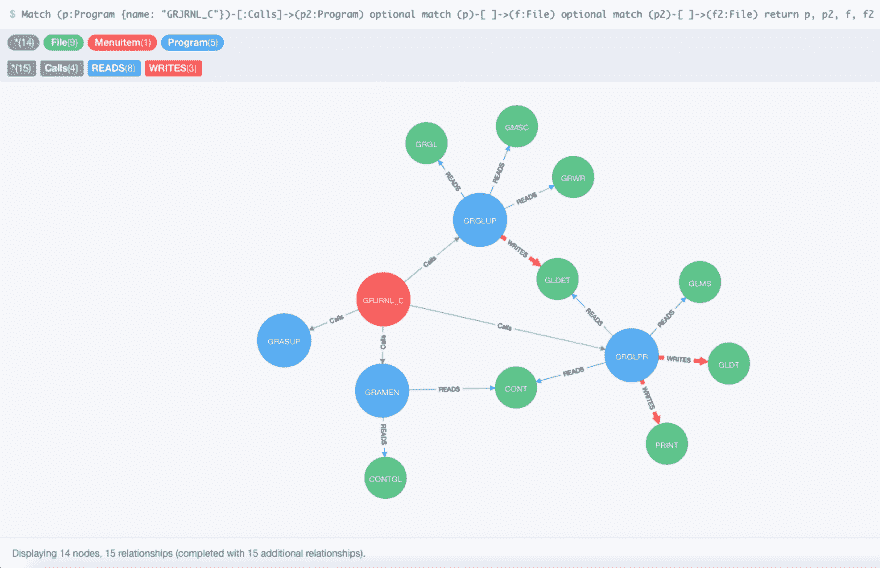

# 用 Neo4j 绘制 RPG 源代码

> 原文：<https://dev.to/jreighley/graphing-rpg-source-code-with-neo4j-l45>

在学习 Clojure 的过程中，我有很多疯狂的、过于雄心勃勃的想法。我发现尝试努力的事情真的很好。软件文档和培训材料看起来非常枯燥和晦涩，直到你建立了一个“桶”来存放知识。但是一旦你尝试过却失败了，或者没有效率地尝试并成功了，当你接受训练时，你会想，“如果我早知道，我就能那样写我的程序了。”一旦你知道知识如何有用以及为什么有用，记住知识就容易多了。你有钩子可以挂在上面。

一个这样的实验源于我对我们的软件进行“大规模文档化”的尝试。遗留的 RPG 代码是高度结构化的。它包含[‘F specs’](https://www.ibm.com/support/knowledgecenter/en/ssw_ibm_i_73/rzasd/fdsent.htm#fdsent)，定义了什么文件用于输入和输出。我一直致力于编写文档，并认为“这将是有用的”，所以我编写了一个 Clojure 程序来通读我们拥有的所有 8000 多个文件，并根据每个文件中包含的 f 规范构建地图。

当我扫描代码时，我也搜索了我们的程序员用来让一个程序调用另一个程序的最常见的模式，并将它们添加到映射中。许多程序是由常量问题控制的，所以我也在代码中搜索了这些问题的参考。

这是一个有趣的项目，但最终我只是有一个大地图(2.9 MB！).我不确定如何有效地使用地图。直接使用似乎不太方便。它作为一个很酷的学习实验被归档了。

一年左右过去了，我开始对图形数据库感兴趣。我下载了一个安装的 Neo4j。我对它进行了足够的修补，以至于怀疑它能完成这项工作。一旦我有了“桶”(我需要解决的问题)，我就参加了为期一天的 Neo4j 课程。

我很快编写了另一个 clojure 程序来将我的地图加载到 Neo4j DB 中。我为所有的程序、文件以及它们之间的关系创建了节点。一旦我将数据放入 Neo4j，我就可以开始编写查询了。我添加了标签来指示用户可以从菜单中调用哪些程序。

[T2】](https://res.cloudinary.com/practicaldev/image/fetch/s--z-QnxQbF--/c_limit%2Cf_auto%2Cfl_progressive%2Cq_auto%2Cw_880/https://thepracticaldev.s3.amazonaws.com/i/1fqumvsf7olcostspnnl.png)

因此，现在我可以编写一个 Cypher 查询来获取菜单项的所有可能的分支路径。客户可能会打电话说“我运行了这个程序，但这个报告是错误的”，这样我就可以很快确定是哪个程序写了有问题的文件(有时是一系列事件中的第三个或第四个)，这给了我一个更确定的故障诊断起点。例如，在上面的映射中，客户调用 grj rnl _ C-> program gr glup-> file GL det-> program grg lpr-> file GLDT。查看气泡图比通读 3 个程序的源代码来找出答案要容易得多。

它还远非完美。程序员在过去的 35 年里发生了很大的变化，我已经确定了他们的大多数模式，但不是全部。CL 代码还可以重写这些文件，以重定向输入或输出来使用另一个文件。我怀疑我的自动化文档大约有 80-85%的准确性，但是如果你把它放在心上，它仍然是一个很好的起点。

而且我学到了很多关于 RPG，关于 Clojure，关于 Neo4j 的东西——所以就算一无所获，我也有！