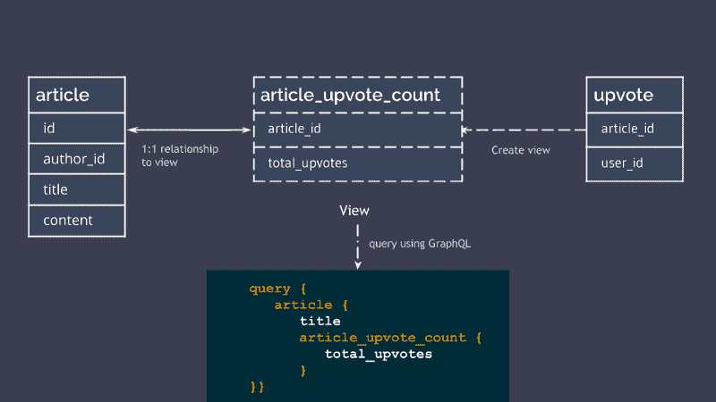
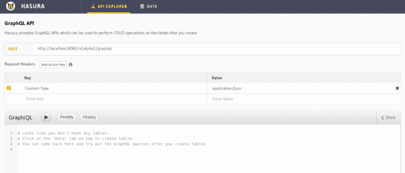
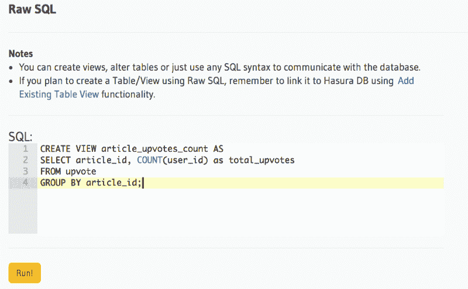
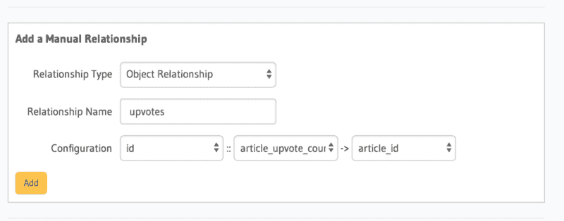

# 带有 Postgres 视图和物化视图的 GraphQL

> 原文：<https://dev.to/hasurahq/graphql-with-postgres-views-and-materialized-views-4g7h>

### Postgres 观点牛逼。您可以使用关系将它们链接到常规表，然后进行单个嵌套查询来获取相关数据。

[T2】](https://res.cloudinary.com/practicaldev/image/fetch/s--JQoOjNj_--/c_limit%2Cf_auto%2Cfl_progressive%2Cq_auto%2Cw_880/https://blog.hasura.io/conteimg/downloaded_images/postgres-views-and-materialized-views-with-graphql-fd75680888b8/1-aaBWLnKdOp_6YPzltA21xA.png)

## TL；速度三角形定位法(dead reckoning)

以下是这篇文章内容的摘要

*   **视图介绍—** 视图基本上就是虚拟表。使用它们有很多好处。
*   **在 Hasura GraphQL 引擎上使用视图有何特别之处？**—[Hasura GraphQL 引擎](https://github.com/hasura/graphql-engine)是一个开源工具，让你在几分钟内通过 Postgres 建立自己的 graph QL 服务器。使用`graphql-engine`，您可以将视图作为关系添加到表或其他视图中。这使得用一个查询获取所有需要的数据变得非常简单。
*   **示例用例** —我们将前面章节中讨论的所有内容放在一起，为博客引擎构建一个后端，作者可以在这里发布文章，其他作者可以投票支持这篇文章。我们试图以一种让我们通过单个查询获得所有数据的方式来建模数据库。

## SQL 中有哪些视图？

视图是一个命名查询。

假设您有一个不想到处重复的复杂查询，您可以在这个查询上创建一个视图。创建视图为查询提供了一个名称，现在您可以从这个视图中进行选择，就像从普通表中进行选择一样。

您可以使用视图来表示连接的表或表的子集，只需从表中选择所需的列和行。

视图几乎可以用在任何可以使用真实表的地方，在 SQL 数据库设计中非常常见。

### 视图为什么有用？

*   有助于将表结构的细节封装在一致的接口后面。它还让您以直观的方式组织数据。
*   提供更好的可读性，因为命名查询设置上下文的速度比原始 SQL 查询快得多。您可以使用视图，而不是用复杂的查询来破坏您的客户端代码库。
*   视图有单独的权限，因此可以用来限制对表的访问，这样用户只允许查看特定的行和列。
*   通过在数据库中指定逻辑，避免在客户机上进行多次查询和复杂的计算。查询视图也比在客户机上进行多次查询然后处理数据要快得多。

因为视图不是真正的表，所以只能对它们执行选择查询。

现在我们知道了什么是风景，为什么它们很棒。让我们来看看 Hasura 如何让与他们的合作变得更好！

## 在 Hasura GraphQL 引擎上使用视图

Hasura GraphQL 引擎可以用于任何 Postgres。你只需要提供一个 Postgres 连接，你马上就能得到:

*   即时 GraphQL APIs，用于存储和检索表和视图中的数据。
*   能够在视图和表之间添加关系。然后，您可以查询表(或视图)并从表和视图中获取相应的数据。

## 示例用例

让我们为一个**博客引擎**构建一个后端，来看看上面提到的所有东西的运行情况。

### 功能设置

*   我们将有一个作者名单，每个作者都有他们可以发表的文章。
*   每篇文章都可以被其他作者“投票支持”。
*   我们希望能够在一个查询中获取作者的文章列表以及每篇文章收到的总投票数。

### 执行概述

*   一个用于存储作者信息的`author`表。
*   一个存储每篇文章内容的`article`表。
*   将在`upvote`表中跟踪支持票。
*   总结一篇文章获得的所有“支持票”的视图。将项目表中的对象关系添加到视图中。
*   使用 Hasura 提供的 GraphQL APIs 为作者获取文章(以及 upvotes)。

既然我们知道需要做什么，让我们开始吧。

## 通过 Postgres 获取 GraphQL APIs

我们将使用 Hasura GraphQL 引擎通过 Postgres 即时获取 GraphQL APIs。点击下面的按钮，将 GraphQL 引擎部署到 Heroku 的自由层。

<figure>[](https://heroku.com/deploy?template=https://github.com/hasura/graphql-engine-heroku) 

<figcaption>点击此按钮将 GraphQL 引擎部署到 Heroku</figcaption>

</figure>

这将把`graphql-engine`部署到 Heroku。如果您没有 Heroku 帐户，您可能需要创建一个。`graphql-engine`将在`https://your-app.herokuapp.com`运行(用你的 heroku 应用名称替换`your-app`)。

## 控制台

Graphql 引擎附带了一个名为`Console`的管理 UI。您可以使用`Console`为您的应用程序构建后端。

它运行在您的`graphql-engine` URL 的`/console`端点，在本例中是`https://your-app.herokuapp.com/console`。`console`的登陆页面看起来是这样的:

[T2】](https://res.cloudinary.com/practicaldev/image/fetch/s--01hnu7ga--/c_limit%2Cf_auto%2Cfl_progressive%2Cq_auto%2Cw_880/https://blog.hasura.io/conteimg/downloaded_images/postgres-views-and-materialized-views-with-graphql-fd75680888b8/1-CuBaxCvX-UlNLsSCBRx0uA.png)

## 创建表格

转到`Data`选项卡，点击`Create Table`创建一个新表。

让我们从`author`表开始

*   **`user_id`** 整数*主键*
*   **`username`** 正文

`article`表

*   **`id`** 整数(自动递增)*主键*
*   **`author_id`** 整数
*   **`title`** 正文
*   **`content`** 正文
*   **`created_at`** 时间戳*默认现在()*

`upvote`表

*   **`user_id`** 整数
*   **`article_id`** 整数
*   *复合主键:`user_id`和`article_id`T3】*

## 创建视图

现在我们已经创建了表，让我们创建显示每篇文章总投票数的视图。

创建该视图的 SQL 语句将是

```
CREATE VIEW article_upvotes_count AS 
SELECT article_id, COUNT(user_id) as total_upvotes
FROM upvote
GROUP BY article_id; 
```

Enter fullscreen mode Exit fullscreen mode

要运行这个 SQL 语句，请转到`Data`选项卡，并在左侧面板中单击`SQL`。

[T2】](https://res.cloudinary.com/practicaldev/image/fetch/s---zIPEctz--/c_limit%2Cf_auto%2Cfl_progressive%2Cq_auto%2Cw_880/https://blog.hasura.io/conteimg/downloaded_images/postgres-views-and-materialized-views-with-graphql-fd75680888b8/1-9QCnxNt_xEKALycn_V9vwQ.png)

## 从视图中提取数据

从一个视图或一个表中获取数据也是一样的，在这个例子中是获取一个文章列表和每篇文章的总投票数:

```
query {
  article_upvotes_count {
    article_id
    total_upvotes
  }
} 
```

Enter fullscreen mode Exit fullscreen mode

*获取所有文章的总投票数*

或者，您也可以将这个视图作为一个关系添加到`article`表中，并在一个查询中获取`article`细节以及总投票数。

## 创建表和视图之间的关系

转到`Data`选项卡，点击`article`。点击`Relationship`标签并点击`Add a manual relationship`按钮。

在出现的表单中，选择以下选项:

[T2】](https://res.cloudinary.com/practicaldev/image/fetch/s--MxGtebN---/c_limit%2Cf_auto%2Cfl_progressive%2Cq_auto%2Cw_880/https://blog.hasura.io/conteimg/downloaded_images/postgres-views-and-materialized-views-with-graphql-fd75680888b8/1-NiaL44f5i6Vs57clAh2YYw.png)

现在，您可以查询作者的所有文章的`article`表以及每篇文章的`total_upvotes`。

```
query fetch_articles_by_author {
  article (where: { author_id: 1 } order_by: ["-upvotes.total_upvotes"]) {      
    id
    author_id
    title
    content
    created_at
    upvote { 
      total_upvotes
    }  
  }
} 
```

Enter fullscreen mode Exit fullscreen mode

*`-`表示降序排列，`+`表示升序排列。*

这样我们就为博客引擎建立了一个简单的后端。