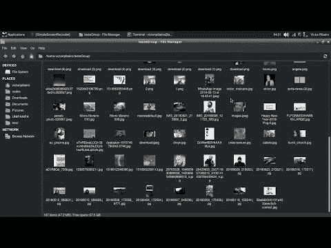

# 使用 k-means 来组织你的图片

> 原文：<https://dev.to/victorqribeiro/groupimg-3o56>

python 中的一个脚本，通过相似性来组织图像。

[groupImg](https://github.com/victorqribeiro/groupImg) 使用 k-means 算法根据图像的相似性对图像进行聚类。

观看下面的工作:

[T2】](http://www.youtube.com/watch?v=LgzsJU-b34o)