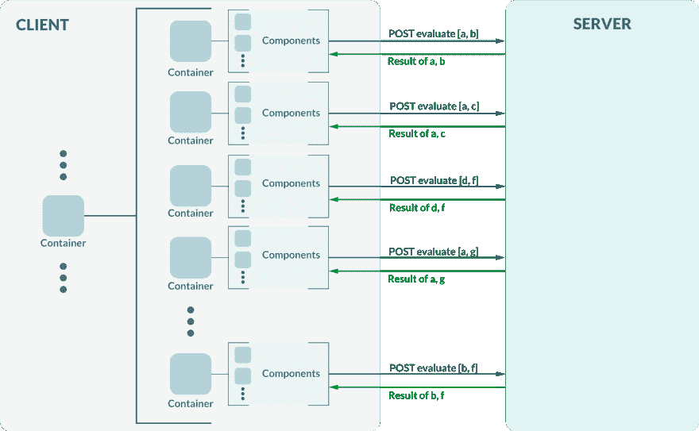
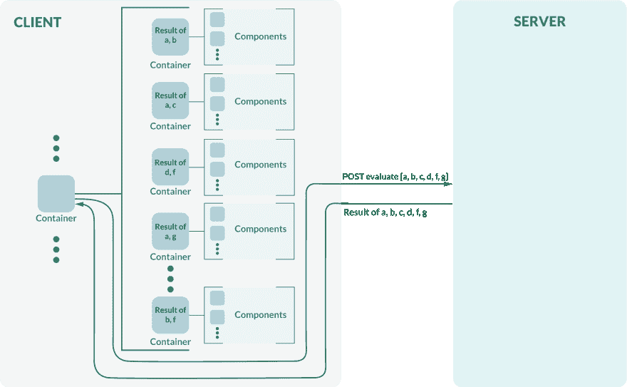
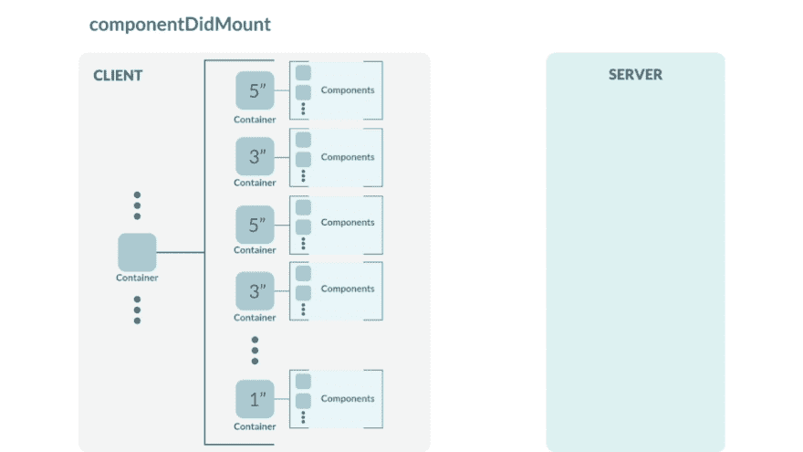
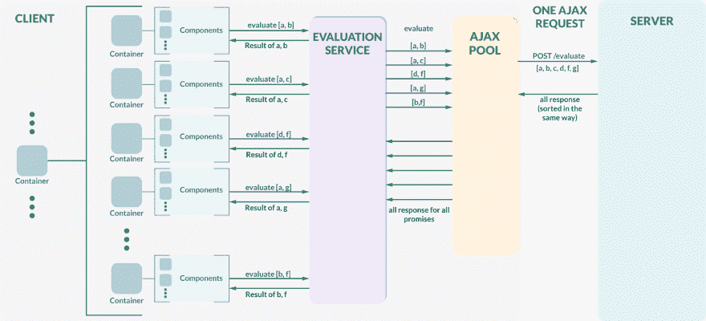
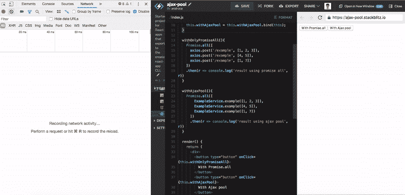

# 将 AJAX 请求分组到一个池中

> 原文：<https://dev.to/aralroca/grouping-ajax-requests-in-a-pool-dlf>

*原文:[https://Aral roca . com/2018/09/10/grouping-Ajax-requests-in-a-pool/](https://aralroca.com/2018/09/10/grouping-ajax-requests-in-a-pool/)T3】*

在这篇文章中，我想解释一下我是如何提高客户端和服务器之间的通信速度的。理解这一点很重要，这不是所有 AJAX 请求全局解决方案。相反，它只能应用于某些特定类型的请求，如果你继续阅读，我们很快就会看到。

请注意，在大多数项目中，其他解决方案可能更有效。

## 最初的问题是什么？

我目前正在开发一个复杂的 React 应用程序，用户可以使用 React 组件安装自己的交互式小部件。这些交互式小部件中的一些需要做一些 AJAX 请求来在 componentDidMount、componentWillUnmount 或更多(我们很快就会看到)上加载/插入一些数据(或任何东西)。

为了实现第一种方法，我们可以让每个交互式小部件(React 容器)调用 componentDidMount 方法上的 POST /whatever。

[T2】](https://res.cloudinary.com/practicaldev/image/fetch/s--hV2aLYaQ--/c_limit%2Cf_auto%2Cfl_progressive%2Cq_auto%2Cw_880/https://aralroca.files.wordpress.com/2018/09/problem.png)

***形象 1*** *。本例中是发布/评估*

在这个实现中，每个容器负责执行相应的 POST /evaluate。或者，使用 Redux，每个容器负责分派一个动作，该动作反过来执行请求。在解析每个承诺之后，每个容器决定如何处理评估。

在本例中，在开始时，将在时钟的同一时刻发出至少 5 个请求。并且，在解析这些请求之后，React 将在不同的呈现中改变 DOM 至少 5 次。

在某些情况下，这种实现可能足够快。但是，请记住，用户可以在自己的页面上安装大量的交互式小部件。因此，这意味着可以在同一时间发出 20 个、30 个或更多请求。

不幸的是，我们可以同时发出的请求数量是有限制的，所以其余的请求被添加到一个队列中，增加了总时间。此外，在这个/evaluate 中，我们通过不同的小部件评估相同的事物(例如，在*Image1】*中，项目“a”被评估了 3 次)。

在本文中，我们的任务是通过将所有这些请求组合成一个，并删除重复的请求来缩短请求时间。

[T2】](https://res.cloudinary.com/practicaldev/image/fetch/s--yZpv2SYi--/c_limit%2Cf_auto%2Cfl_progressive%2Cq_auto%2Cw_880/https://aralroca.files.wordpress.com/2018/09/clock.png)

## 对组的请求类型

在开始实现之前，第一个重要的步骤是知道哪个是请求目标。我们不能对每种类型的请求进行分组，至少在不修改后端行为的情况下。

请求应该是怎样的？

*   它应该接受一个数组作为参数。
*   响应是相同顺序的数组。
*   如果任何项目无法解决，而不是使用 500 内部服务器错误，状态应该是 200 OK。错误应该在响应数组索引中。
*   每个项目应该花费大致相同的时间来解决。如果对“a”的评估要比对“f”的评估多 10 倍，这就不是一个好方法，因为我们更喜欢独立地加载每个交互式小部件。

## 将 AJAX 请求分组到一个容器中

在分析了最初的问题之后，为了提高页面的加载速度，我们可以应用的一个常见解决方案是使用一个父容器来分组所有的请求，同时删除重复的项。

componentDidMount 方法中的父容器执行这个 AJAX 调用(或者使用 Redux 操作来完成)。然后，这个父容器将结果分发给其子容器(或者，使用 Redux，每个子容器从存储中获取结果)。

[T2】](https://res.cloudinary.com/practicaldev/image/fetch/s--XlGB9esA--/c_limit%2Cf_auto%2Cfl_progressive%2Cq_auto%2Cw_880/https://aralroca.files.wordpress.com/2018/09/container-solution.png)

这样，我们将所有这些请求组合成一个，而不是同时发出 20 或 30 个请求。此外，在解析请求的承诺后，React 将同时为所有交互式小部件呈现新的 DOM。

## 更多的问题在路上...

在上面的例子中，我们只关心 componentDidMount 方法。然而，实际上，每个交互式小部件在配置中都可以有一个“interval”属性。这个小部件能够在每个“时间间隔”发送不同的请求。

[T2】](https://res.cloudinary.com/practicaldev/image/fetch/s--Hg9k7RXV--/c_limit%2Cf_auto%2Cfl_progressive%2Cq_66%2Cw_880/https://aralroca.files.wordpress.com/2018/09/interval1.gif)

在这种情况下，我们很难将父容器中每个时钟周期发出的所有请求进行分组。然而，这是可能的。为了解决这个问题，我们可以用所有子区间的最大公约数在父容器中创建一个公共区间。这个全局时间间隔检查每个请求需要发出的节拍，以便对它们进行分组。另外，另一种方法是在父容器上创建不同的时间间隔，而不重复时间。

顺便说一下，让我告诉你一些别的事情:一些交互式小部件可以被连接，并且“间隔”属性可以根据另一个小部件的输出而改变。

[T2】](https://res.cloudinary.com/practicaldev/image/fetch/s--P5Qbbgm8--/c_limit%2Cf_auto%2Cfl_progressive%2Cq_66%2Cw_880/https://aralroca.files.wordpress.com/2018/09/interval2.gif)

更多麻烦...通过使用一个父容器，根据每个滴答来分组请求仍然不是不可能的，但是也许我们需要**重新考虑一个无痛的和更灵活的方法来实现这个**。

[T2】](https://res.cloudinary.com/practicaldev/image/fetch/s--VgkpbyuI--/c_limit%2Cf_auto%2Cfl_progressive%2Cq_auto%2Cw_880/https://aralroca.files.wordpress.com/2018/09/kevin-ku-392517-unsplash.jpg)

## 将 AJAX 请求分组到一个池中

另一种不同的方法是，不在父容器中实现所有案例的所有逻辑，而是使用 AJAX 池直接将同一时间发出的所有请求组合成一个请求。

[T2】](https://res.cloudinary.com/practicaldev/image/fetch/s--FlxQixzr--/c_limit%2Cf_auto%2Cfl_progressive%2Cq_auto%2Cw_880/https://aralroca.files.wordpress.com/2018/09/ajax-pool.png)

该池在队列中添加所有要评估的在同一滴答中发出的事物。在下一个时钟周期，它将通过以 param 的形式发送所有队列来执行请求。

要使用这个池，交互式小部件必须使用相应的服务，而不是直接发送请求。

而不是:

```
axios.post('/evaluate', { data: [a, b] })
.then(res => {
 // ...
})
```

使用:

```
EvaluationService.evaluate([a, b])
.then(res => {
 // ...
})
```

这些承诺总是将过滤后的结果返回给每个小部件。

每个服务将使用或不使用 AJAX 池，这取决于请求的类型。在这种情况下，在 EvaluationService 中，我们将使用这个池。

这个 EvaluationService 负责初始化池，将项目添加到队列中，删除重复项并保存索引。然后，当请求得到解决时，它将从总响应中过滤出所需的项目。

```
import AjaxPool from './services/ajax-pool';

const pool = new AjaxPool();

export default class EvaluateService {
  static evaluate(data) {
    const id = pool.initPool();

    const indexes = data
      .map((item) => {
        let index = pool.findInQueue(id,
          existingItem => _.isEqual(existingItem, item),
        );

        if (index === -1) {
          index = pool.addToQueue(id, exp);
        }

        return index;
      });

    return pool
      .request(id, '/evaluate', queue => ({  data: queue }), 'post')
      .then((allEvaluations) => indexes.map(index => allEvaluations[index]));
  }
}
```

每次我们调用这个服务的 evaluate 方法时，它首先调用 initPool 来获取池的相应“id”。这个“id”对于每个 AJAX 请求都是唯一的。如果在同一个时钟周期中有多个执行，那么在所有组中应该使用相同的“id”。

AJAX 池的目的是用相同的响应解决所有的承诺，但是只使用一个 AJAX 请求。

```
import uuid from 'uuid';
import axios from 'axios';

const DEFAULT_DELAY = 0; // Wait the next ticking

export default class AjaxPool {
  constructor(milliseconds = DEFAULT_DELAY) {
    this.DELAY_MILLISECONDS = milliseconds;
    this.queues = {};
    this.needsInitialization = true;
    this.requests = {};
    this.numRequest = {};
  }

  /**
 * Initialising the queue 
 */
   initPool() {
     if (this.needsInitialization) {
       this.requestID = uuid();
       this.queues[this.requestID] = [];
       this.needsInitialization = false;
       this.numRequest[this.requestID] = 0;
     }

     return this.requestID;
   }

   findInQueue(id, method) {
     if (typeof method !== 'function') {
       return -1;
     }

     return _.findIndex(this.queues[id], method);
   }

   cleanRequest(id) {
     this.numRequest[id] -= 1;

     if (this.numRequest[id] === 0) {
       delete this.requests[id];
       delete this.queues[id];
       delete this.numRequest[id];
     }
   }

   /**
 * Add to queue
 * 
 * [@param](https://dev.to/param)
 {any} queueElement 
 * @return {number} index of element on the queue
 */
   addToQueue(id, queueElement) {
     return this.queues[id].push(queueElement) - 1;
   }

   request(id, url, getData, method = 'get') {
     this.numRequest[id] += 1;
     return new Promise((res, rej) => {
       _.delay(() => {
         this.needsInitialization = true;

         if (!this.requests[id]) {
           const data = typeof getData === 'function' ? getData(this.queues[id]) || {} : {};
           this.requests[id] = axios[method](url, data);
         }
         // For each request in the same "ticking" is doing one AJAX 
         // request, but all resolve the same promise with the same result
         this.requests[id]
           .then((result) => {
             if (result.error) {
               rej(result.error);
             } else {
               res(result);
             }

             this.cleanRequest(id);
           })
           .catch((err) => {
             this.cleanRequest(id);
             rej(err);
           });
       }, this.DELAY_MILLISECONDS);
     });
   }
}
```

在这种情况下，我们不会使用很大的延迟，只需要 0 毫秒来等待下一次滴答。但是，可以使用几毫秒作为参数来构建池。例如，如果我们使用 100ms，它将分组更多的请求。

```
const pool = new AjaxPool(100);
```

## 

📕**代号**:T3】https://stackblitz.com/edit/ajax-pool

## 结论

对池中的请求进行分组:

*   改善客户端的总加载时间，避免在队列中添加一些请求。
*   服务器的请求更少，降低了成本。
*   它是可重用的，项目的每个组件都可以使用它，而不需要额外的逻辑。

虽然:

*   它并不总是最好的解决方案，只适用于特定类型的请求。

[T2】](https://res.cloudinary.com/practicaldev/image/fetch/s--MoFer2rP--/c_limit%2Cf_auto%2Cfl_progressive%2Cq_auto%2Cw_880/https://aralroca.files.wordpress.com/2018/09/matt-lamers-769327-unsplash.jpg)