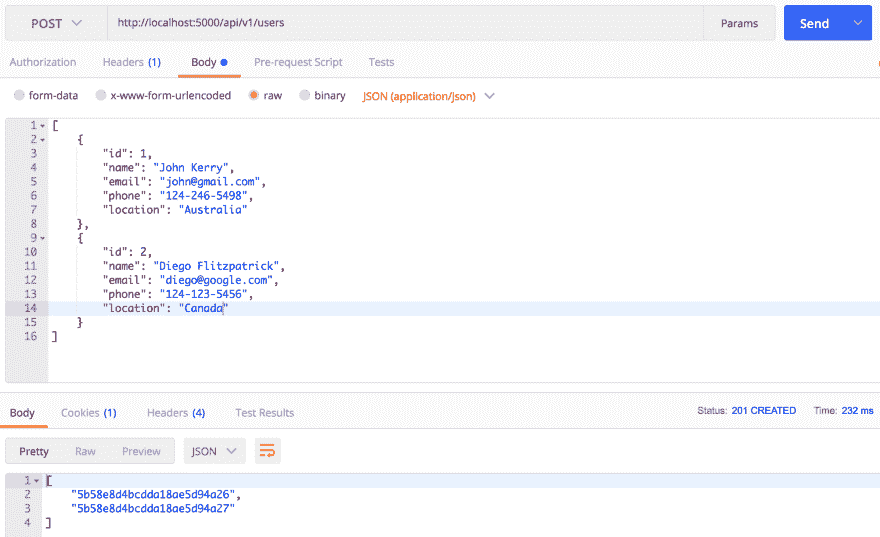
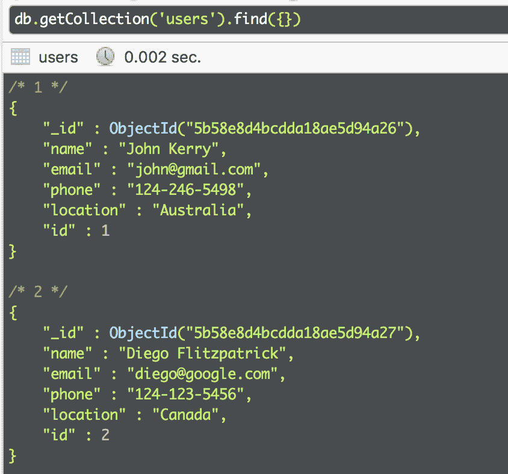

# 使用 Python、Flask 和 MongoDB 创建 RESTful API 的指南

> 原文：<https://dev.to/xngwng/guide-to-creating-a-restful-api-using-python-flask-and-mongodb-2566>

*注:这篇文章是我的同事 Keyur 写的。我们在同一地方写博客*

## RESTful API 简介

在 HTTP 协议上使用 JSON 的 RESTful APIs 是目前最流行的创建 web APIs 的方法。它们使开发人员能够从资源的角度考虑对这些资源的操作，比如 CRUD(创建、读取、更新、删除)。然而，还有一些即将出现的 API，比如越来越受许多应用程序欢迎的 GraphQL。

在本教程中，我们将使用 Python 和 Flask 框架构建一个 RESTful API 来创建、读取、更新和删除 Mongo 数据库中的文档(包含用户信息)。

## 入门

以下是我们构建 API 所需的工具:

*   Python 2.7
*   邮递员[下载这里](https://www.getpostman.com/)
*   Mongo 数据库[文档](https://docs.mongodb.com/manual/)
*   Robo 3T [下载此处](https://robomongo.org/download)

### 创建您的本地环境

*注意:在使用 Python 时，我们建议使用虚拟环境来保持所有项目的依赖性与其他项目的隔离。*

```
conda create -n restfulapi python=2.7 anaconda # Create the environment
source activate restfulapi # Activate the environment 
```

Enter fullscreen mode Exit fullscreen mode

### 安装依赖项

```
pip install -r requirements.txt 
```

Enter fullscreen mode Exit fullscreen mode

### 启动 MongoDB 服务器

如果您使用的是 MacOS，您可以使用`brew`来启动服务器。

```
brew services start mongodb 
```

Enter fullscreen mode Exit fullscreen mode

### MongoDB 中的收藏

> 集合类似于传统关系数据库中的表。我们将创建一个*用户*集合来存储用户详细信息，类似于 SQL 中的*用户*表。

#### 创建用户

我们将创建一个端点`POST /api/v1/users`，它接收一个 JSON 对象，这个 JSON 对象由像`name`、`email`、`phone`这样的用户细节组成，作为请求体中的 JSON。我们还可以设计端点来接受一组用户。

```
@app.route("/api/v1/users", methods=['POST'])
def create_user():
    """
       Function to create new users.
    """
    try:
      # Create new users
      body = ast.literal_eval(json.dumps(request.get_json()))
      record_created = collection.insert(body)
      body._id = record_created.inserted_id
      # Prepare the response
      return jsonify(body)
    except:
      # Something went wrong server side, so return Internal Server Error.
      resp.status_code = 500
      return resp 
```

Enter fullscreen mode Exit fullscreen mode

[T2】](https://res.cloudinary.com/practicaldev/image/fetch/s--uyy9o0XN--/c_limit%2Cf_auto%2Cfl_progressive%2Cq_auto%2Cw_880/https://www.moesif.com/blimg/posts/technical/restful/create_user.png)

如果这是一个接受用户数组的批处理端点，我们可以返回创建的用户数。另一方面，单个用户可以返回实体 id，这样前端就可以引用新创建的项目。

## 读取用户

为了获取我们刚刚创建的用户列表，我们将设计一个端点`GET /api/v1/users`并将搜索标准作为查询字符串参数传递。

```
@app.route("/api/v1/users", methods=['GET'])
def fetch_users():
    """
       Function to fetch the users.
    """
    # Prepare the response
    try:
      # Call the function to get the query params
      query_params = helper_module.parse_query_params(request.query_string)
      key = query_params.keys()[0]
      value = query_params.values()[0]

      # Encode params
      key, value = helper_module.encode_params(key, value)

      # Fetch all the record(s)
      records_fetched = collection.find({key: value})

      if len(records_fetched) > 0:
        # Prepare the response
        resp = jsonify(records_fetched)
        return resp
      else:
        # No records found, so we can return an empty list (Added for example)
        return jsonify([])
    except:
      # Something went wrong server side, so return Internal Server Error.
      resp.status_code = 500
      return resp 
```

Enter fullscreen mode Exit fullscreen mode

如果找到匹配的文档，我们将返回用户的详细信息，否则我们将返回一个空数组。

[T2】](https://res.cloudinary.com/practicaldev/image/fetch/s--TCkT_WmT--/c_limit%2Cf_auto%2Cfl_progressive%2Cq_auto%2Cw_880/https://www.moesif.com/blimg/posts/technical/restful/fetch_user.png)

## 更新用户

现在，我们将设计一个端点`POST /api/v1/users/<user_id>`来更新用户详细信息。

```
@app.route("/api/v1/users/<user_id>", methods=['POST'])
def update_user():
    """
       Function to update the user.
    """
     try:
          # Update the user
          body = ast.literal_eval(json.dumps(request.get_json()))
          record_updated = collection.update_one({"_id": user_id}, body)

          # Prepare the response
          resp = jsonify(body)
      except:
        resp.status_code = 500
        # Return the object
        return resp 
```

Enter fullscreen mode Exit fullscreen mode

更新请求:

[T2】](https://res.cloudinary.com/practicaldev/image/fetch/s--A2O_oDmd--/c_limit%2Cf_auto%2Cfl_progressive%2Cq_auto%2Cw_880/https://www.moesif.com/blimg/posts/technical/restful/update_user.png)

## 删除用户

最后，我们将设计一个端点`DELETE /api/v1/users/<user_id>`来从数据库中删除用户。

```
@app.route("/api/v1/users/<user_id>", methods=['DELETE'])
def remove_user():
    """
       Function to remove the user.
    """
    try:
        # Delete all the users matched
        body = ast.literal_eval(json.dumps(request.get_json()))
        record_deleted = collection.delete_one({ "_id" : user_id })

        # Prepare the response
        if result.deleted_count > 0
          # We return 204 No Content to imply resource updated successfully without returning
          # the deleted entity.
          resp.status_code = 204
          return resp
        else:
          # Entity not found, perhaps already deleted, return 404
          resp.status_code = 404
          return resp
    except:
      # Something went wrong server side, so return Internal Server Error.
      resp.status_code = 500
      return resp 
```

Enter fullscreen mode Exit fullscreen mode

我们将在请求体中指定删除文档的匹配条件。例如，我们想删除带有`id`的文档为`3`

[T2】](https://res.cloudinary.com/practicaldev/image/fetch/s--U9DtHN4_--/c_limit%2Cf_auto%2Cfl_progressive%2Cq_auto%2Cw_880/https://www.moesif.com/blimg/posts/technical/restful/remove_user.png)

一旦用户被删除，我们将把被删除用户的数量信息返回给客户端。

## 处理未找到页面的请求

我们建议用给用户的信息性消息来处理找不到页面的请求。

```
@app.errorhandler(404)
def page_not_found(e):
    """Send message to user with notFound 404 status."""
    # Message to the user
    message = {
        "message": "Message from the API",
        "errors": [
            {
                "message": "This route is not currently supported. Please refer API documentation."
            }
        ]
    }
    # Make the message looks good
    resp = jsonify(message)
    # Send OK response
    resp.status_code = 404
    # Return the object
    return resp 
```

Enter fullscreen mode Exit fullscreen mode

如果您想研究数据，您也可以使用 Robo 3T mongo shell。

[T2】](https://res.cloudinary.com/practicaldev/image/fetch/s--DsjWemmv--/c_limit%2Cf_auto%2Cfl_progressive%2Cq_auto%2Cw_880/https://www.moesif.com/blimg/posts/technical/restful/mongo_shell.png)

要查看 RESTful API 的运行情况，您可以从 [GitHub](https://github.com/Moesif/moesif-flask-mongo-example) 中克隆并运行这个示例应用程序

在下一篇博客中，我们将学习如何授权和认证我们的 API。如果你对使用 Python 开始使用 GraphQL 感到好奇，请参考这个[博客](https://www.moesif.com/blog/technical/graphql/Getting-Started-with-Python-GraphQL-Part1/)。同时，如果您有任何问题，请联系 [Moesif 团队](//mailto:team@moesif.com)