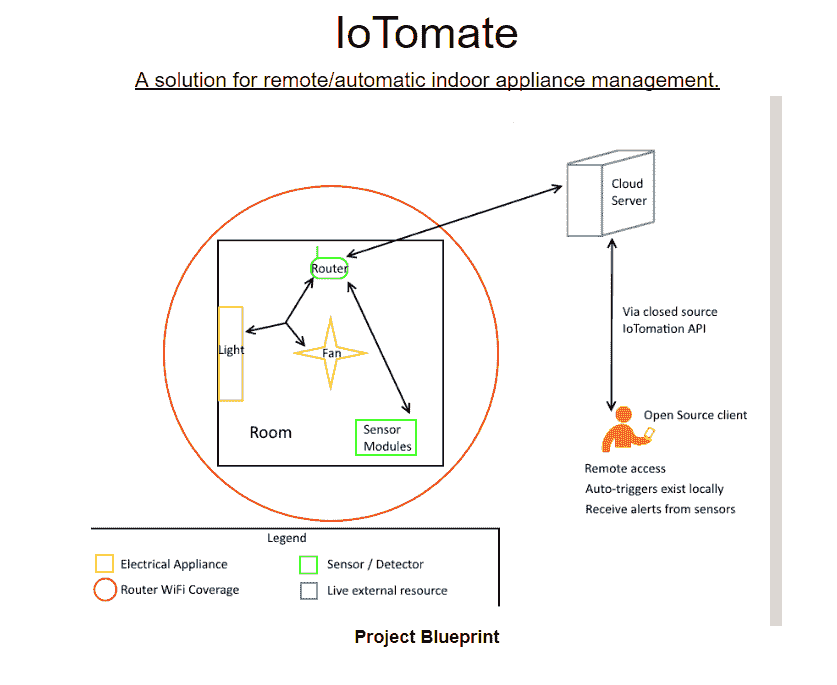

# 黑客印度，2015

> 原文：<https://dev.to/laneone/hackindia-2015-1n9f>

HackIndia 是我们参加的第一个黑客马拉松，我和我的技术友好的朋友们从未真正理解黑客马拉松的本质，尽管我们有一个相当好的 go to strategy 来尝试。这是一个开放的黑客，意味着你可以在任何你希望的主题/背景下建立一个黑客的想法，并提交给评委。我们选择了家庭自动化/物联网。该调查于 2015 年 10 月在巴纳尚卡里的 PES 大学进行。

我们在这次黑客攻击中构建的第一个产品叫做 IoTomate，这是一个端到端的解决方案，它抽象并简化了拥有物联网家庭的整个过程。它背后的概念很简单，每个设备都连接到云，特别是 Bluemix 的云实例，这是一个 IBM 产品，允许您以 Node-RED 编写的代码块的形式托管 API，它允许我们感应/启动设备，它还允许我们使用 Android 应用程序设置“触发”条件， 这意味着该设备在家中做出的每一个反应都是一些传感器值的结果，例如，如果房间的温度上升到 30 度以上，自动打开风扇，如果温度下降到 27 度以下，则关闭风扇。另一个例子是，如果没有连接到 WiFi 的“家庭”设备，很可能没有人在家，因此立即关闭家中的所有灯/风扇。

现在，我们真的相信我们产品的卖点是我们在云端编写的 API，我们还围绕 ESP8266 构建了一个小突破，它打开/关闭继电器，继电器又连接到充当我们演示/测试设备的台灯。这是我们应用中的一个额外的关键卖点，ESP8266 及其姐妹组件的实施成本约为 360 卢比，ESP 为 280 卢比，8 通道继电器为 80 卢比，这确实使我们的产品处于低端。当涉及到实施时，如果我们大规模生产这种产品，我们可能会大大降低成本。

作为我们的第一次入侵，我们对他们心目中的评判标准一无所知，他们最初列出了 5 名参赛者，我们的团队是其中之一，我们知道我们正在获得某种牵引力，但对我们来说利用这一点还为时过早。我们向评委们解释了如何扩展这个 api，以允许更多的触发条件，包括其他传感器，如红外等，这些传感器也可以连接到云。我们没有考虑的一个关键因素是，如果有某种类似的尝试已经在尝试，一位法官向我们指出，谷歌正在实现一种叫做 Nest API 的东西，这是我们一开始甚至没有看到的东西。

我们从那次黑客攻击中空手而归，但我们学到了很多关于裁判的一般期望和他们在这类事件中寻求的激情。我们还接受了美国消费者新闻与商业频道的采访，因为我们都是工程系的一年级学生，这让我们成为现场最年轻的团队之一。

您可以在这里查看确切的 API 规范:它列出了我们在尝试实现 IoTomate 时考虑的几乎每个端点。

[T2】](https://res.cloudinary.com/practicaldev/image/fetch/s--4FWaXhe3--/c_limit%2Cf_auto%2Cfl_progressive%2Cq_auto%2Cw_880/https://thepracticaldev.s3.amazonaws.com/i/rddt1xzsv5j9p4cej1is.PNG)