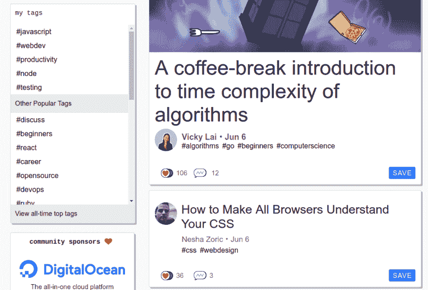
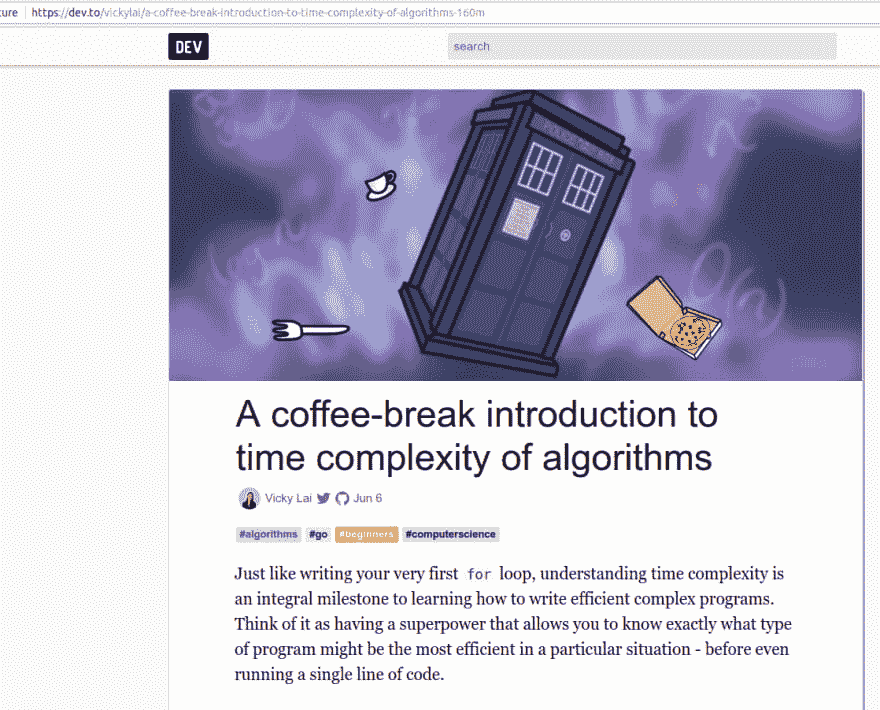
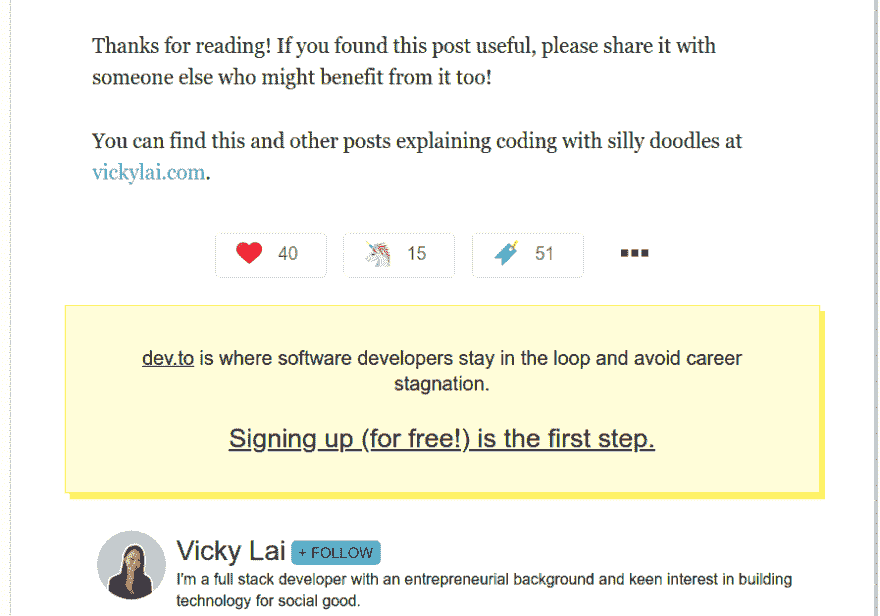
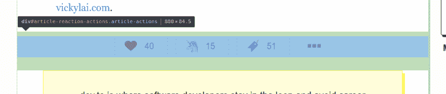
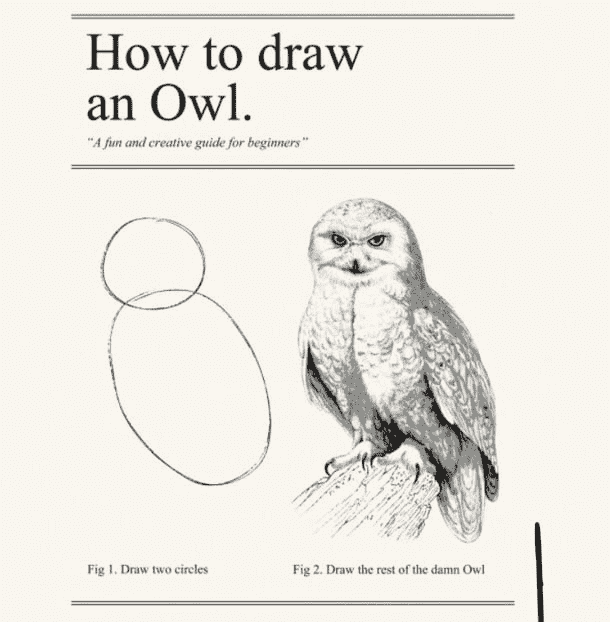
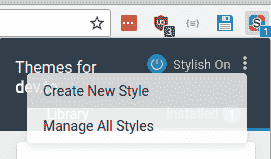
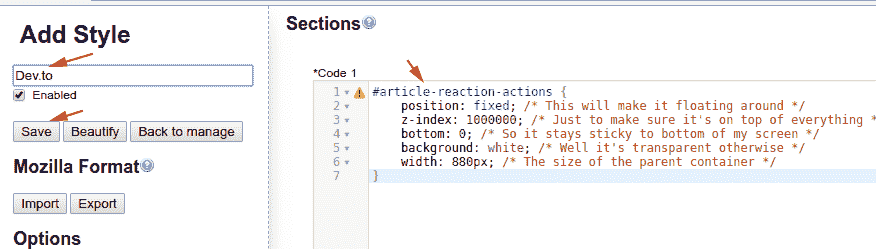
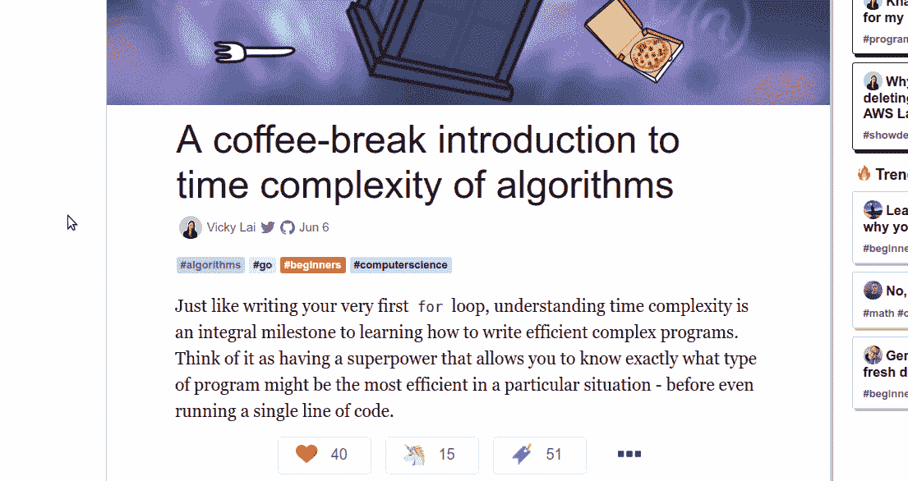

# 用 CSS 破解一些开发工具

> 原文：<https://dev.to/entrptaher/hacking-a-bit-of-devto-with-css-43ib>

# 问题:懒惰的开发者没有粘性保存

当你浏览这个网站时，你会看到这样的标题，有时还有描述、图片和标签。

[T2】](https://res.cloudinary.com/practicaldev/image/fetch/s--jbSov1JB--/c_limit%2Cf_auto%2Cfl_progressive%2Cq_auto%2Cw_880/http://i.imgur.com/O8GSdWl.png)

所以你有两个选择，要么打开来读，要么留着以后读。有时候标题很棘手，就像你现在正在读的这篇文章。也许你认为这是非常有趣的事情，但它实际上是一个获取观点/喜欢等的陷阱。让我们打开邮件看看里面有什么。

[T2】](https://res.cloudinary.com/practicaldev/image/fetch/s--wNy4fqjc--/c_limit%2Cf_auto%2Cfl_progressive%2Cq_auto%2Cw_880/http://i.imgur.com/hznbrJx.png)

太好了！这是一篇很好的文章，包含许多有价值的信息。但是等等，你得抓紧你的火车，所以你已经决定拯救邮政。

[T2】](https://res.cloudinary.com/practicaldev/image/fetch/s--mvKu5f6e--/c_limit%2Cf_auto%2Cfl_progressive%2Cq_auto%2Cw_880/http://i.imgur.com/JDOTViI.png)

保存按钮要么在上一页，要么在当前文章的底部，没有保存按钮在文章的一边，你可以很容易地保存它供以后使用。也许你可以用 ctrl + d 来使用书签，但是那样会很无聊。

我们可以等待团队为我们建造一个，也可以自己建造一个。有时候摆弄一些小东西不是很棒吗？

# 解决方案:摆弄 CSS

好吧，我们先把选择器取出来。我将右键单击，选择“检查元素”，它将像这样突出显示。
[T3】](https://res.cloudinary.com/practicaldev/image/fetch/s--ge5kQ5lE--/c_limit%2Cf_auto%2Cfl_progressive%2Cq_auto%2Cw_880/http://i.imgur.com/IRkVCy8.png)

现在我们知道该打破什么了。让我们为选择器编写一些 css 代码，

```
#article-reaction-actions {
    position: fixed; /* This will make it floating around */
    z-index: 1000000; /* Just to make sure it's on top of everything */
    bottom: 0; /* So it stays sticky to bottom of my screen */
    background: white; /* Well it's transparent otherwise */
    width: 880px; /* The size of the parent container */
} 
```

Enter fullscreen mode Exit fullscreen mode

我不打算讨论上面片段中的每个字母是干什么的。我现在懒得做那件事。

[T2】](https://res.cloudinary.com/practicaldev/image/fetch/s--KrCNQTI1--/c_limit%2Cf_auto%2Cfl_progressive%2Cq_auto%2Cw_880/https://i.imgur.com/9EfP2Qk.png)

为了应用样式，我将使用[stylistic](https://chrome.google.com/webstore/detail/stylish-custom-themes-for/fjnbnpbmkenffdnngjfgmeleoegfcffe)，这是一个 chrome 扩展。也有[火狐](https://addons.mozilla.org/en-US/firefox/addon/stylish/)和 [safari](https://safari-extensions.apple.com/details/?id=com.sobolev.stylish-5555L95H45) 版本。

让我们创造一种新的风格。当我读这篇文章时，我会安装 chrome 扩展，回到这篇文章，然后点击图标。
[T3】](https://res.cloudinary.com/practicaldev/image/fetch/s--KPv6zjNF--/c_limit%2Cf_auto%2Cfl_progressive%2Cq_auto%2Cw_880/http://i.imgur.com/qZYYVs3.png)

然后我将使用上面的代码片段，输入一个好听的名字并保存它。
[T3】](https://res.cloudinary.com/practicaldev/image/fetch/s--9a3dUIZO--/c_limit%2Cf_auto%2Cfl_progressive%2Cq_auto%2Cw_880/http://i.imgur.com/cHzLabj.png)

太好了，现在当我刷新页面时，我会看到这个，
[](https://i.giphy.com/media/2UwXvG8rdZ4TbA6qq0/giphy.gif)

很好，不是吗？我可以用它来阅读前几行，并决定保存或记住它，而不用滚动到末尾。

PS:

*   这只是为了缓解我的无聊，但我在许多不同的网站上使用时尚。如果需要的话，我还会用 Tampermonkey 来摆弄 JS。
*   请不要仅仅为了这篇文章而改变网站或者创建一个 chrome 扩展。这没什么大不了的。
*   抱歉，未经允许就在图片上发帖，:D，这是开发，所以我想这不会有什么坏处。