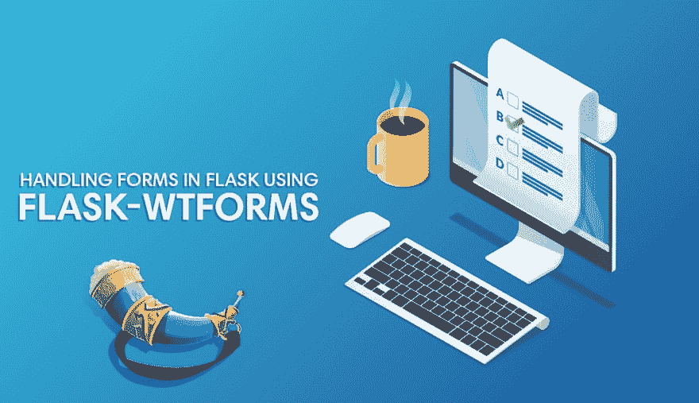
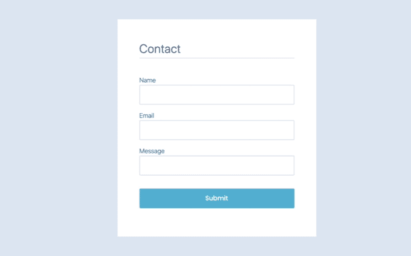
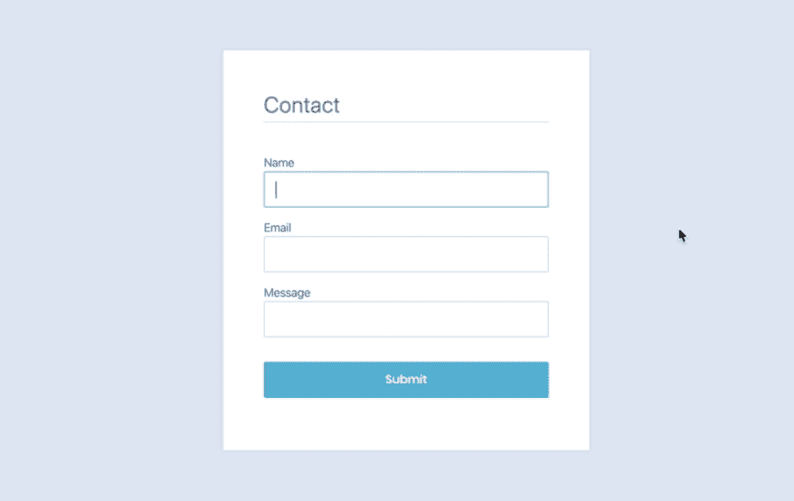
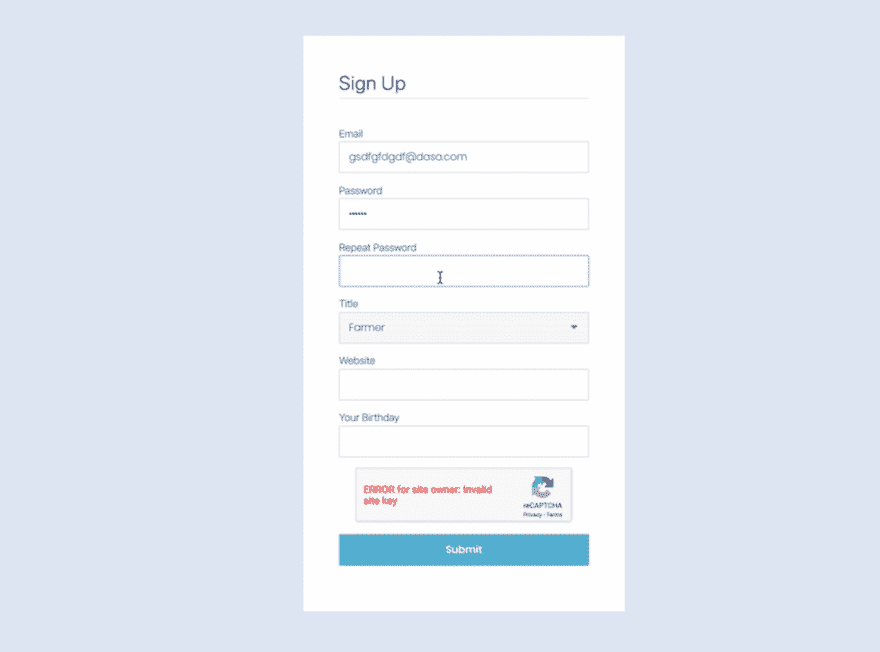

# 用 Flask-WTF 处理烧瓶中的表单

> 原文：<https://dev.to/hackersandslackers/handling-forms-in-flask-with-flask-wtf-4d0m>

[T2】](https://res.cloudinary.com/practicaldev/image/fetch/s--l9hqTyHK--/c_limit%2Cf_auto%2Cfl_progressive%2Cq_auto%2Cw_880/https://res-1.cloudinary.com/hackers/image/upload/q_auto:best/v1/2019/11/flask-wtforms.jpg)

让我们来谈谈大家都讨厌的东西:表单。唯一比填写表格更痛苦的事情是创建一个表格，更不用说一个有反馈的功能性表格了。如果构建函数形式的想法没有让你感到恶心，那么你可能会陷入一些奇怪的事情。打电话给我。

如果您没有在 Flask 中创建表单的迫切需求，那么如果您决定放弃这篇文章，我不会生气。随意在 Instagram 上无休止地滚动，但要知道:处理表单认证和数据提交是应用开发的*巅峰*。这就是前端和后端相遇的地方:一个人的击键导致有意义的动作的数据之舞。创造形式的人是一个黄金时代的先驱:一个把我们带到西方技术顶峰的英雄。话说回来，还有 Instagram。

Flask 和 Django 都非常依赖一个名为 [WTForms](https://wtforms.readthedocs.io/en/stable/) 的 Python 库。奇怪的是，WTForms 多年来一直是处理表单的无可争议的库，没有任何后果:该库易于使用，没有人恶意劫持该库来窃取每个人的个人信息或比特币。这是 Python 和 Javascript 生态系统的真正区别。WTForms 的风格实际上是一个名为 [Flask-WTF](https://flask-wtf.readthedocs.io/) 的 Flask 插件，它为 Flask 用户提供了一些额外的好处。事实上，Flask-WTF 离原始库并不远(本教程实际上最初使用了 **WTForms** 而不是 **Flask-WTF** ，并且源代码几乎完全相同)。

## 打基础

我知道你很懒，所以复制+粘贴下面一行，这样我们就可以继续了:

<figure>

```
$ pip3 install flask flask-wtf 
```

Enter fullscreen mode Exit fullscreen mode

<figcaption>Install dependencies</figcaption>

</figure>

在放下一些代码片段让你盲目地复制和粘贴之前，理解我们将要做的事情是有帮助的。在任何人迷路之前，让我们来看看我们的结构:

<figure>

```
/flask-wtforms-tutorial
├─ /templates
├─ /static
├─ app.py
├─ config.py
└─ forms.py 
```

Enter fullscreen mode Exit fullscreen mode

<figcaption>Project structure</figcaption>

</figure>

创建一个有效的表单至少有三个部分:

1.  **Routes** 用于确定哪些用户在访问我们应用内的 URL 时应该得到服务。我们将通过在单个`app.py`文件中定义我们的路线来简化事情。
2.  **表单类**是 Python 模型，它决定了我们的表单将捕获的数据，以及当用户试图提交表单时，验证用户是否已经充分完成表单的逻辑。这些班级将住在`forms.py`。
3.  Jinja 模板将呈现用户将看到的实际 HTML 表单。我们很快就会发现，Flask 使得在 Python 模型和 HTML 表单之间架起一座桥梁变得很容易。

我们将从在`forms.py` **中创建表单逻辑开始。**

## 什么形式

**Flask-WTF** 与 **WTForms** 打包在一起作为一个依赖项:这两个库旨在一起使用，而不是一个混淆另一个。Flask-WTF 的核心是一个名为`FlaskForm`的类，我们用自己定义的表单类来扩展它。这主要是为了方便，因为创建扩展`FlaskForm`的类本质上给了我们一些与验证等相关的现成逻辑。:

<figure>

```
from flask_wtf import FlaskForm 
```

Enter fullscreen mode Exit fullscreen mode

<figcaption>forms.py</figcaption>

</figure>

我们的表单需要输入字段，以及在提交后验证这些字段内容的方法。我们可以直接从`wtforms`包中导入字段类型，从`wtforms.validators`包中导入验证器:

<figure>

```
from flask_wtf import FlaskForm, 
from wtforms import StringField, TextField, SubmitField
from wtforms.validators import DataRequired, Length 
```

Enter fullscreen mode Exit fullscreen mode

<figcaption>forms.py</figcaption>

</figure>

我们将为每个表单创建一个 Python 类。我们将从创建一个简单的“联系我们”表单开始:

<figure>

```
"""Form object declaration."""
from flask_wtf import FlaskForm
from wtforms import StringField, TextField, SubmitField
from wtforms.validators import DataRequired, Length

class ContactForm(FlaskForm):
    """Contact form."""
    name = StringField(
        'Name',
        [DataRequired()]
    )
    email = StringField(
        'Email',
        [
            Email(message=('Not a valid email address.')),
            DataRequired()
        ]
    )
    body = TextField(
        'Message',
        [
            DataRequired(),
            Length(min=4,
            message=('Your message is too short.'))
        ]
    )
    recaptcha = RecaptchaField()
    submit = SubmitField('Submit') 
```

Enter fullscreen mode Exit fullscreen mode

<figcaption>forms.py</figcaption>

</figure>

我们已经创建了一个包含 3 个输入字段(`name`、`email`、`body`)和一个`submit`字段(实际上只是一个按钮)的表单。我们的每个输入字段都由以下部分组成:

*   **输入类型**:这些是我们从`wtforms`导入的字段类型，_ 其中`StringField`是单行文本字段，`TextField`是多行文本区域，等等。WTForms 有一个强大的输入类型集合，包括密码、日期选择器、多选下拉列表等输入。稍后我们将对此进行更深入的探讨。
*   **Label** :传递给“field”对象的第一个参数是字段的“Label”，也就是每个字段的可读名称。标签会传递给我们的最终用户，所以我们应该正确地命名我们的输入字段。
*   **验证器**:一个*验证器*是对一个字段的限制，用户的输入必须满足这个限制才能被认为是有效的。这些是限制，例如确保密码至少有 8 个字符长。一个输入字段可以有多个验证器。如果用户试图提交一个没有完全满足任何字段的*验证的表单，该表单将失败并向用户返回一个错误。*
*   **错误消息**:每当验证器没有被满足时，我们需要告诉用户哪里出错了。因此，每个验证器都有一个错误消息。

不可否认，由于表单类的复杂性，乍一看并不容易理解。下面是每个输入字段的快速蓝图:

```
[VARIABLE] = [FIELD TYPE]('[LABEL]', [
        validators=[VALIDATOR TYPE](message=('[ERROR MESSAGE'))
    ]) 
```

Enter fullscreen mode Exit fullscreen mode

## 烧瓶中的上菜形式路线

所以我们有一个表单类，但是我们甚至还没有创建一个 Flask 应用程序。让我们来处理这个问题，同时为我们的联系表单创建一个路径:

<figure>

```
from flask import Flask, url_for, render_template, redirect
from forms import ContactForm

app = Flask( __name__ , instance_relative_config=False)
app.config.from_object('config.Config')

@app.route('/', methods=('GET', 'POST'))
def contact():
    form = ContactForm()
    if form.validate_on_submit():
        return redirect(url_for('success'))
    return render_template('index.jinja2', form=form) 
```

Enter fullscreen mode Exit fullscreen mode

<figcaption>app.py</figcaption>

</figure>

这看起来很简单，但是这里发生的事情比乍看起来要多。我们的`contact`路由接受 **GET** 和 **POST** 请求；通常我们通过使用 Flask 的`request`对象(比如`if request.method == 'POST'`)来处理这样的路由，但是我们甚至没有导入`request`对象！因为我们使用 Flask-WTF 的`FlaskForm`基类来创建`ContactForm()`，所以我们能够将包含表单逻辑的路由简化为两种场景:一种是用户提交一个有效的，另一种是*所有其他的*。我们之所以能够做到这一点，是因为我们的表单现在有一个名为`validate_on_submit()`的内置方法，它检测一个请求是否是*POST 请求和有效请求。*

当我们服务表单时，我们是通过将表单变量传递给一个`index.jinja2` Jinja 模板来完成的。

## 晋嘉的建筑形式

写类似 HTML 的东西显然是我们生活中最糟糕的部分。幸运的是，Jinja 通过简化表单处理减轻了一些痛苦:

<figure>

```




    <div class="form-wrapper">
      <h2 class="title">Contact</h2>

      <form method="POST" action="{{ url_for('contact') }}">

          <fieldset class="form-field">
              {{ form.name.label }}
              {{ form.name(size=20) }}
          </fieldset>

          <fieldset class="form-field">
              {{ form.email.label }}
              {{ form.email }}
          </fieldset>

          <fieldset class="form-field">
              {{ form.body.label }}
              {{ form.body }}
          </fieldset>

          {{ form.submit }}

      </form>
    </div>

 
```

Enter fullscreen mode Exit fullscreen mode

<figcaption>contact.jinja2</figcaption>

</figure>

这真的和看起来一样简单。我们将表单(名为`form`)传递给这个模板，因此`{{ form.name }}`是我们表单的*名称*字段，`{{ form.email }}`是我们表单的*电子邮件*字段，以此类推。让我们看看它是什么样子的:

<figure>[](https://res.cloudinary.com/practicaldev/image/fetch/s--X5TPii92--/c_limit%2Cf_auto%2Cfl_progressive%2Cq_66%2Cw_880/https://res-3.cloudinary.com/hackers/image/upload/q_auto:best/v1/2019/11/wtforms-no-error.gif) 

<figcaption>提交无效表单。</figcaption>

</figure>

哦...我们还没有内置显示错误的方法！没有任何视觉反馈，用户根本不知道*为什么*表单失败，或者它是否试图验证。

表单域可以处理多个验证器，也就是说，在提供的数据被认为有效之前，单个域必须满足几个标准。由于一个字段可以有多个验证器，如果不满足所述验证器，它也可能抛出多个错误。为了处理这个问题，我们可以使用 Jinja 遍历每个字段的所有错误(如果存在的话),并显示所有错误。这里有一个例子，说明我们如何单独处理**电子邮件**字段中的错误:

<figure>

```
...

<fieldset class="form-field">
  {{ form.email.label }}
  {{ form.email }}
  
    <ul class="errors">
      
        <li>{{ error }}</li>
      
    </ul>
  
</fieldset>

... 
```

Enter fullscreen mode Exit fullscreen mode

<figcaption>contact.jinja2</figcaption>

</figure>

当 Flask 中的表单失败时，它使用提供的请求元数据执行表单操作。在我们的例子中，表单的动作会重新加载默认情况下它所在的页面，但是会发送附加到请求的任何表单错误消息。我们可以使用`form.email.errors`访问每个字段的表单错误，因为我们知道可能有多个错误，所以我们使用``遍历这个单个字段的所有错误。

让我们看看现在有了正确的错误反馈处理后的完整表单是什么样子:

<figure>

```




  <div class="form-wrapper">
    <h2 class="title">Contact</h2>

    <form method="POST" action="{{ url_for('signup') }}">

      <fieldset class="form-field">
      {{ form.name.label }}
      {{ form.name }}
        
        <ul class="errors">
          
            <li>{{ error }}</li>
          
        </ul>
        
      </fieldset>

      <fieldset class="form-field">
        {{ form.email.label }}
        {{ form.email }}
        
          <ul class="errors">
            
              <li>{{ error }}</li>
            
          </ul>
        
      </fieldset>

      <fieldset class="form-field">
        {{ form.body.label }}
        {{ form.body }}
        
          <ul class="errors">
            
              <li>{{ error }}</li>
            
          </ul>
        
      </fieldset>

      {{ form.submit }}

      </form>
  </div>

 
```

Enter fullscreen mode Exit fullscreen mode

<figcaption>contact.jinja2</figcaption>

</figure>

当我们处理表单逻辑处理的现实时，我们简单的表单突然变得更加复杂，也许更麻烦。我们不应该让这转化为我们最终用户的复杂性。相反，只要我们以有效的视觉方式传达错误，我们为捕捉边缘情况而设计的表单越健壮，表单对用户就越有用:

<figure>[](https://res.cloudinary.com/practicaldev/image/fetch/s--YAwdiXc5--/c_limit%2Cf_auto%2Cfl_progressive%2Cq_66%2Cw_880/https://res-2.cloudinary.com/hackers/image/upload/q_auto:best/v1/2019/11/wtforms-error.gif) 

<figcaption>字段现在抛出错误信息！</figcaption>

</figure>

我们现在可以看到一个正确的错误信息显示时，用户试图提交一个伪造的电子邮件！您还会注意到当用户试图在没有填写必填字段的情况下提交表单时出现的提示:这个提示实际上是内置的，对于任何包含`DataRequired()`验证器的字段都会出现。

### 创建注册表单

让我们通过创建一个更复杂的表单，比如一个帐户注册表单来更深入地研究 Flask-WTF:

<figure>

```
from flask_wtf import FlaskForm, RecaptchaField
from wtforms import (
    StringField,
    TextAreaField,
    SubmitField,
    PasswordField,
    DateField,
    SelectField
)
from wtforms.validators import (
    DataRequired,
    Email,
    EqualTo,
    Length,
    URL
)

...

class SignupForm(FlaskForm):
    """Sign up for a user account."""
    email = StringField(
        'Email',
        [
            Email(message='Not a valid email address.'),
            DataRequired()
        ]
    )
    password = PasswordField(
        'Password',
        [
            DataRequired(message="Please enter a password."),
        ]
    )
    confirmPassword = PasswordField(
        'Repeat Password',
        [
            EqualTo(password, message='Passwords must match.')
        ]
    )
    title = SelectField(
        'Title',
        [DataRequired()],
        choices=[
            ('Farmer', 'farmer'),
            ('Corrupt Politician', 'politician'),
            ('No-nonsense City Cop', 'cop'),
            ('Professional Rocket League Player', 'rocket'),
            ('Lonely Guy At A Diner', 'lonely'),
            ('Pokemon Trainer', 'pokemon')
        ]
    )
    website = StringField(
        'Website',
        validators=[URL()]
    )
    birthday = DateField('Your Birthday')
    recaptcha = RecaptchaField()
    submit = SubmitField('Submit') 
```

Enter fullscreen mode Exit fullscreen mode

<figcaption>forms.py</figcaption>

</figure>

我们在这里添加了一些东西:

*   **RecaptchaField** 是 Flask-WTF 特有的字段类型(因此我们从`flask_wtf`而不是`wtforms`导入它)。正如您所料，这允许我们在表单中添加一个验证码，以防止机器人提交表单。一个有效的 Recaptcha 字段需要我们提供两个配置变量来工作:`RECAPTCHA_PUBLIC_KEY`和`RECAPTCHA_PRIVATE_KEY`，这两个变量都可以通过遵循 [Google API 文档](https://developers.google.com/recaptcha/docs/display)来获得。
*   **PasswordField** 要求新用户设置密码，当然在前端有隐藏输入。我们利用`EqualTo`验证器来创建第二个“确认密码”字段，其中第二个字段必须与第一个字段匹配才能被认为是有效的。
*   **SelectField** 是一个下拉菜单，其中每个“选项”是一个显示名称和 id 的元组。
*   **URL** 是一个内置的字符串字段验证器，它确保字段的内容与 URL 匹配。我们将它用于`website`字段，这是我们的第一个可选字段:在这种情况下，一个空字段将被接受为有效的，但一个非 URL 将不被接受。
*   **日期字段**是我们的最后一个字段，它只接受日期作为输入。这种形式也是可选的。

这是我们的新表格:

<figure>[](https://res.cloudinary.com/practicaldev/image/fetch/s--9xOR1iCe--/c_limit%2Cf_auto%2Cfl_progressive%2Cq_66%2Cw_880/https://res-3.cloudinary.com/hackers/image/upload/q_auto:best/v1/2019/11/flaskwtf-signup.gif) 

<figcaption>我们的新注册表单。</figcaption>

</figure>

## 接下来会发生什么？

如果这是一个真正的注册表单，我们也要在这里处理用户创建和数据库交互。虽然听起来很棒，但我会节省你的时间，因为我知道你还有一个 Instagram 要查看。向通过这种漫无边际的胡说八道的人脱帽致敬——这是你应得的。

阅读一篇 2000 字的教程，一个人能消化的东西是有限的，所以为了方便起见，我们将这篇教程的源代码发布在了 Github 上:

## /[烧瓶-wtform-教程](https://github.com/hackersandslackers/flask-wtform-tutorial)

### 📝😎在 Flask 应用程序中实现表单的教程。

<article class="markdown-body entry-content container-lg" itemprop="text">

# Flask-WTF 教程

[](https://camo.githubusercontent.com/0b153563dd844ea8bbae9bf9d219c0d9930aa35e7d2ed0e07638a2caa3745902/68747470733a2f2f696d672e736869656c64732e696f2f62616467652f507974686f6e2d76253545332e382d626c75652e7376673f6c6f676f3d707974686f6e266c6f6e6743616368653d74727565266c6f676f436f6c6f723d776869746526636f6c6f72423d356538316163267374796c653d666c61742d73717561726526636f6c6f72413d346335363661)[](https://camo.githubusercontent.com/f084d311ceb36b7defc164ff0bdeac736439789c62fd77f1c595eea119f9c51f/68747470733a2f2f696d672e736869656c64732e696f2f62616467652f466c61736b2d76322e312e312d626c75652e7376673f6c6f6e6743616368653d74727565266c6f676f3d666c61736b267374796c653d666c61742d737175617265266c6f676f436f6c6f723d776869746526636f6c6f72423d35653831616326636f6c6f72413d346335363661)[](https://camo.githubusercontent.com/86d8e0d04d4ace9f921e61789392d0fe147151201a54ef154d62262753fea5b6/68747470733a2f2f696d672e736869656c64732e696f2f62616467652f466c61736b2d2d5754462d76312e302e312d626c75652e7376673f6c6f6e6743616368653d74727565266c6f676f3d666c61736b267374796c653d666c61742d737175617265266c6f676f436f6c6f723d776869746526636f6c6f72423d35653831616326636f6c6f72413d346335363661)[](https://camo.githubusercontent.com/556bded58c9998ff95a5c6abd94d070c459b92b20b2a0977dc3a2f94af805fbe/68747470733a2f2f696d672e736869656c64732e696f2f6769746875622f6c6173742d636f6d6d69742f676f6f676c652f736b69612e7376673f7374796c653d666c61742d73717561726526636f6c6f72413d34633536366126636f6c6f72423d613362653863266c6f676f3d476974487562)[](https://github.com/hackersandslackers/flask-wtform-tutorial/issues)[](https://github.com/hackersandslackers/flask-wtform-tutorial/stargazers)[](https://github.com/hackersandslackers/flask-wtform-tutorial/network)

[T2】](https://github.com/hackersandslackers/flask-wtform-tutorial/blob/master/.github/flask-wtforms-tutorial@2x.jpg?raw=true)

通过使用 Flask-WTForm 库创建表单来处理 Flask 应用程序中的用户输入。

*   **教程**:https://hackersandslackers.com/flask-wtforms-forms/
*   **演示**:【https://flaskwtf.hackersandslackers.app/】T2=

# 入门指南

在本地设置:

### 装置

使用`make deploy`开始运行:

```
$ git clone https://github.com/hackersandslackers/flask-wtform-tutorial.git
$ cd flask-wtform-tutorial
$ make deploy
```

Enter fullscreen mode Exit fullscreen mode

### 环境变量

用您的值替换 **.env.example** 中的值，并将该文件重命名为**。环境**:

*   `FLASK_APP`:你的应用的入口点(应该是`wsgi.py`)。
*   `FLASK_ENV`:运行你的应用程序的环境(或者是`development`或者是`production`)。
*   `SECRET_KEY`:随机生成的字符串，用于加密应用程序的数据。

记住永远不要提交保存在。Github 的 env 文件。

* * *

**黑客和懒鬼**教程免费。如果你觉得这个教程有帮助，一个[的小额捐赠](https://www.buymeacoffee.com/hackersslackers)将会非常感谢，让我们继续做生意。所有的收益都归咖啡所有的咖啡都归…

</article>

[View on GitHub](https://github.com/hackersandslackers/flask-wtform-tutorial)