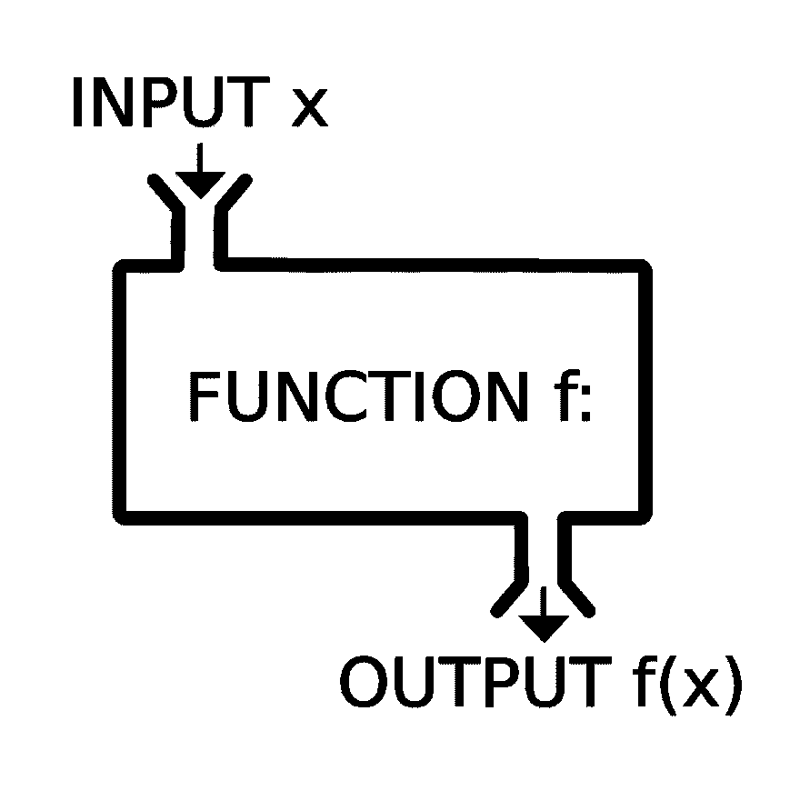

# 新手用散列表

> 原文：<https://dev.to/zeyadetman/hashtables-for-newbies--5136>

*这篇文章最初发表在我的博客上[新手散列表](https://zeyadetman.github.io/technical/2018/09/26/hashtables-for-newbies.html)T3】*

# 哈希表

在我们制作散列表之前，让我们先讨论一下它的组成部分`arrays`、`functions`和`hashing`。就算知道也要看！

## 组件

### 数组？

`const colors = ['red','blue','orange']`

如果我们`console.log(colors[0])`控制台显示的是`red`的头部，我们就按照这个顺序编写元素，并且知道每个索引指向哪种颜色。这简单明了。

### 功能？

函数是很酷的盒子，你给它传递一个值，告诉它如何从中产生一个结果。[T2】](https://res.cloudinary.com/practicaldev/image/fetch/s--EPNCE-Z7--/c_limit%2Cf_auto%2Cfl_progressive%2Cq_auto%2Cw_880/https://upload.wikimedia.org/wikipedia/commons/thumb/3/3b/Function_machine2.svg/1200px-Function_machine2.svg.png)

线性代数课`f(x) = x+5`写过这个吗？在编程中，你可以用同样的方式写它`const f = x => x+5`，如果我们给它传递一个`3`，这个函数返回`8`这里没有花哨。

### 哈希？

哈希在技术谈判中有点像黑箱，换句话说，它是你将某个东西转换成唯一的`hash`或`value`的一系列步骤，这是一条你无法回头的路。在编程中，我们将这些步骤(哈希算法)写在一个叫做哈希函数的函数中。

### 物体？

一个键值表示，类似于数组，但是在数组中你通过索引得到值，在对象中你通过它的特殊键得到值。

`const white = {code: '#fff', type: 'color'}`

如果我们想得到`white`的`code`，我们只需简单地写出`white['code']`<sup>(1)，简单又快速，对吧？</sup>

## 什么是哈希表？

简而言之，Hashtable 是一种数据结构，可以帮助你使用普通的数组作为键值数组！

### 让我们探索如何？

我们有一个这样的`colors`数组:

```
const  colors  = [{color:  'white', code:  '#fff'},
{color:  'orange', code:  '#fc3'}]; 
```

而问题是我们必须找到颜色`orange`的`code`？！
没有哈希表，第一个简单的解决方案是迭代整个数组，如果颜色是橙色，显示代码！很慢，对吧？

```
colors.map(color  =>
  {
    if (color['color'] ===  'orange')
    console.log(color['code']);
  }
); 
```

让我们采用另一种方法，将其转换为键值数组。
将最后一个数组转换为此数组:

```
const  colors  = ['#fff','#fc3']; 
```

如果我们写`colors['orange']`，控制台显示`#fc3`！
要做到这一点，我们必须让`hash`字`white`和`orange`的索引大小相等，也就是说`>=`为零，并且小于数组大小。

```
const  colors  = [];

const  hashFunction  =  key  => {
  const  letters  =  key.split('');
  const  hashValue  =  letters.reduce((acc, cur) =>
  acc  +  cur.charCodeAt(0), 0)
  % (!colors.length  ?  1  :  colors.length+1); 

  // in the line above, we made a '%' to range the
  // value to be between zero (included) and the length of
  // the list

  return  hashValue;
} 
colors[hashFunction('orange')] =  '#fc3';
colors[hashFunction('white')] =  '#fff';

console.log(colors[hashFunction('orange')]); // '#fc3' 
```

哇！太好了！但是如果我们有两种颜色返回相同的索引我们称之为`Collision`，我们该怎么办？！
在哈希表的实际实现中，哈希函数必须避免与两个约束的冲突:

*   每个单词的索引必须是唯一的。
*   索引必须是零，列表长度必须是。

#### 备注:

(1)写它`white['code']`不要`white[code]`无论你在对象中写了什么`code`以避免普通变量之间的冲突。