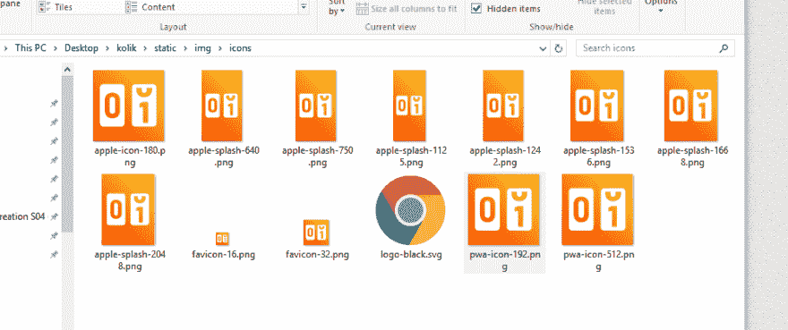

# 无障碍 PWA 图标和闪屏生成

> 原文：<https://dev.to/dominikfiala/hassle-free-pwa-icons-and-splash-screen-generation-3c24>

最近，我创建了我的第一个渐进式网络应用程序(PWA)。部分原因是我在苹果商店找不到任何适合我的免费应用，部分原因是我试图说服我的一个朋友，它比原生移动应用程序快得多，维护起来也更好。

我主要是后端开发人员，所以用我日常不使用的技术来开发东西总是很有趣和轻松的。所有的编码都很有趣，主要是因为我使用了很棒的工具，主要是带有一个很棒的 [PWA 模板](https://github.com/vuejs-templates/pwa)的 [Vue CLI](https://cli.vuejs.org/) ，它允许你几乎立即开始一个项目的工作，而不是自己弄清楚样板文件。

不过，我遇到了一些问题。当我发现从主屏幕打开应用程序和在浏览器中打开应用程序时，PWA 中的 [localStorage 有所不同](https://stackoverflow.com/questions/11545149/ios-web-app-has-different-localstorage-than-mobile-safari)时，第一个惊喜出现了。嗯，只是不要让人们在浏览器中使用你的应用程序，让他们使用 PWA 版本。完成了。

第二个问题是 iOS Safari 如何计算视口高度，这使得在 CSS 中创建布局变得非常困难。简而言之:它把自己的工具栏放在你精心定位的应用程序导航栏上。我用这个 [buggyfill](https://github.com/rodneyrehm/viewport-units-buggyfill) 进行了实验，效果不错，但它让我意识到我想专注于应用程序的功能，而不是渲染细节，所以我在项目中采用了[框架 7](https://framework7.io/) 来解决这个问题。完成了。

但令我惊讶的是，创建一个简单的 PWA 的最大挑战是用各种设备/操作系统要求的所有分辨率的图标填充它。Chrome DevTools 验证了 512 和 192 像素的 PNG 图标，还有 32 和 16 像素的 favicons，以及适用于所有 iOS 设备的各种分辨率。到目前为止一切顺利，这只是一个不同分辨率的正方形。完成了。

然后你发现有一个`<link rel="apple-touch-startup-image">` HTML 标签可以使用，这样当你的应用加载时，你的应用用户就不会盯着白屏看了。但是你需要**为每个 iOS 设备创建所述启动图像，所有这些设备都有不同的分辨率和显示纵横比**。

所以你不能再缩小一个高分辨率的 PNG 了。更糟糕的是，你不能只使用一种分辨率，并希望 iOS 会重新调整它，并在每个屏幕上使用它。你可以抱有希望，但会失望。不过，这适用于应用程序图标(我最终只有 180x180px 版本，所有设备似乎都可以正常工作)。

幸运的是，苹果已经覆盖了它，并在一个方便的表格中给你一个所有分辨率的概述。

所以所有的理论都到位了，剩下要做的就是创建不同分辨率的应用图标。我该怎么做？我不是平面设计师。我不想使用在线工具，然后手动将生成的文件下载到我的项目中。我不想使用现成的解决方案，它有十几个依赖项，输出大量文件，你需要手动检查和挑选。见鬼，我是一名 web 开发人员，一定有更好的方法来改变这一点:

[T2】](https://res.cloudinary.com/practicaldev/image/fetch/s--979NA3eM--/c_limit%2Cf_auto%2Cfl_progressive%2Cq_auto%2Cw_880/https://thepracticaldev.s3.amazonaws.com/i/29elzout5l42wr7tr214.png)

...变成这样:

[T2】](https://res.cloudinary.com/practicaldev/image/fetch/s--BGpK_Z5V--/c_limit%2Cf_auto%2Cfl_progressive%2Cq_auto%2Cw_880/https://thepracticaldev.s3.amazonaws.com/i/j6lrv3tue1egy3aoo160.png)

然后我就想到了！这些具有各种长宽比和分辨率的**图形只不过是非常简单的响应网页**和一个图像(分别为 SVG)。幸运的是，我在开始的时候创建了一个矢量图形的标志。

这是一个可扩展 web 应用程序图标的模板，可以适应任何屏幕大小和方向:

```
<!DOCTYPE html>
<html>
<head>
  <meta name="viewport" content="width=device-width, initial-scale=1">
  <style>
  body {
    margin: 0;
    background: linear-gradient(225deg, #F9D423, #F83600);
    height: 100vh;
  }
  img {
    width: 100%;
    height: 100%;
    margin: 0 auto;
  }
  </style>
</head>
<body>
  
</body>
</html> 
```

只需在不同的视窗尺寸截图，就可以了！**嗯，别傻了，别用手做。自动化它！**用一个小的节点脚本为你截屏(它使用 [Webshot CLI](https://www.npmjs.com/package/webshot-cli) ，可通过 NPM 获得)。

```
const { exec } = require('child_process')
const util = require('util')

const sizes = [
  { name: 'favicon-16', size: '16/16' },
  { name: 'favicon-32', size: '32/32' },
  { name: 'apple-icon-180', size: '180/180' },
  { name: 'pwa-icon-192', size: '192/192' },
  { name: 'pwa-icon-512', size: '512/512' },
  { name: 'apple-splash-640', size: '640/1136' },
  { name: 'apple-splash-750', size: '750/1334' },
  { name: 'apple-splash-1242', size: '1242/2208' },
  { name: 'apple-splash-1125', size: '1125/2436' },
  { name: 'apple-splash-1125', size: '1125/2436' },
  { name: 'apple-splash-1536', size: '1536/2048' },
  { name: 'apple-splash-1668', size: '1668/2224' },
  { name: 'apple-splash-2048', size: '2048/2732' },
]

sizes.map(item => {
  exec(util.format(
    'npx webshot --window-size=%s ./src/assets/logo/logo.html ./static/img/icons/%s.png',
    item.size,
    item.name
  ))
}) 
```

一个 SVG，一个 HTML，一个节点脚本和一个本地安装的 NPM 包。这就是生成大量 PWA 图形所需的全部内容:

[T2】](https://res.cloudinary.com/practicaldev/image/fetch/s--29XVOsyS--/c_limit%2Cf_auto%2Cfl_progressive%2Cq_auto%2Cw_880/https://thepracticaldev.s3.amazonaws.com/i/h180kbeceu28sgn1xs8o.png)

感谢阅读！由于这是我在这个可爱的社区的第一篇帖子，我将感谢任何反馈。祝大家黑得开心！