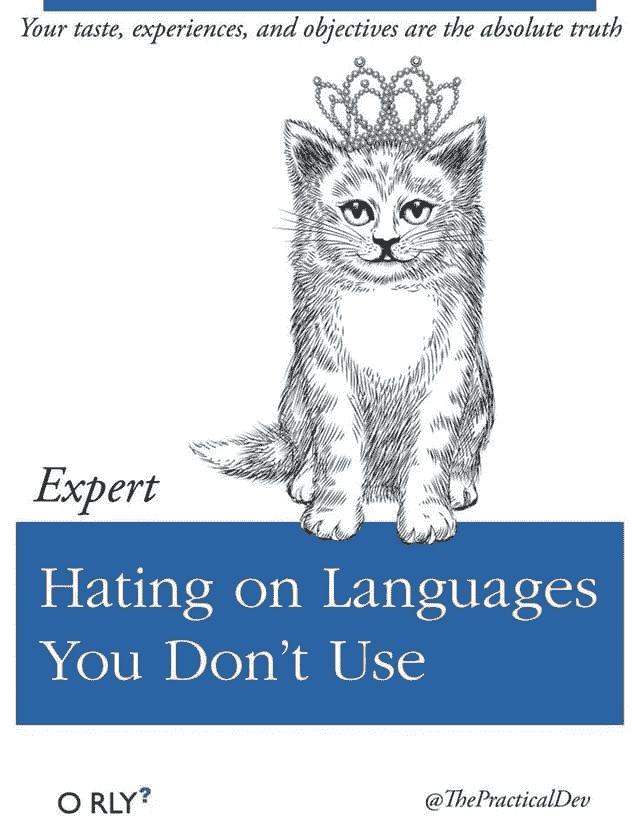

# 讨厌你不用的语言

> 原文：<https://dev.to/sadick/hating-on-languages-you-dont-use-440i>

[T2】](https://res.cloudinary.com/practicaldev/image/fetch/s--etbVS7PL--/c_limit%2Cf_auto%2Cfl_progressive%2Cq_auto%2Cw_880/https://thepracticaldev.s3.amazonaws.com/i/bkvr83xnp350khbetqcw.JPG)

请不要。每种语言都有擅长的地方。你的品味、经历和目标并不是绝对的真理。仅仅因为你不喜欢它并不意味着它是一种低劣的语言。