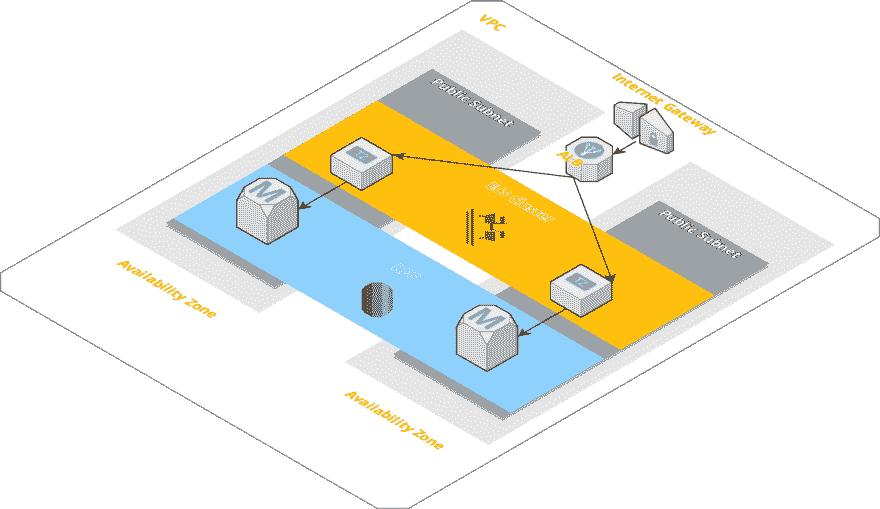
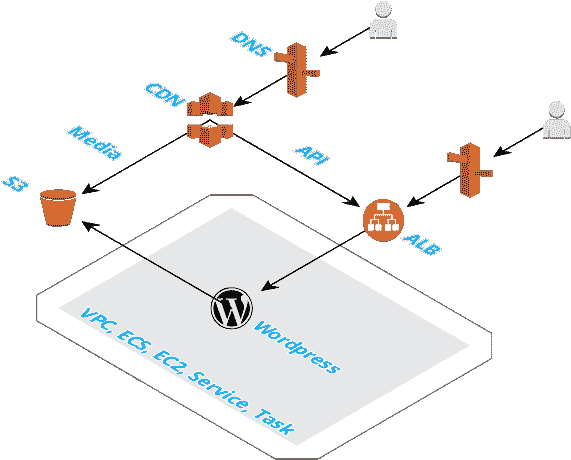

# AWS 上的无头 Wordpress CMS

> 原文：<https://dev.to/rgfindl/headless-wordpress-cms-on-aws-1nol>

## 使用 Docker 快速启动 AWS 上的无头 Wordpress CMS

无头 CMS 目前很流行。但是什么是无头 CMS，为什么我应该开始使用它？

一个无头的 CMS 是一个从它的前端解耦的后端。后端是创建和发布内容的地方。而前端是显示内容的地方(网络、移动应用、机顶盒、Alexa 等)。

例如，传统的 CMS 是一个单一的网站。添加内容和显示内容使用的是同一个网站。后端和前端**耦合**。

无头 CMS 仅用于创建和发布内容。该内容随后可通过 API 获得。用于显示内容的网站或移动应用程序是独立的。

但是为什么解耦更好呢？以下是一些原因:

*   比传统内容管理系统更快、更灵活的内容交付
*   面对用户界面变化的弹性(经得起未来考验)
*   快速设计迭代
*   增强的安全性
*   更少的发行者和开发者依赖性
*   更简单的部署

****感谢列表[亮点](https://www.brightspot.com/blog/decoupled-cms-and-headless-cms-platforms)T3】*

既然我们都一致认为无头 CMS 是正确的选择。让我们来看看这些令人敬畏的 [CloudFormation 模板](https://github.com/rgfindl/headless-wordpress)，我创建它们是为了帮助你运行和管理你的 headless (Wordpress) CMS。

需要明确的是，这是一个运行在 AWS 上的 Wordpress 安装，使用基础设施作为代码和 Docker。

等等……为什么使用 Wordpress，而不使用像 [Contently](https://contently.com/) 或 [Cosmic JS](https://cosmicjs.com/) 这样酷的新的无头 CMS 服务？嗯，这些服务真的很棒，但它们要花很多钱，如果可以的话，我通常喜欢自己管理一切。还有… Wordpress 在管理内容方面真的很好。

但是 Wordpress 怎么会是无头 CMS 呢？简单，它有一个 API。

诀窍是让 Wordpress 成为无状态的，这样它就可以自动缩放，并在 AWS 上运行，实现零停机部署。

好了，无头 CMS 很酷，Wordpress 也挺酷的，我们继续。

[https://github.com/rgfindl/headless-wordpress](https://github.com/rgfindl/headless-wordpress)

# 建筑

我们的 Wordpress 实例作为一个使用 Docker 的[弹性容器服务](https://aws.amazon.com/ecs/)运行。

首先，我们有 [VPC](https://aws.amazon.com/vpc/) ，然后是 [ECS](https://aws.amazon.com/ecs/) 集群，然后是 EC2 实例，最后是带有任务的 ECS 服务。我们的 Wordpress 服务通过一个[弹性负载平衡器](https://aws.amazon.com/elasticloadbalancing/)向世界公开。我们使用 RDS 作为我们的 MySQL 数据库。

[T2】](https://github.com/rgfindl/headless-wordpress/raw/master/diagram1.png)

我们的 Wordpress 服务是无状态的，这意味着我们不能像 Wordpress 媒体或插件那样依赖文件系统来存储内容。每次我们的 Wordpress 服务的一个实例被产生时，它将只有被烘焙到我们的 Docker 映像中的文件。

让我们先看看我们是如何处理 Wordpress 媒体的。

我们使用一个叫做 [WP 卸载媒体](https://wordpress.org/plugins/amazon-s3-and-cloudfront/)的插件。这个插件允许我们将媒体存储在 [S3](https://aws.amazon.com/s3/) 并使用[云锋](https://aws.amazon.com/cloudfront/)作为 CDN。看看下面的图表。我们也使用相同的 CDN 来缓存 Wordpress API…

[T2】](https://github.com/rgfindl/headless-wordpress/raw/master/diagram2.png)

现在我们如何处理插件？(我们可以忽略模板，因为这是无头的😃)

还记得我说过把东西烤成我们码头工人的形象吗？就是这样…我们必须在 Docker 图像中包含插件。让我们看一下那个文档并浏览一遍。

```
FROM wordpress:latest

# Install unzip
RUN apt-get update; \
    apt-get install -y --no-install-recommends unzip

# Install WP plugins
RUN curl -L https://downloads.wordpress.org/plugin/amazon-s3-and-cloudfront.2.0.zip -o /tmp/amazon-s3-and-cloudfront.2.0.zip
RUN unzip /tmp/amazon-s3-and-cloudfront.2.0.zip -d /usr/src/wordpress/wp-content/plugins
RUN rm /tmp/amazon-s3-and-cloudfront.2.0.zip

RUN curl -L https://downloads.wordpress.org/plugin/advanced-custom-fields.5.7.7.zip -o /tmp/advanced-custom-fields.5.7.7.zip
RUN unzip /tmp/advanced-custom-fields.5.7.7.zip -d /usr/src/wordpress/wp-content/plugins
RUN rm /tmp/advanced-custom-fields.5.7.7.zip

RUN curl -L https://downloads.wordpress.org/plugin/custom-post-type-ui.1.5.8.zip -o /tmp/custom-post-type-ui.1.5.8.zip
RUN unzip /tmp/custom-post-type-ui.1.5.8.zip -d /usr/src/wordpress/wp-content/plugins
RUN rm /tmp/custom-post-type-ui.1.5.8.zip 
```

如你所见，我们的 Dockerfile 非常简单。它扩展了最新的 Wordpress 图片，然后安装了 3 个插件。它下载、解压并复制每个插件到 wordpress/wp-content/目录。当你第一次启动你的 Wordpress 站点时，你必须激活这些插件。激活状态存储在 MySQL 中，因此您不必在每次 ECS 任务回收时都这样做。

# 安装

好了，让我们安装这个架构。首先几个先决条件。

## 先决条件

安装以下必备组件:

*   [AWS 账户](https://aws.amazon.com/)
*   [EC2 密钥对](https://console.aws.amazon.com/ec2/v2/home)
*   cim - ( `npm install -g cim` )
*   [AWS CLI](https://docs.aws.amazon.com/cli/latest/userguide/installing.html)

## 书库

*   VPC
*   精英公司
*   无线电数据系统
*   electroniccashregister 电子现金出纳机
*   Wordpress

### VPC

这创建了我们的 ECS 集群和 RDS 数据库将在其中运行的 [Amazon 虚拟私有云](https://aws.amazon.com/vpc/)。

> 亚马逊虚拟专用云(亚马逊 VPC)允许您提供 AWS 云的逻辑隔离部分，您可以在您定义的虚拟网络中启动 AWS 资源。

```
cd vpc
cim stack-up 
```

### ECS

这创建了一个[弹性容器服务](https://aws.amazon.com/ecs/)，我们的 EC2 将在其中运行。

> Amazon Elastic Container Service(Amazon ECS)是一个高度可扩展的高性能容器编排服务，它支持 Docker 容器，并允许您在 AWS 上轻松运行和扩展容器化的应用程序。

```
cd vpc
cim stack-up 
```

### RDS

这创建了一个我们的 Wordpress 应用程序将使用的[关系数据库服务](https://aws.amazon.com/rds/)数据库集群。

> Amazon 关系数据库服务(Amazon RDS)使得在云中设置、操作和扩展关系数据库变得很容易。

```
cd rds
export DatabaseUsername="???"; export DatabasePassword="???"; cim stack-up 
```

### ECR

这创建了一个[弹性容器注册表](https://aws.amazon.com/ecr/)，它将保存我们的 wordpress 服务的 docker 图像。

> Amazon Elastic Container Registry(ECR)是一个完全托管的 Docker 容器注册表，它使开发人员可以轻松地存储、管理和部署 Docker 容器映像。

```
cd ecr
cim stack-up 
```

### 文字出版社

在我们发射这个云阵之前。我们需要向 ECR 推广我们的服务形象。

#### 推送图像

```
cd wordpress/src 
```

*   [注册认证](http://docs.aws.amazon.com/AmazonECR/latest/userguide/Registries.html#registry_auth)
    *   `aws ecr get-login --registry-ids <account-id>`
    *   复制/粘贴输出以执行 docker 登录，还将`/headless-wp`附加到存储库 url。
*   构建图像
    *   `docker build -t headless-wp:<version> .`
*   [推送图像](http://docs.aws.amazon.com/AmazonECR/latest/userguide/docker-push-ecr-image.html)
    *   `docker tag headless-wp:<version> <account-id>.dkr.ecr.<region>.amazonaws.com/headless-wp:latest`
    *   `docker tag headless-wp:<version> <account-id>.dkr.ecr.<region>.amazonaws.com/headless-wp:<version>`
    *   `docker push <account-id>.dkr.ecr.<region>.amazonaws.com/headless-wp`

#### 更新版本

确保`Version`参数 in _cim.yml 与上面的`version`标签匹配。ECS 任务定义将从 ECR 中提取图像。

#### 叠加起来

一旦`Version`被设置，你可以使用`cim stack-up`用新版本更新堆栈。

```
cd wordpress
cim stack-up 
```

祝贺你，你的新 Wordpress 网站现在可用了。

首先运行 Wordpress 安装向导。

接下来启用我们添加的一些插件。

添加一些博客文章和页面。

然后查看 API。例:`https://<cdn-url>/wp-json/wp/v2/posts`

# 环境变量

祝贺你安装了无头 Wordpress。如果你在路上遇到什么困难，请不要犹豫，向我寻求帮助。

我想解释的一件事是 Wordpress 环境变量，因为它们确实把所有东西都联系在一起了。它们告诉我们的 Wordpress 安装关于 RDS 数据库、媒体 S3 桶和 CloudFront CDN URL。让我们来看看。这些可以在 Wordpress 栈的 [AWS::ECS::TaskDefinition](https://github.com/rgfindl/headless-wordpress/blob/master/wordpress/wp.stack.yml#L233) 中找到。

```
Environment:
  - Name: AWS_REGION
    Value: !Ref AWS::Region
  - Name: AWS_ACCOUNT_ID
    Value: !Ref AWS::AccountId
  - Name: WORDPRESS_DB_HOST
    Value:
      Fn::ImportValue:
        !Sub "${RDSStack}-RDSClusterEndpoint"
  - Name: WORDPRESS_DB_USER
    Value:
      Fn::ImportValue:
        !Sub "${RDSStack}-DatabaseUsername"
  - Name: WORDPRESS_DB_PASSWORD
    Value:
      Fn::ImportValue:
        !Sub "${RDSStack}-DatabasePassword"
  - Name: WORDPRESS_CONFIG_EXTRA
    Value: !Sub
      - |
        define( 'AS3CF_AWS_USE_EC2_IAM_ROLE', true );
        define( 'AS3CF_SETTINGS', serialize( array(
          'bucket' => '${MediaBucket}',
          'copy-to-s3' => true,
          'serve-from-s3' => true,
          'domain' => 'cloudfront',
          'cloudfront' => '${DomainName}',
          'enable-object-prefix' => true,
          'object-prefix' => 'wp-content/uploads/',
          'force-https' => ${ForceHttps},
          'remove-local-file' => true
        ) ) );
        define( 'WP_HOME', '${CMSUrl}' );
        define( 'WP_SITEURL', '${CMSUrl}' );
      - {
        MediaBucket: !Ref MediaBucket,
        DomainName: !If [UseCustomDomain, !Ref Domain, !GetAtt CDN.DomainName],
        ForceHttps: !If [UseCustomDomain, 'true', 'false'],
        CMSUrl: !If [UseCustomDomain, { "Fn::ImportValue" : {"Fn::Sub": "${ECSStack}-CustomDomainUrl" } }, {"Fn::Sub": ["http://${Url}", {"Url": { "Fn::ImportValue" : {"Fn::Sub": "${ECSStack}-LoadBalancerUrl" } }}]}]
        }
  - Name: WORDPRESS_DEBUG
    Value: '1' 
```

WORDPRESS_DB_*变量直接来自 RDS 栈。CloudFormation 允许您导出可以在其他堆栈中导入的输出变量。

WORDPRESS_CONFIG_EXTRA 变量是我们配置 [WP 卸载媒体](https://wordpress.org/plugins/amazon-s3-and-cloudfront/)插件的地方。首先，我们通过 AS3CF_AWS_USE_EC2_IAM_ROLE 变量告诉它使用我们的任务角色 [AWS::IAM::Role](https://github.com/rgfindl/headless-wordpress/blob/master/wordpress/wp.stack.yml#L208) 。然后我们用 AS3CF_SETTINGS 变量来设置插件。

感谢阅读。我希望你喜欢它！