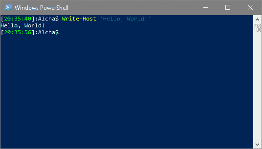
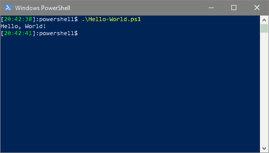

# PowerShell 中的 Hello World

> 原文：<https://dev.to/4lch4-industries/hello-world-in-powershell-4n99>

下面是我为变节的程序员的[样本程序](https://github.com/jrg94/sample-programs)库[写的一篇博文。](https://therenegadecoder.com/)

## PowerShell 背景

PowerShell 是用于管理 Windows 机器/服务器的事实上的脚本语言。微软已经明确表示 PowerShell 将继续存在，并将成为未来管理 Windows 服务器的首选方式。

[杰弗里·斯诺弗](https://en.wikipedia.org/wiki/Jeffrey_Snover)被认为是这种语言背后的设计者，而布鲁斯·帕耶特和詹姆斯·特鲁厄也参与了这个项目，在 2017 年的一次采访中，斯诺弗[解释了创建 PowerShell 背后的动机](https://www.heavybit.com/library/podcasts/to-be-continuous/ep-37-the-man-behind-windows-powershell/):

> 我一直在推动一系列管理变革，然后我最初采用了 UNIX 工具，并使它们在 Windows 上可用，然后它就不起作用了。对吗？因为 Windows 和 Linux 之间有一个核心的架构差异。在 Linux 上，所有东西都是一个 **ASCII** 文本文件，所以任何可以操纵它的东西都是一个管理工具。`AWK`、`grep`、`sed`？快乐的日子！
> 
> 我带来了 Windows 上可用的工具，但它们并没有帮助管理 Windows，因为在 Windows 中，所有东西都是返回结构化数据的 API。所以，那没有帮助。[...]我想到了 PowerShell 的这个想法，我说:“嘿，我们可以做得更好。”

最初，PowerShell 被称为 **Monad** ，它的想法发表在一份名为 [Monad Manifesto](https://blogs.msdn.microsoft.com/powershell/2007/03/18/monad-manifesto-the-origin-of-windows-powershell/) 的白皮书中。在发布 Beta 3 版本后不久，微软正式将 **Monad** 更名为 *Windows PowerShell* ，随后发布了候选版本 1。

PowerShell 现已升级到 5.1 版本，用于稳定构建，2016 年发布的新 6.0 版本正在公开测试中。这个版本最大的变化是现在[是开源的](https://arstechnica.com/information-technology/2016/08/powershell-is-microsofts-latest-open-source-release-coming-to-linux-os-x/)，现在将被称为 **PowerShell Core** ，因为它运行在[上。网芯](https://www.microsoft.com/net/download/windows)与[相对。以前版本用的. NET Framework](https://www.microsoft.com/net/learn/architecture) 。

## PowerShell 中的 Hello World

足够的背景，让我们实际上得到一些工作😊

```
Write-Host  'Hello, World!' 
```

Enter fullscreen mode Exit fullscreen mode

要执行这段代码，只需在任何 Windows 机器上打开默认安装的 PowerShell 控制台。您将在窗口中看到如下的回复输出:

[T2】](https://res.cloudinary.com/practicaldev/image/fetch/s---hdtn9MC--/c_limit%2Cf_auto%2Cfl_progressive%2Cq_auto%2Cw_880/https://thepracticaldev.s3.amazonaws.com/i/icyxqdj2qcih4ybdza6c.png)

与大多数现代脚本语言一样，运行 Hello World 示例非常容易。

## 如何运行解决方案

不过，最好的方法不是直接在控制台中运行命令，而是将您的脚本编写在一个文件中，并在必要时调用该文件。从存储库中下载 Hello-World.ps1 文件的副本，并打开一个控制台。

现在，导航到您下载脚本的位置，并通过如下调用来执行它:

```
.\Hello-World.ps1 
```

Enter fullscreen mode Exit fullscreen mode

这会调用脚本并将输出返回到控制台:

[T2】](https://res.cloudinary.com/practicaldev/image/fetch/s--sijp5VcG--/c_limit%2Cf_auto%2Cfl_progressive%2Cq_auto%2Cw_880/https://thepracticaldev.s3.amazonaws.com/i/7yzlsn708p253osdjfgn.png)