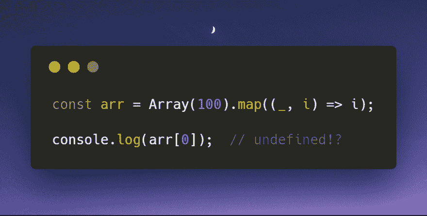

# 这就是为什么在 JavaScript 中映射一个构造好的数组不起作用的原因

> 原文：<https://dev.to/sreisner/heres-why-mapping-a-constructed-array-in-javascript-doesnt-work-55di>

### 为什么映射一个构造好的数组在 JavaScript 中不起作用

#### 以及如何正确做到

[T2】](https://res.cloudinary.com/practicaldev/image/fetch/s--jrJDVyBu--/c_limit%2Cf_auto%2Cfl_progressive%2Cq_auto%2Cw_880/https://cdn-images-1.medium.com/max/892/1%2AbFIR37BFmQcxyPd7UPs6xg.png)

### 场景

为了便于演示，假设您需要生成一个从 0 到 99 的数字数组。你会怎么做？这里有一个选择:

```
const arr = [];

for (let i = 0; i < 100; i++) {
  arr[i] = i;
} 
```

如果你和我一样，在 JavaScript 中看到传统的 for 循环会让你有点不舒服。事实上，我已经*年*没有写过一个传统的 for 循环了，这要归功于高阶函数，比如 [forEach](https://developer.mozilla.org/en-US/docs/Web/JavaScript/Reference/Global_Objects/Array/forEach) 、 [map](https://developer.mozilla.org/en-US/docs/Web/JavaScript/Reference/Global_Objects/Array/map) 、 [filter](https://developer.mozilla.org/en-US/docs/Web/JavaScript/Reference/Global_Objects/Array/filter) 、 [reduce](https://developer.mozilla.org/en-US/docs/Web/JavaScript/Reference/Global_Objects/Array/reduce) 。面向胜利的声明式函数编程！

也许你还没有喝过函数式编程的苦艾酒，你认为上面的解决方案看起来非常好。从技术上来说确实如此，但是在你领略了高阶函数的魔力之后，你可能会想，“*那边* ***一定是*** *更好的方法。*”

我对这个问题的第一反应是，“*我知道！我将创建一个长度为 100 的空数组，并将索引映射到每个元素！* " JavaScript 允许你用数组构造函数创建一个长度为 *n* 的空数组，如下所示:

```
const arr = Array(100); 
```

完美，对吧？我有一个长度为 100 的数组，所以现在我只需要将索引映射到每个元素。

```
const arr = Array(100).map((_, i) => i);

console.log(arr[0] === undefined); // true 
```

什么鬼东西！？数组的第一个元素应该是 *0* ，但实际上是*未定义*！

### 解释

为了解释为什么会发生这种情况，我需要在这里做一个重要的技术区分。在内部，JavaScript 数组**是**对象，以数字作为键。例如:

```
['a', 'b', 'c'] 
```

本质上等同于这个对象:

```
{
  0: 'a',
  1: 'b',
  2: 'c',
  length: 3
} 
```

当访问数组中索引为 0 的元素时，实际上只是访问一个键为 0 的对象属性。这一点很重要，因为当您将数组视为对象并结合这些高阶函数的实现方式时(别担心，我已经为您完成了这一部分)，我们问题的原因就很清楚了。

当你用数组构造函数创建一个新的数组时，它会创建一个新的数组对象，它的*长度*属性被设置为你传入的值，否则*对象就是一个真空*。无论如何，在数组的对象表示中没有索引键。

```
{
  //no index keys!
  length: 100
} 
```

当您试图访问索引 0 处的数组值时，您会得到 *undefined* ，但这并不是说值 *undefined* 存储在索引 0 处，而是说如果您试图访问一个不存在的键的对象值，JavaScript 中的默认行为是返回 *undefined* 。

恰好高阶函数*映射*、*归约*、*过滤*和 *forEach* 从 0 到*长度*迭代数组对象的索引键，但是回调只有在对象上的键存在时才执行*。这解释了为什么我们的回调函数从来没有被调用，当我们在数组上调用 map 函数时什么也没有发生——因为没有索引键！*

### 解

正如你现在所知道的，我们需要的是一个数组，它的内部对象表示包含一个从 0 到*长度*的每个数字的键。最好的方法是[将数组](https://developer.mozilla.org/en-US/docs/Web/JavaScript/Reference/Operators/Spread_syntax)展开成一个空数组。

```
const arr = [...Array(100)].map((_, i) => i);

console.log(arr[0]);
// 0 
```

将数组扩展到一个空数组中会导致数组在每个索引处填充了未定义的。

```
{
  0: undefined,
  1: undefined,
  2: undefined,
  ...
  99: undefined,
  length: 100
} 
```

这是因为 spread 运算符比 map 函数简单。它只是从 0 到*长度*循环遍历数组(或者实际上是任何可迭代的数组),并在封闭数组中创建一个新的索引键，其值是从当前索引处的扩展数组返回的。由于 JavaScript 在其每个索引处从我们的扩展数组返回*未定义的*(记住，它默认这样做，因为它没有该值的索引键)，我们最终得到一个实际上填充了索引键的新数组，因此*映射* -able(以及*减少* -able、*过滤* -able 和 *forEach* -able)。

### 结论

我们发现了数组在 Javascript 中被内部表示为对象的一些含义，并了解了创建任意长度的数组的最佳方式，其中填充了您需要的任何值。

与往常一样，请在下面留下您的评论、问题和反馈！

编码快乐！👍

### 跟我来！

如果你喜欢这篇文章，请关注我！或者至少给我一两下掌声。你能省下一点掌声，对吧？

**中**:[@ Shawn . web dev](https://medium.com/@shawn.webdev)
**推特**:[@ reisner Shawn](https://twitter.com/ReisnerShawn)
**dev . to**:[@ sreisner](https://dev.to/sreisner)
**insta gram**:[@ Shawn . web dev](https://www.instagram.com/shawn.webdev)

### 查看我的更多作品

*   [ES6 生成器的一个快速、实用的用例:构建一个无限重复的数组](https://medium.com/p/49d74f555666)
*   [学习 React Context API，并将其应用到您的应用中](https://medium.com/p/6c199446b80c)
*   [构建一个带有 React 和 Material UI 的“Mask Toggle”密码输入组件](https://medium.com/p/f55e6bd73434)

* * *