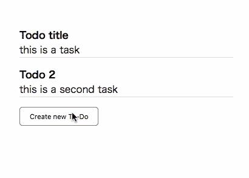

# 嗨，又见面了。业务逻辑是一种优秀的旧式过程编程

> 原文：<https://dev.to/ryohey/hi-again-business-logic-as-a-good-old-procedural-programming-4ikn>

## 为什么？

软件规范和实现之间存在差距。如果我们能用一个简单的 DSL 编写程序流，甚至运行它...这只是一个想法，但我们可以做到。半开玩笑半认真。

## UI 为函数

我的第一个想法是，我们是否可以把用户界面写成一个异步函数。事实上，我们已经看到了。

```
if (confirm(“Do you want to send the message?”)) {
  somethingHappen()
} else {
  alert(“cancelled!”)
} 
```

Enter fullscreen mode Exit fullscreen mode

很简单，对吧？没有任何回调，没有流量，没有调度，没有单一状态。它很容易阅读。

## 重新发明 UI 功能

让我们用同样的方法在 TypeScript 中使用 async/await。我们可以将视图定义为返回用户输入事件的异步函数。

```
interface View {
  confirmToSend: async () => boolean
} 
```

Enter fullscreen mode Exit fullscreen mode

然后编写业务逻辑。

```
const main = async (view: View) => {
  if (await view.confirmToSend()) {
    somethingHappen()
  }
} 
```

Enter fullscreen mode Exit fullscreen mode

然后实现查看。现在我用 React。反正不重要。

```
class App implements View {
  async confirmToSend(): boolean {
    return new Promise((resolve) => {
      this.setState({
        isVisibleConfirm: true,
        onClickConfirmYes: () => resolve(true),
        onClickConfirmNo: () => resolve(false),
      })
    })
  }

  public render() {
    return <div>
      {this.state.isVisibleConfirm && 
        <div className="modal confirm">
          <p>Do you want to send the message?</p>
          <button onClick={this.state.onClickConfirmYes}>Yes</button>
          <button onClick={this.state.onClickConfirmNo}>No</button>
        </div>}
    <div>
  }
} 
```

Enter fullscreen mode Exit fullscreen mode

重点是`confirmToSend`返回等待用户交互的承诺。

一起运行它们。

```
ReactDOM.render(<App ref={view => view && main(view)} />) 
```

Enter fullscreen mode Exit fullscreen mode

因此，这个应用程序根据用 async / await 编写的业务逻辑工作。

你知道我们如何用 React 以过程化的方式编写业务逻辑吗？我们可能需要另一个例子。

## 待办 App

所以让我们来看看待办事项应用程序的例子。

首先，我们编写业务逻辑。

```
export interface Todo {
  title: string
  description: string
}

export interface Store {
  getTodos(): Promise<Todo[]>
  addTodo(todo: Todo): Promise<void>
}

export interface View {
  showTodos(todos: Todo[]): Promise<["click-todo", Todo] | ["create-todo"]>
  showTodo(Todo: Todo): Promise<["close"]>
  showCreateForm(): Promise<["cancel"] | ["create", Todo]>
  closeCreateForm(): Promise<void>
  closeTodo(Todo: Todo): Promise<void>
}

export const mainLoop = async (store: Store, view: View) => {
  initial: while (true) {
    const todos = await store.getTodos()
    const event = await view.showTodos(todos)

    switch (event[0]) {
      case "click-todo": {
        const e = await view.showTodo(event[1])
        switch (e[0]) {
          case "close":
            await view.closeTodo(event[1])
            continue initial
        }
        break
      }
      case "create-todo": {
        const e = await view.showCreateForm()
        switch (e[0]) {
          case "cancel":
            await view.closeCreateForm()
            continue initial
          case "create":
            await view.closeCreateForm()
            await store.addTodo(e[1])
            continue initial
        }
        break
      }
    }
  }
} 
```

Enter fullscreen mode Exit fullscreen mode

看起来很漂亮！这是这个应用程序的独立、完整的行为定义。我们只要看这个功能就能明白这个 app 是怎么工作的。这是应用程序的规范。

让我们看看一些技巧。

### 商店

存储从某处获取数据并存储。我们将视图作为一个界面。所以我们应该把商店写成一个接口，把业务逻辑和实现分开。

### 无限循环

主循环！你可能很久以前用无限循环做游戏什么的...这个待办事项应用应该一直运行到用户关闭标签页，所以会无限循环编写。

### 标签和`continue`

当用户关闭模式视图时，应用程序应该重置到第一个状态。我们可以使用 continue 返回到 while 循环的起点。

### 事件

在上面的例子中，我们使用布尔来处理用户交互。但是在真正的应用程序中，我们必须为一个 showSomewhat 函数处理许多事件。
我使用数组为每个 show 函数定义了一些事件类型。我们可以使用有类型和有效载荷的对象。但是类型推理也可以，所以我不想输入太多。

```
["click-todo", Todo]|["close-todo"] 
```

Enter fullscreen mode Exit fullscreen mode

也许你喜欢

```
interface CloseTodoEvent {
  type: "close-todo"
}

interface ClickTodoEvent {
  type: "click-todo"
  payload: Todo
} 
```

Enter fullscreen mode Exit fullscreen mode

## 待办事项视图

现在让我们看看视图的实现。

```
import * as React from "react"
import { Todo } from "./main"

interface State {
  todos: Todo[]
  modalTodo: Todo | null
  isCreateFormVisible: boolean
  formTitle: string
  formDescription: string
  onClickTodo: (todo: Todo) => void
  onClickCreateNew: () => void
  onClickModal: () => void
  onClickAdd: () => void
  onClickCancelCreation: () => void
}

export class AppView extends React.Component<{}, {}> {
  public state: State = {
    todos: [],
    modalTodo: null,
    isCreateFormVisible: false,
    formTitle: "",
    formDescription: "",
    onClickTodo: (todo: Todo) => {},
    onClickCreateNew: () => {},
    onClickModal: () => {},
    onClickAdd: () => {},
    onClickCancelCreation: () => {}
  }

  showTodos(todos: Todo[]) {
    return new Promise<["click-todo", Todo] | ["create-todo"]>(resolve => {
      this.setState({
        todos,
        modalTodo: null,
        onClickTodo: (todo: Todo) => resolve(["click-todo", todo]),
        onClickCreateNew: () => resolve(["create-todo"])
      })
    })
  }

  showTodo(todo: Todo) {
    return new Promise<["close"]>(resolve => {
      this.setState({
        modalTodo: todo,
        onClickModal: () => resolve(["close"])
      })
    })
  }

  closeTodo(todo: Todo): Promise<void> {
    this.setState({ modalTodo: null })
    return Promise.resolve()
  }

  showCreateForm() {
    return new Promise<["cancel"] | ["create", Todo]>(resolve => {
      this.setState({
        formTitle: "",
        formDescription: "",
        isCreateFormVisible: true,
        onClickCancelCreation: () => resolve(["cancel"]),
        onClickAdd: () =>
          resolve([
            "create",
            {
              title: this.state.formTitle,
              description: this.state.formDescription
            }
          ])
      })
    })
  }

  closeCreateForm() {
    this.setState({
      isCreateFormVisible: false
    })
    return Promise.resolve()
  }

  public render() {
    const {
      todos,
      modalTodo,
      isCreateFormVisible,
      formTitle,
      formDescription,
      onClickCreateNew,
      onClickTodo,
      onClickModal,
      onClickCancelCreation,
      onClickAdd
    } = this.state
    return (
      <>
        <ul>
          {todos.map((t, i) => (
            <li className="todo" onClick={() => onClickTodo(t)} key={i}>
              <p className="title">{t.title}</p>
              <p className="description">{t.description}</p>
            </li>
          ))}
        </ul>
        <button onClick={onClickCreateNew}>Create new To-Do</button>
        {modalTodo !== null && (
          <div className="modal">
            <p className="title">{modalTodo.title}</p>
            <p className="description">{modalTodo.description}</p>
            <button onClick={onClickModal}>Close</button>
          </div>
        )}
        {isCreateFormVisible && (
          <div className="modal create-todo-form">
            <label>title</label>
            <input
              type="text"
              value={formTitle}
              onChange={e => this.setState({ formTitle: e.target.value })}
            />
            <label>description</label>
            <input
              type="text"
              value={formDescription}
              onChange={e => this.setState({ formDescription: e.target.value })}
            />
            <button onClick={onClickCancelCreation}>Cancel</button>
            <button onClick={onClickAdd}>Add</button>
          </div>
        )}
      </>
    )
  }
} 
```

Enter fullscreen mode Exit fullscreen mode

这有点难看，但很管用。我们可能需要一些库来做得更好。

## 截图

[](https://res.cloudinary.com/practicaldev/image/fetch/s--1PO2UPHl--/c_limit%2Cf_auto%2Cfl_progressive%2Cq_66%2Cw_880/https://thepracticaldev.s3.amazonaws.com/i/gg98mw4twq8rhs2seig9.gif) 
真管用！
让我们再次向优秀的旧式过程编程问好！

## 更进一步

*   我们能把这种方法应用到现实世界中吗？
*   我们如何处理中断的事件？
*   我们如何处理有多个窗格的应用程序。
*   这种业务逻辑使测试更有效率吗？

## 源代码

[https://github.com/ryohey/Hi-Again](https://github.com/ryohey/Hi-Again)